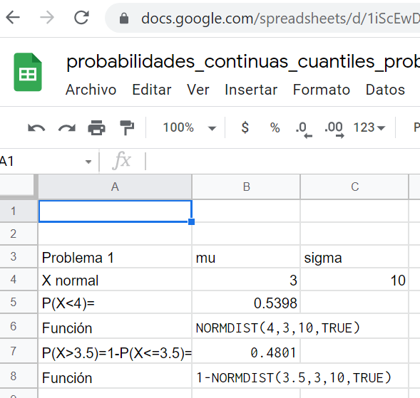
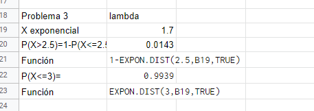

```{r setup, include=FALSE}
knitr::opts_chunk$set(echo = TRUE)
options(scipen=999)
contador=0
```

# Variables aleatorias continuaS


## Problema `r contador=contador+1;contador`.

El tiempo $X$ que utiliza un comercial para exponer un producto cuando LO VENDE sigue, aproximadamente,
una distribución  normal  con parámetros $\mu =3$
minutos  45 segundos y  $\sigma = 10$ segundos.  
    a. ¿Cuál es la probabilidad de que  consiga la venta  en menos de 4 minutos?  
    b. ¿Y en más de 3.5 minutos?
    
### Solución

Tenemos que $X$ es $N(\mu=3,\sigma=10)$   tenemos que $P(X <4)=`r round(pnorm(4,mean=3,sd=10))`$

En segundo lugar nos piden $P(>3.5)=1-P(\leq 3.5)=`r round(pnorm(3.5,mean=3,sd=10))`$


Los cálculos los podemos hacer con R

```{r}
round(pnorm(4,mean=3,sd=10),4)# apartado a. P(X<4)
round(1-pnorm(3.5,mean=3,sd=10),4)# apartado b. P(X>3.5)
```

o con   Google sheets  (u otra hoja de cálculo)


```{r plot1_c,echo=FALSE}

```

## Problema `r contador=contador+1;contador`.

El tiempo $X$ que utiliza un comercial para exponer un producto cuando NO VENDE sigue, aproximadamente, una distribución  normal  con parámetros $\mu=2$ y $\sigma=0.8$.
    a. ¿Cuál  es el cuantil  $0.95$ de esta variable? Interpretarlo en el sentido de tiempo perdido por el comercial.
    b. ¿Cuál es  el tiempo perdido   en el 40\% de las llamadas más cortas?
    
### Solución

Tenemos que $X$ es $N(\mu=2,\sigma=0.8)$   tenemos que buscar el  cuantil $0.05$ es decir el valor $x_{0.95}$ tal que  $P(X <x_{0.95})=0.95$  que es $x_{0.95}=`r round(qnorm(0.95,mean=1,sd=0.8))`$

En segundo lugar nos piden  el cuantil $x_{0.4}$ es decir el valor $x_{0.4}$ tal que  $P(X <x_{0.4})=0.4$  que es $x_{0.4}=`r round(qnorm(0.4,mean=1,sd=0.8))`$


Los cálculos los podemos hacer con R

```{r}
round(qnorm(0.95,mean=2,sd=0.8),4)# apartado a,  cuantil 0.95
round(qnorm(0.4, mean=2,sd=0.8),4)# apartado b.  cuantil 0.4
```

o con   Google sheets  (u otra hoja de cálculo)


```{r plot2_c,echo=FALSE}
knitr::include_graphics("pro2_cont_1.PNG")
```


## Problema `r contador=contador+1;contador`.

Un centro de atención telefónica por voz (*call center*) recibe  por termino medio 102 llamadas por hora. Suponed que el tiempo entre llamadas consecutivas es exponencial.
    a. Sea X el tiempo entre dos llamadas consecutivas ¿cuál es la distribución de $X$? 
    b. Calcular la probabilidad que pasen al menos 2.5 minutos hasta recibir la primera llamada.
    c. Calcular la probabilidad que pasen menos de  3 minutos hasta recibir  la siguiente llamada.
    d. Calcular la esperanza y la varianza de $X$.
   

### Solución

a. En 60 minutos recibe 100 llamadas así que en un minuto recibe $\lambda=\frac{102}{60}=`r 102/60`$. Luego $X=$ tiempo entre dos llamadas consecutivas en minutos  sigue una ley $Exp(\lambda=1.7)$

b. $P(X>2.5)=1-P(X\leq 2.5)=`r round(1-pexp(2.5,rate=1.7),4)`.$


c. $P(X<3)=P(X\leq 3)=`r round(pexp(3,rate=1.7),4)`.$

d. $E(X)=\frac{1}{\lambda}=\frac{1}{1.7}=`r round(1/1.7,4)`$ y   $Var(X)=\frac{1}{\lambda^2}=\frac{1}{1.7^2}=`r round(1/1.7^2,4)`.$ 


Cálculos con R

```{r}
round(1-pexp(2.5,rate=1.7),4)# apartado b.
round(pexp(3,rate=1.7),4)# apartado c.
```
o con   Google sheets  (u otra hoja de cálculo)


```{r plot3_c,echo=FALSE}

```

    
    

## Problema `r contador=contador+1;contador`.

Sea $X$ una variable aleatoria normal con parámetros $\mu=1$ y
$\sigma=1$. Calculad el valor de $b$ tal que $P\left((X-1)^2\leq b\right)=0.1$.


### Solución

La v.a. $X$ es $N(\mu=1,\sigma=1)$ nos piden $b$ tal que $P((X-1)^2\leq b)=0.1)$,. Notemos que $b>=0$, además sabemos que $Z=\frac{X-\mu}{\sigma}=\frac{X-1}{1}=X-1$ sigue una distribución $N(0,1)$.

Tenemos que $P((X-1)^2\leq b)=P(-\sqrt(b)\leq (X-1)\leq\sqrt{b})=P(-\sqrt(b)\leq Z\leq \sqrt{b})=F_Z(\sqrt{b})-F_Z(-\sqrt{b})=F_Z(\sqrt{b})-(1-F_Z(\sqrt{b}))=
2*F_Z(\sqrt{b})-1$.

Entonces buscamos $b$ tal que $2*F_Z(\sqrt{b})-1=0.1$  y de aquí tenemos que 

$F_Z(\sqrt{b})=\frac{1+0.1}{2}=0.55$ luego $\sqrt{b}=z_{0.55}$   y $b=\sqrt{z_{0.55}}$ donde $z_{0.55} es el cuantil $0.55$ de una normal estándar $P(Z\leq z_{0.55})=0.55.$
En definitiva $b=\sqrt{z_{0.55}}=\sqrt{`r  round(qnorm(0.55,0,1),4)`}=`r  round(sqrt(qnorm(0.55,0,1)),4)`.$

Para el cálculo del cuantil $z_{0.55}$ con R es 

```{r}
z0.55=round(qnorm(0.55,0,1),4)
z0.55
round(sqrt(z0.55),4)
```

## Problema `r contador=contador+1;contador`.

 Sea $Z$ una variable aleatoria $N(0,1)$. Calcular
$P\left(\left(Z-\frac{1}{4}\right)^2 >\frac{1}{16}\right)$.


### Solución


\begin{eqnarray*}
P\left(\left(Z-\frac{1}{4}\right)^2 >\frac{1}{16}\right)&=& 1-P\left(\left(Z-\frac{1}{4}\right)^2 \leq \frac{1}{16}\right)\\
&=&
1-P\left(-\sqrt{\frac{1}{16}}\leq Z-\frac{1}{4}\leq\sqrt{\frac{1}{16}} \right)\\
&=&
1-P\left(-\frac{1}{4}+\frac14\leq Z\leq  \frac{1}{4}+\frac14\right)\\
&=&
1-P(0\leq Z\leq 0.5 )=1-(P(Z\leq 0.5)-P(Z\leq 0))\\
&=& 1-(`r round(pnorm(0.5,0,1),4)`-0.5)=
`r 1- (round(pnorm(0.5,0,1),4)-0.5)`.
\end{eqnarray*}


## Problema `r contador=contador+1;contador`.

 Un  contratista de viviendas unifamiliares de lujo   considera que el coste en euros  de una contrata habitual es una variables $X$  que sigue una distribución  $N(\mu=600000,\sigma=60000)$
    a.  ¿Cuál es la probabilidad de que  el coste del edificio esté entre 560000 y 660000 euros?
    b. 0.2 es la probabilidad de que el coste de la vivienda supere ¿qué cantidad?
    c. ¿Cuál es el coste mínimo del  5\% de las casa más caras?
    

### Solución


a. $P(560000\leq X\leq 660000)=P(X\leq   660000)-P(X\leq 560000)=`r round(pnorm(660000,mean=600000,sd=60000),4)`-`round(pnorm(560000,mean=600000,sd=60000),4)`.$


Con R

```{r}
round(pnorm(660000,mean=600000,sd=60000)-pnorm(560000,mean=600000,sd=60000),4)
```

En el 58\% de los casos (aproximadamente) el coste se tituará entre esas dos cantidades

b. Nos piden  el valor $x_0$ tal que $P(X>x_0)=0.2$, es decir el valor que supera el 20\% de las  viviendas más caras.  Este valor será el que deje por debajo  el coste del 89\% de las casas por lo que es el cuantil 0.8 lo calculamos con R (ejercicio utiliza  google sheets para obtener el mismo resultado)

```{r}
qnorm(0.8,mean=600000,sd=60000)
```
El 20\% de las casas más caras cuestan por encima de 650500 euros aproximadamente.


c. Ahora somos más ambiciosos y que remos gastar para estar entre el 5\% de casas más caras. De manera similar al caso anterior queremos calcular el cuantil $x_{0.95}$, lo haremos con R


```{r}
qnorm(0.95,mean=600000,sd=60000)
```

El 5\% de  viviendas más costosas  supera los 699000 euros aproximadamente

Con Google sheets  (u otra hoja de cálculo)


```{r plot7_c,echo=FALSE}
knitr::include_graphics("prob7_cont_1.png")
```

    

## Problema `r contador=contador+1;contador`.

Si $X$ está distribuida uniformemente en $(0,2)$ e $Y$ es una variable exponencial con parámetro $\lambda$. Calcular el valor de $\lambda$ tal que $P(X<1)=P(Y<1)$. 

### Solución


$X$ sigue una ley $U(0,2)$ luego $F_X(x)=P(X\leq x)=\frac{x}{2}$ si $0<x<2$ y  la variable $Y$ es una $Exp(\lambda)$ luego $F_Y(y)=P(Y\leq y)=1-e^{-\lambda\cdot x}$ si $x>0$.

Luego $P(X<1)=\frac{1}{2}$ y $P(Y\leq 1)=1-e^{\lambda\cdot 1}$. POr lo tanto nos piden el valor de $lambda$ tal que $\frac{1}{2}=1-e^{-\lambda}$.

Así que $e^{-\lambda}=1-\frac12=0.5$ luego $-\lambda=\ln(0.5)=`r log(0.5)`.$ por lo tanto $\lambda=`r - log(0.5)`.$


