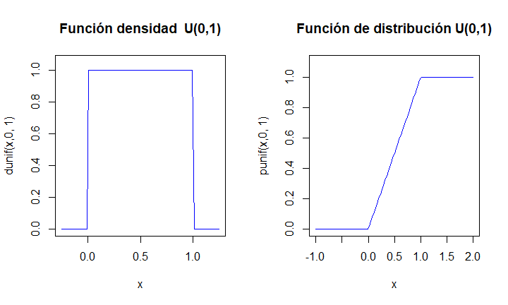
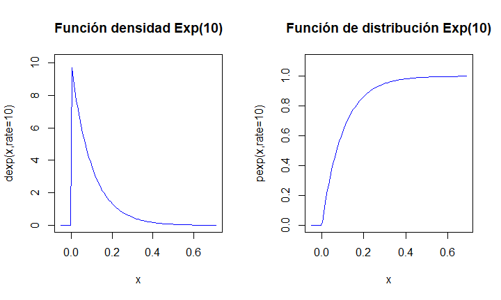
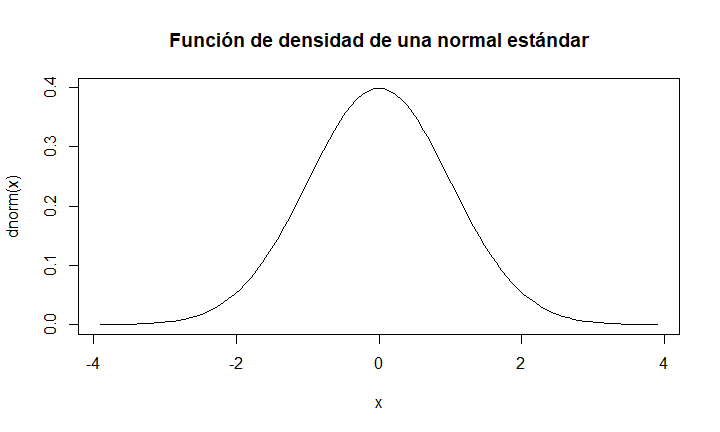
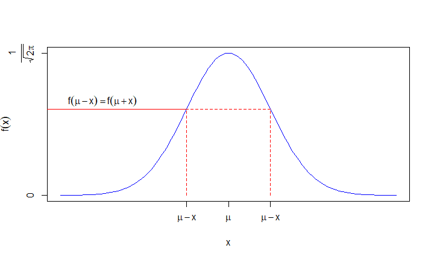
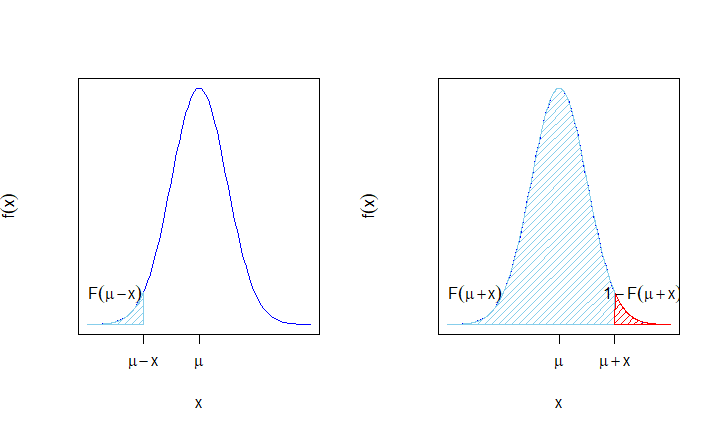

# Distribución uniforme 

## Distribución uniforme

Una v.a. continua $X$ tiene una distribución uniforme sobre el intervalo real $(a,b)$ ,con $a<b$, si su función de densidad es 

$$
f_X(x)=\left\{\begin{array}{ll}
\frac1{b-a}, & \mbox{si } a<x<b,\\ 0,  & \mbox{en cualquier otro caso.}
\end{array}
\right. 
$$ 


## Distribución uniforme

<div class="exercise">

**Ejercicio**

Comprobar que el área comprendida entre $f_X$ y la horizontal
vale 1.
</div>


<div class="exercise-sol">

$$
\int_{-\infty}^{+\infty} f_x(x)\cdot dx=\int_{a}^{b} \frac{1}{b-a} \cdot dx=\left.\frac{x}{b-a}\right]_{x=a}^{x=b}=\frac{b}{b-a}-\frac{a}{b-a}=
\frac{b-a}{b-a}=1.
$$
</div>


## Función de distribución uniforme.

Su función de distribución es

$$
F_X(x)=\left\{\begin{array}{ll} 0,  & \mbox{si } x\leq a,\\
\frac{x-a}{b-a}, & \mbox{si } a<x<b,\\ 1,  & \mbox{si } b\leq x.
\end{array}
\right. 
$$


## Función de distribución uniforme:  cálculo.

Efectivamente:

* Si $x\leq a$, entonces 
$$F_X(x)=\int_{-\infty}^{x} f(t)\cdot dt= \int_{-\infty}^{x} 0\cdot dt.$$
* Si $a<x<b$ entonces ,

$$
\begin{array}{rl}
F_X(x)&=\displaystyle\int_{-\infty}^{x} f(t)\cdot dt= \int_{-\infty}^{a} 0\cdot dt+\int_{a}^{x} \frac1{b-a} \cdot dt\\
&= \displaystyle 0 +\left.\frac{t}{b-a}\right]_{t=a}^{t=x}= \frac{x}{b-a}-\frac{a}{b-a}=\frac{x-a}{b-a}.
\end{array}
$$

## Función de distribución uniforme:  cálculo.


* Por último si $x\geq b$ entonces,

$$
\begin{array}{rl}
F_X(x)&=\displaystyle\int_{-\infty}^{x} f(t) dt=\int_{a}^{b} \frac{1}{b-a} dt=
  \left.  \frac{t}{b-a} \right]_{t=a}^{t=b}
\\&=\displaystyle \frac{b}{b-a}-\frac{a}{b-a}=\frac{b-a}{b-a}=1.
\end{array}
$$


Denotaremos a la v.a. $X$ uniforme en el intervalo $(a,b)$ por  $U(a,b)$.

## Esperanza y varianza  para una v.a. $X$ $U(a,b)$

Calculemos  la esperanza de $X$

$$
\begin{array}{rl}
E(X)&=\displaystyle\int_{-\infty}^{+\infty} x\cdot f_X(x) dx =\int_{a}^{b} x \cdot \frac{1}{b-a} dx =
\left.\frac{x^2}{2\cdot (b-a)}\right]_{x=a}^{x=b}\\
&=\displaystyle \frac{b^2}{2\cdot (b-a)}-\frac{a^2}{2\cdot (b-a)} =
\frac{b^2-a^2}{2\cdot (b-a)} \\ & =\displaystyle\frac{(b+a)\cdot (b-a)}{2\cdot (b-a)}=
\frac{b+a}{2}.
\end{array}
$$


## Esperanza y varianza  para una v.a. $X$ $U(a,b)$

De cara a calcular su varianza, calculemos primero la esperanza de $X^2$:

$$
\begin{array}{rl}
E(X^2)&=\displaystyle\int_{-\infty}^{+\infty} x^2 f_X(x) dx=\int_{a}^{b} x^2 \frac1{b-a}
dx =\left.\frac{x^3}{3\cdot (b-a)}\right]_{x=a}^{x=b} \\
&=\displaystyle\frac{b^3-a^3}{3\cdot (b-a)}=\frac{b^2+ab+a^2}{3}.
\end{array}
$$

<div class="exercise">

**Ejercicio**

* Demostrad que la  igualdad  $b^3-a^3=(b-a)\cdot (b^2+ab+a^2)$ es cierta.

* Utilizadla para el cálculo final del valor de  $E(X^2)$.

</div>


## Esperanza y varianza  para una v.a. $X$ $U(a,b)$.

Calculemos $Var(X)$.
$$
\begin{array}{rl}
Var(X)&=\displaystyle E(X^2)-(E(X))^2=\frac{b^2+ab+a^2}3-\left(\frac{b+a}2\right)^2\\&=\displaystyle
\frac{b^2+ab+a^2}{3}-\frac{b^2+2ab+a^2}{4}\\
&=\displaystyle
\frac{4\cdot (b^2+ab+a^2)-3\cdot (b^2+2ab+a^2)}{4\cdot 3}
\\
&=\displaystyle
\frac{b^2-2ab+a^2}{12}=
\frac{(b-a)^2}{12}.
\end{array}
$$


## Gráficas $U(0,1)$

El código en `R` para dibujar la función de densidad y la función de distribución de una distribución $U(0,1)$ es el siguiente:


```r
par(mfrow=c(1,2))
a=0;b=1
curve(dunif(x,a,b),xlim=c(a-0.25,b+0.25),ylim=c(0,max(1/(b-a)+0.05,0.1)),
      col="blue",main=paste0("Función densidad  U(",a,",",b,")"),
      ylab=paste0("dunif(x,",a,", ",b,")")
      )
curve(punif(x,a,b),xlim=c(a-1,b+1),ylim=c(0,1.1),
      col="blue",main=paste0("Función de distribución U(",a,",",b,")"),
      ylab=paste0("punif(x,",a,", ",b,")",cex.axis=0.8)
      )
par(mfrow=c(1,1))
```
  


## Gráficas $U(0,1)$





## Gráficas interactivas  $U(a,b)$


## Transformación lineal de la v.a. uniforme


Si $X$ sigue una distribución $U(a,b)$ entonces  $Z=\frac{X-a}{b-a}$ sigue una distribución $U(0,1)$.


<div class="prop">

**Propiedad: Transformación lineal de la v.a. uniforme**
</div>

Sea $X$ una v.a  $U(a,b)$

Si $scale\not=0$ y $loc$ son dos constantes reales entonces 

* si $scale>0$, $T=scale\cdot X+loc$ sigue una ley $U(scale\cdot a +loc,scale\cdot b +loc)$  
* si $scale<0$, $T=scale\cdot X+loc$ sigue una ley $U(scale\cdot b +loc,scale\cdot a +loc)$


## Cambio lineal v.a. uniforme.

<div class="dem">
**Demostración**

Supongamos  que $X$ sigue una ley $U(a,b)$, que $scale>0$ y que $T=scale\cdot X+loc$. Dejamos el caso $scale<0$ como ejercicio.

La función de distribución de $X$ es:
$$
F_X(x)=P(X\leq x)=\left\{\begin{array}{ll} 0 & \mbox{ si } x\leq a\\\frac{x-a}{b-a} & \mbox{ si } a\leq x\leq b \\1 & \mbox{ si } b\leq x\end{array}\right.
$$
</div>


## Cambio lineal v.a. uniforme.

<div class="dem">


Si $T$ vale $T=scale\cdot X+loc$, su función de distribución será:
$$
\begin{array}{rl}
F_T(t)&=P(T\leq t)= P(scale\cdot X+ loc\leq t)= P\left(X\leq \frac{t-loc}{scale}\right)=F_X\left(\frac{t-loc}{scale}\right)\\
&=
\left\{\begin{array}{ll} 0, & \mbox{ si } \frac{t-loc}{scale}\leq a\\\frac{\frac{t-loc}{scale}-a}{b-a}, & \mbox{ si } a\leq \frac{t-loc}{scale}\leq b,\\1, & \mbox{ si } b\leq \frac{t-loc}{scale},\end{array}\right.=
\left\{\begin{array}{ll} 0, & \mbox{ si }  t\leq scale\cdot a +loc, \\
\frac{t-(scale\cdot a+loc)}{scale\cdot (b-a)}, & \mbox{ si } scale\cdot a+loc \leq t\leq scale\cdot b+loc, \\
1, & \mbox{ si } scale\cdot b+loc\leq t, \end{array}\right.\\
& = 
\left\{\begin{array}{ll} 0, & \mbox{ si }  t\leq scale\cdot a +loc, \\
\frac{t-(scale\cdot a+loc)}{scale\cdot b+loc-(scale\cdot a+loc)}, & \mbox{ si } scale\cdot a+loc \leq t\leq scale\cdot b+loc, \\
1, & \mbox{ si } scale\cdot b+loc\leq t,\end{array}\right.
\end{array}
$$
función que corresponde a la función de distribución de una v.a. $U(scale\cdot a+loc,scale\cdot b+loc)$, como queríamos demostrar.
</div>


##  Cambio lineal v.a. uniforme.


<div class="exercise">
**Ejercicio**

Sea $X$ una variable $U(0,1)$ y sea $T=scale\cdot X+loc$:

* Si $T$ es $U(-5,5)$  ¿qué  valores toman $scale$ y $loc$?

* Si $loc=-10$ y $scale=10$ ¿qué distribución de probabilidad sigue  $T$?

* Si $loc=0$ y $scale=-1$ ¿qué distribución probabilidad sigue  $T$?

</div>

## Resumen v.a con distribución uniforme, $U(a,b)$

Distribución uniforme | $U(a,b)$
----:|:-----
Dominio | $D_X=(a,b)$
$f_{X}(x)$ |$\left\{\begin{array}{ll}\frac1{b-a}, & \mbox{si } a<x<b,\\ 0,  & \mbox{en cualquier otro caso.}\end{array} \right.$
$F_X(x)=P(X\leq X)=$ |  $\left\{\begin{array}{ll} 0, & \mbox{ si } x\leq a\\\frac{x-a}{b-a}, & \mbox{ si } a\leq x\leq b,\\1, & \mbox{ si } b\leq x.\end{array}\right.$
$E(X)=$ |$\frac{a+b}2$
$Var(X)=$| $\frac{(b-a)^2}{12}$

## Cálculos con  R

Sea $X$ una $v.a.$ $U(a,b)$. Las funciones `dunif(x,a,b)` y `punif(x,a,b)` calculan la función de densidad y de distribución de $X$ en el valor $X$. Por ejemplo, para $a=-1$, $b=1$ y $x=0.5$, los valores $f_X(x)$ y $F_X(x)$ valen:


```r
dunif(x=0.5, min=-1,max=1)
```

```
[1] 0.5
```

```r
punif(q=0.5,min=-1,max=1)
```

```
[1] 0.75
```

## Cálculos con  R


La función `runif(n,a,b)` calcula un muestra de observaciones de tamaño $n$ que sigan la distribución $U(a,b)$:

```r
runif(n=5,min=-1,max=1)
```

```
[1]  0.57881041  0.35149209  0.02775478 -0.77393315  0.54174231
```

## Cálculos con  R

Por defecto, el valor de los parámetros `a` y `b` son 0 y 1, respectivamente:


```r
dunif(x=0.5)
```

```
[1] 1
```

```r
punif(q=0.5)
```

```
[1] 0.5
```

```r
runif(n=5)
```

```
[1] 0.6657760 0.2788621 0.2866181 0.1895627 0.6019269
```

## Cálculos con python

Sea $X$ una $v.a.$ $U(-1,1)$. Tomando como "base" la v.a. $U(0,1)$, los parámetros $loc$ y $scale$ valen: $loc=-1$ y $scale=2,$ ya que como hemos visto $X=2*U(0,1)-1=U(-1,1)$.

En python, hay que usar dichos parámetros para calcular la función de densidad y de distribución:

```python
from scipy.stats import uniform
uniform.pdf(0.5,loc=-1,scale=2)
```

```
0.5
```

```python
uniform.ppf(0.5,loc=-1,scale=2)
```

```
0.0
```

## Cálculos con python

Para generar una muestra de valores aleatorios, hay que usar la función `uniform.rvs`:


```python
uniform.rvs(size=30,loc=-1,scale=2)
```

```
array([-0.57740555, -0.66155462, -0.14735034, -0.1338145 , -0.70799429,
       -0.76422997, -0.18022966,  0.38904802, -0.97606076, -0.65283055,
        0.85824122,  0.47907356, -0.15076041, -0.75990232,  0.62288045,
        0.81990857, -0.52970855,  0.6119947 , -0.37412069, -0.13794952,
        0.81435093, -0.10841814,  0.32259814, -0.29465654,  0.13584076,
        0.80704586,  0.59129044,  0.28355088, -0.52092476,  0.09122931])
```

## Cálculos con python

Los valores de los parámetros por defecto son `loc=0, scale=1`:


```python
uniform.pdf(0.5)
```

```
1.0
```

```python
uniform.ppf(0.5)
```

```
0.5
```

```python
uniform.rvs(size=5)
```

```
array([0.99228421, 0.54948763, 0.01635299, 0.67766559, 0.32632039])
```


# Cuantiles de variables aleatorias


## Cuantiles

<div class="definition"> 
**Cuantiles** 
</div>

Si  $X$ es una v.a. con dominio $D_X$ y  $0<p<1$ llamaremos cuantil de orden $p$ al menor valor  perteneciente al dominio $x_p\in D_X$ tal que 

$$P(X\leq x_p)\geq p.$$

En `R`, cada distribución $X$ tiene la función `qX(p,...)` que devuelve precisamente el cuantil $x_p$ tal que $P(X\leq x_p)\geq p.$


## Cuantiles

<div class="example">

Consideremos una v.a. $X$ de distribución $B(5,0.5)$. 

Los cuantiles $x_{0.3}$, $x_{0.6}$ y $x_{0.8}$ son los siguientes:


```r
qbinom(c(0.3,0.6,0.8),5,0.5)
```

```
[1] 2 3 3
```
</div>

## Cuantiles

<div class="example">
Calculemos a mano, el valor $x_{0.3}$ y verifiquemos que da el mismo resultado que nos ha dado `R`.

La función de distribución de $X$ es:
$$
\small{
F_x(x)=P(X\leq x)=
\left\{
\begin{array}{ll}
0, & x< 0, \\
0.03125, & \mbox{ si } 0 \leq x< 1, \\
0.18750, & \mbox{ si } 1 \leq x< 2, \\
0.50000, & \mbox{ si } 2 \leq x< 3, \\
0.81250, & \mbox{ si } 3 \leq x< 4, \\
0.96875, & \mbox{ si } 4 \leq x< 5, \\
1.00000, & \mbox{ si }  5\leq x. \\
\end{array}
\right.}
$$
</div>

## Cuantiles

<div class="example">
El cuantil $p=0.3$ es el  primer valor $x\in D_X$  tal que $F_X(x)=P(X\leq x_{0.3})\geq 0.3$. Mirando la expresión anterior, comprobamos que $x_{0.3}=2$ ya que $F_X(2)=P(X\leq 2)=0.5 \geq 0.3$.
</div>


<div class="exercise">
**Ejercicio**

Calcular los cuantiles de  $0.6$ y $0.8$ de una $B(5,0.5).$
</div>

## Cuantiles

Dada una variable aleatoria $X$, si existe la inversa de la función de distribución de $X$, $F_X^{-1}$, el cuantil de orden $p$ sería el valor que tiene la función $F_X^{-1}$ en $p$: $x_p=F^{-1}(p)$.

En caso de no existir la inversa, dado $p$, definimos el conjunto $A_p$ como:

$$
A_p =\{x\in\mathbb{R},\ |\ F_X(x)\geq p\}.
$$

Entonces el cuantil $p$ es el mínimo del conjunto $A_p$ considerando sólo valores del dominio de la variable: $x_p =\displaystyle\min_{x\in D_X}(A_p)$. Este mínimo siempre existirá y nos da una fórmula explícita para calcular los cuantiles de cualquier variable aleatoria.

## Cuantiles

<div class="example">

**Ejemplo: variable aleatoria que nos da el resultado del lanzamiento de un dado**

Sea  $X$ la variable aleatoria uniforme discreta que nos da el número de puntos obtenidos en el lanzamiento de un dado (seis caras numeradas del 1 al 6).

Su dominio  es $D_X=\{1,2,3,4,5,6\}$ y su función de probabilidad es 
$$
P_X(x)=P(X=x)=
\left\{
\begin{array}{ll}
 \frac{1}{6}, & \mbox{ si } x=1,2,3,4,5,6, \\
0, & \mbox{ en otro caso. }.
\end{array}
\right.
$$

Su función de distribución es:

$$
F_X(x)= P(X\leq x)=
\left\{
\begin{array}{ll}
0, & \mbox{ si } x<1, \\
\frac{k}{6} & \mbox{ si } k\leq x< k+1 \mbox{ para } x= 1,2,3,4,6, \\
 1, & \mbox{si  } x \geq 6.
\end{array}
\right.
$$

</div>

## Cuantiles

<div class="example">

La función siguiente llamada `ddado` nos define la función de probabilidad de $X$ para un dado de $n$ caras:

```r
ddado=function(x,n=6) {
  sapply(x,FUN=function(x) {
    if( x %in% c(1:n)){return(1/n)} else {return(0)}})
  }
```

## Cuantiles

Por ejemplo, el valor de $P_X(0.5)$ sería:

```r
ddado(1.5,n=6)
```

```
[1] 0
```
y los valores de $P_X(i)$ para $i=1,\ldots 10$ sería:

```r
ddado(1:10,n=6)
```

```
 [1] 0.1666667 0.1666667 0.1666667 0.1666667 0.1666667 0.1666667 0.0000000
 [8] 0.0000000 0.0000000 0.0000000
```

</div>

## Cuantiles

<div class="example">

La función `pdado` nos da la función de distribución de $X$:


```r
pdado=function(x,n=6) 
  {
  sapply(x,FUN=function(y){ if (y<1){ return(0)}else{if(y>=n){return(1)} else
  {return(sum(ddado(c(1:(floor(y))),n=n)))}}})
  }
```

Los valores de $F_X(i)$ para $i=0,\ldots, 11$ serían:

```r
pdado(0:11,6)
```

```
 [1] 0.0000000 0.1666667 0.3333333 0.5000000 0.6666667 0.8333333 1.0000000
 [8] 1.0000000 1.0000000 1.0000000 1.0000000 1.0000000
```

</div>

## Cuantiles

<div class="example">


A continuación, construímos la función `qdado` que nos calcula el cuantil $p$, para $0\leq p\leq 1$, de la variable $X$ como el mínimo de la antiimagen de $p$ mediante la función de distribución $F_X^{-1}(p)$


```r
qdado=function(p,n=6){
sapply(p,FUN=function(pp=p,nn=n) 
  {
  if(pp<0 | pp>1) {return(NA)}
  else {
  aux=pp>=pdado(1:n,nn)
  aux
  ifelse(all(!aux),return(1),return(max(which(pp>=pdado(1:n,nn)))))}}
)
}
```


</div>

## Cuantiles

<div class="example">


Efectivamente los cuantiles del dado $X$ son 


```r
qdado(1.5)
```

```
[1] NA
```

```r
qdado(-1)
```

```
[1] NA
```

```r
qdado(c(0.1,0.5,0.6,1,1.01,2))
```

```
[1]  1  3  3  6 NA NA
```

</div>

## Cuantiles

<div class="example">
Por ejemplo si $X$ es una $B(n=10,p=0.3)$


```r
set.seed(2222)
(q=runif(10,0,1))
```

```
 [1] 0.36765818 0.18187591 0.82617679 0.58497444 0.95886983 0.10179894
 [7] 0.75688767 0.24369144 0.67806543 0.06275295
```

```r
qbinom(q,10,0.3)
```

```
 [1] 2 2 4 3 6 1 4 2 4 1
```

```r
set.seed(2222)
rbinom(10,10,0.3)
```

```
 [1] 2 2 4 3 6 1 4 2 4 1
```
</div>

## Cuantiles

<div class="example">

Por ejemplo si $X$ es una $BN(n=3,p=0.1)$


```r
set.seed(2222)
(q=runif(10,0,1))
```

```
 [1] 0.36765818 0.18187591 0.82617679 0.58497444 0.95886983 0.10179894
 [7] 0.75688767 0.24369144 0.67806543 0.06275295
```

```r
qnbinom(q,3,0.1)
```

```
 [1] 19 12 41 27 61  9 36 15 32  7
```

```r
set.seed(2222)
rnbinom(10,3,0.1)
```

```
 [1] 18  9  6 46 66 49 24 44 19 26
```
</div>


## Un ejemplo gráficas cuantiles $B(n,p)$ y $Po(\lambda)$.


# Distribución exponencial

##  Distribución del tiempo entre dos eventos Poisson

Supongamos que tenemos un proceso Poisson con parámetro $\lambda$ en una unidad de tiempo.

Dado un tiempo $t$, definimos $N_{t}$ como el número de eventos en el intervalo de tiempo $(0,t]$. La distribución de $N(t)$ es una $Po(\lambda\cdot t)$. Consideremos la v.a. $T$ como el tiempo transcurrido entre dos eventos Poisson consecutivos.

Sea $t>0$, entonces

$$
\begin{array}{rl}
P(T>t)&=P(\mbox{Cero eventos en el intervalo}(0,t])\\
&=P(N_{t}=0)=
         \frac{(\lambda t)^0}{0!} e^{-\lambda
         t}=e^{-\lambda t}.
\end{array}
$$

##  Distribución del tiempo entre dos eventos Poisson

Tomando complementarios, la función de distribución de $T$ será:
$$
F_{T}(t)= P(T\leq t)=1-P(T>t)=\left\{\begin{array}{ll} 0, &\mbox{ si } t\leq 0,\\
  1-e^{-\lambda t},& \mbox{ si } t>0,\end{array}\right.
$$

Para hallar la función de densidad de $T$, basta derivar la expresión anterior:
$$
f_{T}(t)=\left\{\begin{array}{ll}\lambda \cdot e^{-\lambda t}, & \mbox{ si }  t>0,\\
0, & \mbox{ si } t\leq 0. \end{array}\right.
$$

Llamaremos a la variable $T$ exponencial de parámetro $\lambda$ y la denotaremos por $Exp(\lambda)$.


## Propiedad de la falta de memoria

Sea $X$  una v.a. $Exp(\lambda)$ entonces

$$P(X>s+t\big|X>s)=P(X>t)\mbox{  para todo } s,t\in \mathbb{R}$$

<div class="dem">
**Demostración**

Si $X$ es una v.a. $Exp(\lambda)$ tenemos que $P(X>x)=1-P(X\leq x)=1-(1-e^{-\lambda\cdot x})=e^{-\lambda\cdot x}$ para todo $x>0$

Por tanto,
$$
\begin{array}{rl}
P(X>s+t\big|X>s) & =\frac{P(\{X>s+t\}\cap \{X>s\})}{P(X>s)}=\frac{P(X>s+t)}{P(X>s)}=\frac{e^{-\lambda\cdot (s+t)}}{e^{-\lambda\cdot s}}=
\frac{e^{-\lambda\cdot s}\cdot e^{-\lambda\cdot t} }{e^{-\lambda\cdot s}}\\ & =e^{-\lambda\cdot t}=P(X>t).
\end{array}
$$
</div>

## Ejemplo distribución exponencial

<div class="example"> 
**El clásico problema del peluquero.** 

Una pequeña peluquería es regentada por un único peluquero. El peluquero está esperando al próximo cliente mientras lee el periódico. 

Supongamos que $N_T=$ número de clientes  que llegan en el intervalo $[0,t)$ es una $Po(\lambda\cdot t)$ entonces la variable $T=$ tiempo entre dos clientes consecutivos sigue una ley $Exp(\lambda)$.

Supongamos que $t$ se mide en horas y que $\lambda=4$ es el promedio de clientes por hora.

</div>

<div class="example-sol">

En este ejemplo la propiedad de la pérdida de memoria significa que
si el peluquero lleva ya esperando más de $s>0.25$  un cuarto de hora  la probabilidad de que espere $t=1/6$ de hora más (10 minutos) no cambia sigue siendo $P(T>0.25+1/6|T>0.25)=P(T>1/6).$
</div>


## Ejemplo distribución exponencial

<div class="example-sol">

El tiempo esperado (en horas) hasta el siguiente cliente es

$$
E(X)=\frac{1}{\lambda}=\frac{1}{4}=0.25.
$$

y la varianza es 

$$
Var(X)=\frac{1}{\lambda^2}=\frac{1}{4^2}=0.0625.
$$

Por último ¿Cuál es la probabilidad de que nuestro peluquero esté sin  clientes (leyendo el periódico) más de 30 minutos (0.5 horas)?


$$
P(X>0.5)=1-P(X\leq 0.5)=1-(1-e^{-4\cdot 0.5 })=e^{-2}=0.1353353.
$$
</div>

## Ejemplo distribución exponencial

<div class="example-sol">

Si queremos hacer los cálculos con R, 


```r
pexp(0.5,rate=3)
```

```
[1] 0.7768698
```

```r
1-pexp(0.5,rate=3)
```

```
[1] 0.2231302
```

```r
pexp(0.5,rate=3,lower.tail = FALSE)
```

```
[1] 0.2231302
```

</div>

## Cálculos  con R

La función de densidad, de distribución y la generación aleatoria de valores de una exponencial, se pueden obtener en R con:


```r
dexp(0.001,rate=3)## alerta no es una probailidad es una densidad y puede ser >1
```

```
[1] 2.991013
```

```r
pexp(0.5,rate=3) ##P(X<0.5)
```

```
[1] 0.7768698
```

```r
rexp(10,3)## diez tiempos de una exponencial
```

```
 [1] 0.5069426 0.4497573 0.2876943 0.5514840 1.0552252 0.3168070 0.2488148
 [8] 0.2377065 0.2974863 0.2121646
```


## Cálculos  con python

Y en  python con:


```python
from scipy.stats import expon
expon.pdf(0.0001,scale= 1./3)
```

```
2.9991001349865014
```

```python
expon.cdf(0.5,scale= 1./3) 
```

```
0.7768698398515702
```

```python
expon.rvs(scale=1./3,size=10)
```

```
array([0.27238386, 1.46348269, 0.22048545, 0.14458971, 0.18901634,
       0.17625803, 0.42814061, 0.13063973, 0.13908107, 0.16852951])
```


## Resumen v.a con distribución exponencial, $Exp(\lambda)$

$X$ | $Exp(\lambda)$
------:|:------
$D_X=$  | $(0,+\infty)$ 
$f_{X}(x)=$ | $\left\{\begin{array}{ll}
\lambda e^{-\lambda x} & \mbox{ si }  x>0\\
0 & \mbox{ si } x\leq 0
\end{array}\right.$
$F_X(x)=P(X\leq X)=$ | $\left\{\begin{array}{ll} 0 &\mbox{si } x\leq 0\\
1-e^{-\lambda x}& \mbox{si } x>0\end{array}\right.$
$E(X)=\frac{1}{\lambda}$ | $Var(X)=\frac{1}{\lambda^2}$

## Gráficas densidad y distribución $Exp(\lambda=10)$


```r
lambda=10
par(mfrow=c(1,2))
curve(dexp(x,rate=lambda),xlim=c(-0.05,round(qexp(0.99,rate=lambda,2),2)+0.25),
      ylim=c(0,dexp(0,lambda)+0.1),col="blue",
      main=paste0("Función densidad Exp(",lambda,")"),
      ylab=paste0("dexp(x,rate=",lambda,")"))
curve(pexp(x,rate=lambda),xlim=c(-0.05,qexp(0.999,10)),ylim=c(0,1.1),col="blue",
      main=paste0("Función de distribución Exp(",lambda,")"),
      ylab=paste0("pexp(x,rate=",lambda,")"))
par(mfrow=c(1,1))
```

## Gráficas densidad y distribución $Exp(\lambda=10)$



## Gráficas densidad y distribución $Exp(\lambda=10)$

<div class="exercise">
**Ejercicio**

Consultad  en el manual de python [scipy.stats](https://docs.scipy.org/doc/scipy/reference/generated/scipy.stats.expon.html). 


Dibujad la función de densidad y de distribución de una $Exp(10).$

</div>


## Gráficas interactivas de una $X$ $Exp(\lambda)$.


## Ejercicio: las bombillas que no envejecen.

<div class="exercise">
**Ejercicio**

Supongamos que compramos una bombilla led que promete un **valor esperado** de duración de 10000 (1.14 años) horas de funcionamiento continuo. Además, nos aseguran que la distribución de $X$, el número de horas de funcionamiento continuo de una bombilla led, sigue una ley  exponencial.

* Si $X$ es $Exp(\lambda)$ ¿cuál es el valor del parámetro  $\lambda$?.
* ¿Cuál es la probabilidad de que una bombilla led ilumine más de 2 años?
* Supongamos que ya tengo una bombilla led funcionando 1 año ¿Cuál es la probabilidad de que dure dos años más?
* ¿Cuál es la varianza de la duración  en horas de este tipo de bombillas?

</div>


# Distribución normal o Gaussiana


## Distribución normal o Gaussiana

Una de las variables  aleatorias  continua más populares  es la llamada    distribución normal o [Gaussiana](https://es.wikipedia.org/wiki/Distribuci%C3%B3n_normal) .

<l class="def"> Distribución normal o de Gauss</l>
Diremos que una v.a. $X$ sigue una ley normal de parámetros
$\mu$ y $\sigma$ y la denotaremos por $N(\mu,\sigma)$
si tiene por función de densidad:

$$
f_{X}(x)=\frac1{\sqrt{2\cdot\pi\cdot\sigma^2}}
e^{-\frac{1}{2}\cdot\left(\frac{x-\mu}{\sigma}\right)^2},
$$
para todo $x\in \mathbb{R}.$

## Distribución normal o Gaussiana

La gráfica de esta función de densidad es conocida como **campana de Gauss.**

La v.a. normal con $\mu=0$ y $\sigma=1$ recibe el nombre de
normal estándar y se suele denotar por la letra $Z$ normal $N(0,1)$.

## Distribución normal o Gaussiana


```r
curve(dnorm(x),main="Función de densidad de una normal estándar",xlim=c(-3.9,3.9))
```




## Propiedades de la función de densidad de la distribución normal

<l class="prop"> Propiedades de la función de densidad de la distribución normal</l>

Sea $X$ una v.a. $N(\mu,\sigma)$ y sea $f_{X}$ su función de densidad. Entonces:

* La función $f_{X}$ verifica todas las propiedades de las funciones de densidad: $f_X(x)>0$, para todo $x\in\mathbb{R}$ y $\displaystyle\int_{-\infty}^\infty f_X(x)\,dx=1$.
* La función $f_X(x)$ es simétrica respecto de la recta $x=\mu$: $f_{X}(\mu-x)=f_{X}(\mu+x)$, para todo $x\in\mathbb{R}$.
* $f_{X}$ tiene un único máximo absoluto en $x=\mu$ que vale $f_X(\mu)=\frac{1}{\sqrt{2\pi\sigma^2}}$.


## Propiedades de la función de densidad de la distribución normal

* Si $F_{X}$ es la función de distribución de $X$, entonces $F_{X}(\mu+x)=1-F_{X}(\mu-x)$, para todo $x\in\mathbb{R}$. 
* En particular si $Z$ es una $N(0,1)$ entonces $F_{Z}(-x)=1-F_{Z}(x)$, para todo $x\in\mathbb{R}$.
* $Z=\frac{X-\mu}{\sigma}$ es una v.a. $N(0,1)$ y $X=\sigma\cdot Z+\mu$ es una $N(\mu,\sigma)$ donde $Z$ es la normal estándar.

## Función de distribución  N(0,1)

Su función de distribución es, como sabemos :

$$
F(x)=\displaystyle\int_{-\infty}^{x} {1\over{\sqrt{2\cdot \pi\cdot\sigma^2}}}
e^{-{1\over 2}{\left({t-\mu}\over{\sigma}\right)}^2} dt.
$$

La función $F(x)$ no tiene ninguna expresión algebraica "decente". Es por esta razón, y  por comodidad, que esta función está tabulada o hay que calcularla usando un software estadístico.


## Resumen v.a con distribución normal, $N(\mu,\sigma)$

$X$  | $N(\mu,\sigma)$ 
-----:|:--------
$D_X=$ | $\mathbb{R}=(-\infty,+\infty)$
$f_{X}(x)$ |$=\frac{1}{\sqrt{2\pi\cdot\sigma^2}}\cdot e^{\frac{-(x-\mu)^2}{2\cdot \sigma^2}}\mbox{ para todo }x\in \mathbb{R}.$
$F_X(x)=P(X\leq X)=$ | Utilizad la función de `R` `pnorm(x,mean=mu,sd=sigma)` o la función correspondiente en python 
$E(X)=\mu.$ | $Var(X)=\sigma^2.$

##  Cálculos con R
 
Las funciones que calculan la función de densidad y de distribución de una variable $N(\mu,\sigma)$ en un valor `x` son `dnorm(x,mean=mu,sd=sigma)` y `pnorm(x,mean=mu,sd=sigma)`, respectivamente. Por ejemplo, para una variable $X\sim N(\mu=1,\sigma=2)$ la función de densidad $f_X(2)$ se puede calcular de la forma siguiente:
 

```r
dnorm(2,mean=1,sd=2)
```

```
[1] 0.1760327
```
y la función de distribución $F_X(2) = P(X\leq 2)$ de la forma siguiente:


```r
pnorm(2,mean=1,sd=2) 
```

```
[1] 0.6914625
```

##  Cálculos con R
 
El cuantil $x_{0.95}$ es el valor que cumple  $P(X\leq x_{0.95})=0.95$ como


```r
qnorm(0.95,mean=1,sd=2)
```

```
[1] 4.289707
```

Y la generación aleatoria de valores según $X$ como


```r
rnorm(n=5,mean=1,sd=2)
```

```
[1]  2.19858942  0.03274072 -0.59125322 -0.88202614  1.95160505
```


##  Cálculos con python
 
De forma la forma habitual importaremos `norm` de `scipy.stas` los parámetros son `loc` y `scale` la media $\mu$ y la desviación estándar $\sigma$. 
 

```python
from scipy.stats import norm
```

Por ejemplo para una $X\sim N(\mu=1,\sigma=2)$, la función de densidad $f_X(2)$:


```python
norm.pdf(2,loc=1,scale=2)
```

```
0.17603266338214976
```

y la función de distribución $F_X(2) = P(X\leq 2)$:


```python
norm.cdf(2,loc=1,scale=2)
```

```
0.6914624612740131
```


##  Cálculos con python

 
El cuantil $x_{0.95}$ es el valor que cumple  $P(X\leq x_{0.95})=0.95$ como


```python
norm.ppf(0.95,loc=1,scale=2)
```

```
4.289707253902945
```

Y la generación aleatoria de valores según $X$ como


```python
norm.rvs(loc=1,scale=2,size=5)
```

```
array([-0.95807589, -1.30513318, -0.87260262,  1.13926893,  1.65554422])
```

## Cálculos python

<div class="exercise">
**Ejercicio**

Consultad [SciPy.org](https://docs.scipy.org/doc/scipy/reference/generated/scipy.stats.norm.html) para dibujar las funciones de densidad y de distribución con python.
</div>

## Propiedades de la distribución normal.

La función de densidad de la
distribución normal tiene las siguientes propiedades:

* La función $f_X$ es continua.
* $\int_{-\infty}^{+\infty} \frac{1}{\sqrt{2\cdot\pi\cdot \sigma^2}}\cdot 
e^{-\frac{1}{2}\cdot \left(\frac{x-\mu}{\sigma}\right)^2} dx =1.$ (propiedad de todas las densidades).
* $f(\mu+x)=f(\mu-x)$.
* $F(\mu-x)=1-F(\mu+x)$.


## Propiedades de la distribución normal.




## Propiedades de la distribución normal

* $\lim\limits_{x\to+\infty}f(x)=\lim\limits_{x\to-\infty}f(x)=0$ es decir tiene asíntota horizontal a derecha e izquierda.
* $f$ es estrictamente creciente si $x<\mu$ y decreciente si $x>\mu$.
* Alcanza el máximo en $x=\mu$ y en este punto vale $f(\mu)=\frac1{\sqrt{2\pi}\sigma}$
* Tiene dos puntos de inflexión en $x=\mu+\sigma$ y en $x=\mu-\sigma$.


## Propiedades de la distribución normal.




## Gráficas interactivas parámetros normal


## Transformaciones lineales de variables aleatorias normales


<l class="prop"> Propiedad: transformación lineal la distribución  normal </l>

Sea $X$ una variable  $N(\mu,\sigma)$  entonces la variable $Y=a X+b$ con
$a\not=0,b\in\mathbb{R}$ tiene distribución $N(a\mu+b, |a| \sigma)$


En particular si  $X$ sigue una $N(\mu,\sigma)$, tomando $a=\frac1{\sigma}$ y $b=
\frac{-\mu}{\sigma}$  obtenemos la tipificación  o estandarización  de la v.a. 

$$Z={{X-\mu}\over {\sigma}}$$
se distribuye $N(0,1)$, es decir $E(X)=0$ y $Var(X)=1$.

## Transformaciones lineales de variables aleatorias normales

Esta propiedad es muy útil, ya que utilizándola sólo necesitaremos tabular la
$N(0,1)$. 


Si $Z$ sigue una   distribución $N(0,1)$  diremos que $Z$ sigue una distribución normal estándar. 

Por lo tanto  podemos calcular cualquier distribución  normal  desde la distribución normal estándar:

$$
F_X(x)=F_Z \left(\frac{x-\mu}{\sigma}\right).
$$


## Propiedades de la distribución normal estándar
Sea $Z$ una $N(0,1)$.

En este caso, $\mu=0$ y $\sigma=1$. Podemos escribir algunas de las propiedades vistas para una distribución normal cualquiera de la forma siguiente:

* La propiedad $f_X(\mu-x)=f_X(\mu+x)$ se traduce a $f_Z(-x)=f_Z(x)$
* La propiedad $F_X(\mu-x)=1-F_X(\mu+x)$ se traduce a $F_Z(-x)=1-F(x).$
* Dado $\delta>0$, 
$$
P(-\delta\leq Z \leq \delta)=F_{Z}(\delta)-F_{Z}(-\delta)=F_Z(\delta)-(1-F_Z(\delta))=
2\cdot F_Z(\delta)-1.
$$


## Cálculos con la distribución normal

<div class="exercise"> 

**Ejercicio Cálculos con la distribución  normal estándar** 

Sea  $Z$  una distribución $N(0,1)$, calcular las siguientes probabilidades en función de $F_Z$.

* $P(-4\leq Z \leq 4).$
* $P(-2\leq Z \leq 2).$
* $P(Z\leq -2).$
* $P( Z \leq 2).$
* $P( Z \geq 2).$
* $P( Z > 2).$
* $P( Z = 2).$
* $P( Z \geq -2).$
</div>


## Cálculos con la distribución normal

<div class="example-sol">

Resolución:

* $P(-4\leq Z \leq 4)=F_{Z}(4)-F_{Z}(-4)=2\cdot F_Z(4)-1$.
* $P(-2\leq Z \leq 2)=F_{Z}(2)-F_{Z}(-2)=2\cdot F_Z(2)-1$.
* $P(Z\leq -2)=F_Z(-2)=1-F_Z(2)$.
* $P( Z \leq 2)=F_{Z}(2)$.
* $P( Z \geq 2)=1-P(Z<2)=1-F_{Z}(2)$.
* $P( Z > 2)=1-P(Z\leq 2)=1-F_{Z}(2)$.
* $P( Z = 2)=0$ ya que es una distribución continua.
* $P( Z \geq -2)=1-P(Z< -2)=1-F_{Z}(-2)=1-(1-F_Z(2))=F_Z(2).$
</div>


## Relación entre una  distribución normal y la normal estándar.

Para hallar la probabilidad de que $X$ esté en un intervalo $(a,b)$ cualquiera, podemos usar la función de distribución de $Z$ de la siguiente manera:
$$
\begin{array}{ll}
P(a<X<b)&=P\left(\frac{a-\mu}{\sigma}<\frac{X-\mu}{\sigma}<\frac{b-\mu}{\sigma}\right)= \\
&=P\left(\frac{a-\mu}{\sigma}<Z<\frac{b-\mu}{\sigma}\right)=F_{Z}\left(\frac{b-\mu}{\sigma}\right)-
F_{Z}\left(\frac{a-\mu}{\sigma}\right).
\end{array}
$$

Para el caso particular en que el intervalo esté centrado en la media $\mu$, o sea existe un valor $\delta>0$ tal que $(a,b)=(\mu-\delta,\mu+\delta)$, obtenemos:
$$
P\left(\mu-\delta\leq X \leq\mu+\delta\right)=2\cdot  F_Z\left(\frac{\delta}{\sigma}\right)-1.
$$

</div>

## Ejemplo cálculo probabilidades normal


<div class="exercise">
**Ejercicio**

Sea $X$ una normal com media $2$ y varianza $4$. Calcular 

* $P(1< X< 2).$
* $P(X>3).$

</div>

## Ejemplo cálculo probabilidades normal

<div class="example-sol">
**Solución**

La primera probabilidad se calcula de la forma siguiente:
$$
\begin{array}{ll}
P(1< X< 2)&= P\left(\frac{1-2}{2}<\frac{X-2}{2}<\frac{2-2}{2}\right)= P\left(\frac{-1}{2}<Z<0\right)\\
&= F_{Z}(0)-F_{Z}(-0.5)=\frac12-1+F_{Z}(0.5)=-\frac12+F_Z(0.5).
\end{array}
$$

La segunda probabilidad se calcular de la forma siguiente:
$$
P(X>3)=P\left(\frac{X-2}2>\frac{3-2}{2}\right)=P(Z>0.5)=1-F_{Z}(0.5).
$$


</div>

## Ejemplo normal con R y python

<div class="exercise">
**Ejercicio**

Sea $X$ una normal com media $2$ y varianza $4$. Calcular  con R y con python las probabilidades

* $P(1< X< 2).$
* $P(X>3).$

</div>

## Ejemplo normal con R y python


<div class="example-sol">
**Solución con R**


```r
pnorm(2,mean=2,sd=2)-pnorm(1,mean=2,sd=2) #P(1< X< 2)
```

```
[1] 0.1914625
```

```r
pnorm(3,mean=2,sd=2,lower.tail =FALSE) #P(X>3)
```

```
[1] 0.3085375
```

```r
1-pnorm(3,mean=2,sd=2,lower.tail=TRUE) #P(X>3) = 1-P(X<=3)
```

```
[1] 0.3085375
```

</div>


## Ejemplo normal con R y python

<div class="example-sol">
**Solución con Python**


```python
norm.cdf(2,loc=2,scale=2)-norm.cdf(1,loc=2,scale=2) #P(1< X< 2)
```

```
0.19146246127401312
```

```python
1-norm.cdf(3,loc=2,scale=2) #P(X>3) = 1-P(X<=3)
```

```
0.3085375387259869
```
</div>

## La distribución normal aproxima otras distribuciones

En los temas que siguen veremos como, bajo determinadas condiciones,

* la distribución normal puede aproximar la distribución binomial,
* la distribución normal puede aproximar la distribución Poisson
* la distribución normal es la distribución límite de la media aritmética de una muestra de variables aleatorias.

