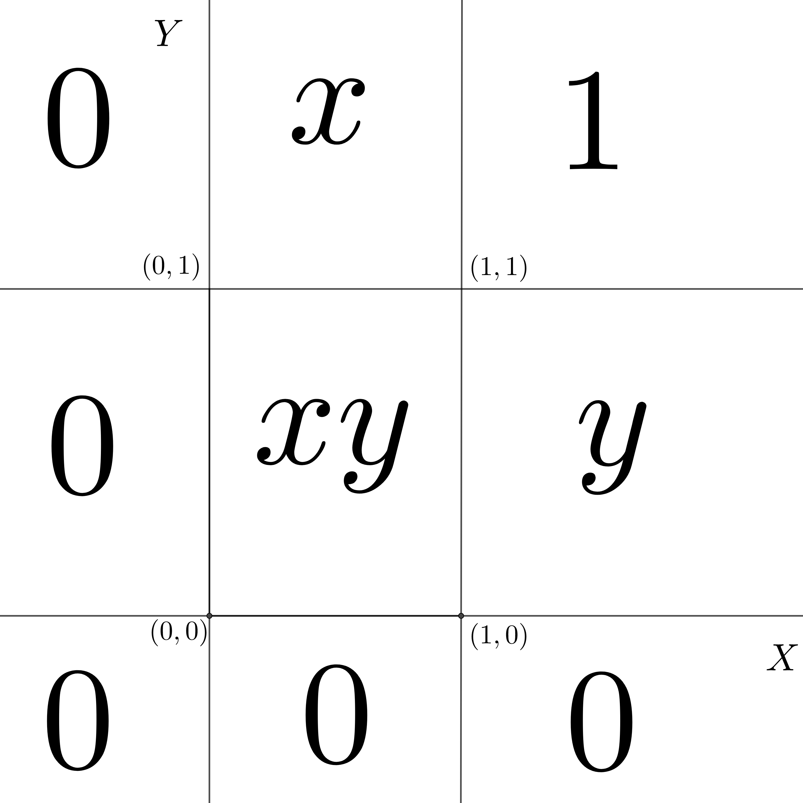
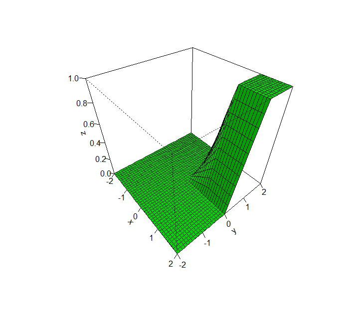
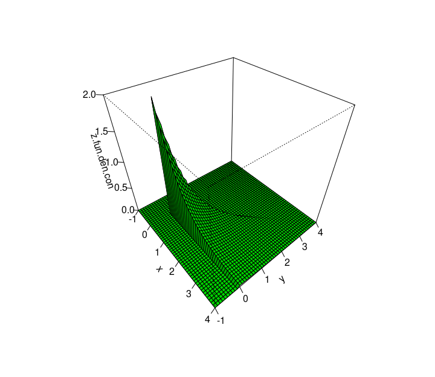
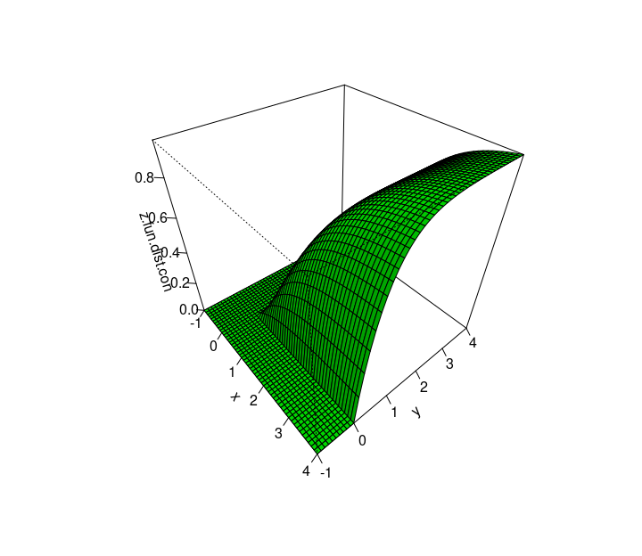
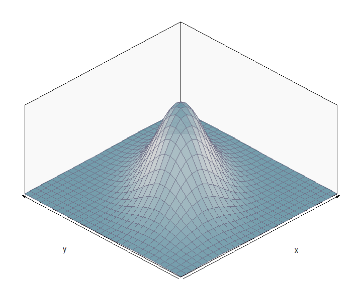
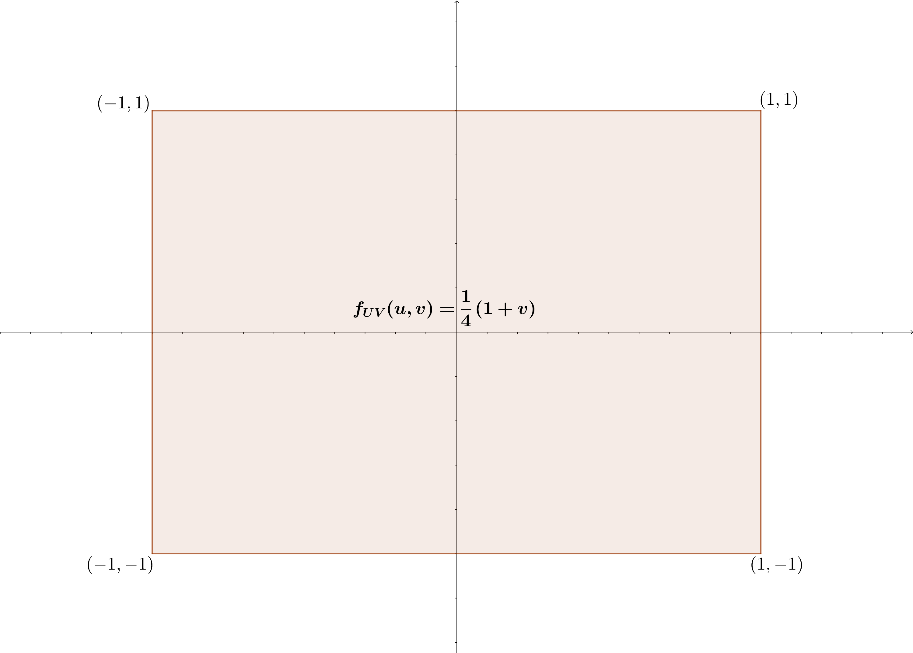
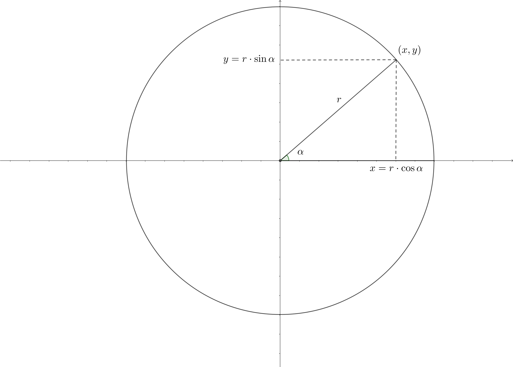

# Dos variables aleatorias

## Introducción
Muchos experimentos aleatorios involucran varias variables aleatorias. 

Por ejemplo, dado un individuo de 30 años escogido al azar de una cierta población, medir su altura y su peso conjuntamente.

Otro ejemplo más complejo sería la medición continuada de un *fenómeno aleatorio* que se repite en el tiempo, como sería medir la temperatura media un día determinado del año, por ejemplo el día 1 de enero en un cierto lugar. 

La variable aleatoria que nos da la medición en 10 años sería una variable aleatoria de varias variables que involucra 10 variables aleatorias supuestas independientes e idénticamente distribuidas, lo que en **estadística inferencial** se le llama una **muestra aleatoria simple**.

## Dos variables aleatorias. Definición

Recordemos que una **variable aleatoria** $X$ es una aplicación que toma valores numéricos para cada resultado de un experimento aleatorio:
$$
\begin{array}{rl}
(X,Y): \Omega & \longrightarrow \mathbb{R}\\
w & \longrightarrow X(w).
\end{array}
$$
A partir de la definición anterior, generalizamos la noción de **variable aleatoria unidimensional** a **variable aleatoria bidimensional**:

<l class="definition">Definición de variable aleatoria bidimensional:</l>
Dado un experimento aleatorio con **espacio muestral** $\Omega$, definimos **variable aleatoria bidimensional** $(X,Y)$ a toda aplicación 
$$
\begin{array}{rl}
X: \Omega & \longrightarrow \mathbb{R}^2\\
w & \longrightarrow (X(w),Y(w)).
\end{array}
$$

## Dos variables aleatorias. Ejemplos
<div class="example">
**Ejemplo**

Consideremos el experimento aleatorio de lanzar un dado no trucado dos veces.

Sea $S$ la suma de los resultados obtenidos y $P$ el producto de los mismos. 

La variable aleatoria $(S,P)$ que asigna a cada resultado $w=(x_1,x_2)$ donde $x_1$ es el resultado obtenido en el primer lanzamiento y $x_2$, el resultado obtenido en el segundo, los valores: $S(w)=x_1+x_2$ y $P(w)=x_1\cdot x_2$ sería una variable aleatoria bidimensional.

El suceso $\{2\leq S\leq 4,\ 3\leq P\leq 6\}$ seria:
$$
\{2\leq S\leq 4,\ 3\leq P\leq 6\} = \{(1,3),(3,1),(2,2)\}.
$$

</div>
<div class="example">
**Ejemplo**

Consideremos el experimento aleatorio de elegir al azar un estudiante de primer curso de grado. Sea $w$ el estudiante elegido. Consideremos la variable aleatoria $(H,W)$ que asigna a dicho estudiante $w$, $H(w):$ la altura de dicho estudiante en cm. y $W(w):$ el peso de dicho estudiante en kg.

Estamos interesado en sucesos del tipo $A=\{H\leq 176,\ W\leq 85\}$, o sea, el conjunto de estudiantes que miden menos de 1.76 m. y que pesan menos de 85 kg.
</div>

<!-- ## Dos variables aleatorias. Introducción  -->
<!-- Los sucesos que se derivan de una **variable aleatoria bidimensional** estan especificados por regiones del plano. -->
<!-- Veamos algunos ejemplos: -->

<!-- * Suceso: $\{X+Y\leq 1\}$. Sería la zona sombreada del gráfico siguiente: -->

<!-- ```{r,echo=FALSE} -->
<!-- xmin=-2 -->
<!-- xmax=3 -->
<!-- ymin=-2 -->
<!-- ymax=3 -->
<!-- tolx=0.0075*(xmax-xmin) -->
<!-- toly=0.0075*(ymax-ymin) -->
<!-- quantsx=5 -->
<!-- quantsy=5 -->
<!-- f = function(x){1-x} -->
<!-- plot(c(xmin-tolx,xmax+tolx,xmin-tolx,xmax+tolx),c(ymin-toly,ymin-toly,ymax+toly,ymax+toly),type="n",xlab="",ylab="",xaxt="n",yaxt="n",axes=FALSE) -->
<!-- x=seq(from=xmin,to=xmax,by=0.01) -->
<!-- #points(x,f(x),type="l") -->
<!-- lines(c(0,0),c(ymin,ymax)) -->
<!-- lines(c(xmin,xmax),c(0,0)) -->
<!-- text(xmax-tolx,2*tolx,"x") -->
<!-- text(toly,ymax+toly/2,"y") -->
<!-- for (i in 0:(quantsx)){ -->
<!--   lines(rep(xmin+((xmax-xmin)/quantsx)*i,2),c(-0.5*toly,0.5*toly)) -->
<!--   text(xmin+((xmax-xmin)/quantsx)*i,-3*toly,xmin+((xmax-xmin)/quantsx)*i,cex=0.75)} -->
<!-- for (i in 0:(quantsy)){ -->
<!--   lines(c(-tolx,tolx),rep(ymin+((ymax-ymin)/quantsy)*i,2)) -->
<!--   text(-3*tolx,ymin+((ymax-ymin)/quantsy)*i,ymin+((ymax-ymin)/quantsy)*i,cex=0.75)} -->
<!-- x2=seq(from=xmin,to=xmax,by=0.01) -->
<!-- lines(x2,f(x2),col="red") -->
<!-- #for (i in 1:length(x2)){ -->
<!-- #  lines(c(x2[i],x2[i]),c(-2,f(x2[i])),lty=1) -->
<!-- #} -->
<!-- polygon(c(xmax,xmin,x2),c(ymin,ymin,f(x2)),col="red") -->
<!-- #for (i in 1:(length(x2)-1)){ -->
<!-- #  polygon(c(x2[i],x2[i+1],x2[i+1],x2[i]),c(-2,-2,f(x2[i+1]),f(x2[i])),col="blue") -->
<!-- #} -->
<!-- ``` -->


## Dos variables aleatorias. Introducción 
Los sucesos que se derivan de una **variable aleatoria bidimensional** estan especificados por regiones del plano.
Veamos algunos ejemplos:

Suceso: $\{X+Y\leq 1\}$. Sería la zona sombreada del gráfico siguiente:

<div class="center">


</div>

## Dos variables aleatorias. Introducción 
Suceso: $\{X^2+Y^2\leq 4\}$. Sería la zona sombreada del gráfico siguiente:

<div class="center">


</div>

## Dos variables aleatorias. Introducción 
Suceso: $\{\max\{X,Y\}\geq 1\}$. Sería la zona sombreada del gráfico siguiente:

<div class="center">


</div>

## Dos variables aleatorias. Introducción 

La probabilidad de que la **variable bidimensional** pertenezca a una cierta **región del plano $B$** se define de la forma siguiente:
$$
P((X,Y)\in B)=P\{w\in \Omega,\ |\ (X(w),Y(w))\in B\},
$$
o sea, la probabilidad anterior es la probabilidad del suceso formado por los elementos de $w\in\Omega$ que cumplen que su **imagen** por la **variable aleatoria bidimensional $(X,Y)$** esté en $B$.


Por ejemplo, si consideramos $B=\{X+Y\leq 1\}$, $P((X,Y)\in B)$ sería la probabilidad del suceso formado por los elementos $w$ de $\Omega$ tal que la suma de las imágenes por $X$ e $Y$ sea menor o igual que 1: $X(w)+Y(w)\leq 1$.

# Función de distribución conjunta

## Función de distribución conjunta. Introducción
Dada una **variable aleatoria bidimensional** $(X,Y)$, queremos estudiar cómo se distribuye la probabilidad de sucesos cualesquiera de la forma $\{(X,Y)\in B\}$, donde $B$ es una región del plano.

Para ello, definimos la **función de distribución conjunta**:

<l class="definition">Definición de función de distribución conjunta:</l>
Dada una variable bidimensional $(X,Y)$, definimos su **función de distribución conjunta** $F_{XY}$ a la función definida sobre $\mathbb{R}^2$ de la manera siguiente:
$$
\begin{array}{rl}
F_{XY}: \mathbb{R}^2 & \longrightarrow \mathbb{R}\\
(x,y) & \longrightarrow F_{XY}(x,y)=P(X\leq x,\ Y\leq y).
\end{array}
$$

## Función de distribución conjunta. Introducción

O sea, dado un valor $(x,y)\in \mathbb{R}^2$, consideramos la región del plano $(-\infty,x]\times (-\infty,y]$:
<div class="center">


</div>

## Función de distribución conjunta. Introducción
Entonces la **función de distribución conjunta** en el valor $(x,y)$ es la probabilidad del suceso formado por aquellos elementos tal que la imagen por la **variable aleatoria bidimensional** $(X,Y)$ caen dentro de la región sombreada en el gráfico anterior:

$$
\begin{array}{rl}
F_{XY}(x,y) & =P\{w\in\Omega,\ |\ (X(w),Y(w))\in (-\infty,x]\times (-\infty,y]\} \\ & = P\{w\in\Omega,\ |\ X(w)\leq x,\ Y(w)\leq y\}.
\end{array}
$$

## Función de distribución conjunta. Propiedades
Sea $(X,Y)$ una variable bidimensional. Sean $F_{XY}$ su **función de distribución conjunta**. Dicha función satisface las propiedades siguientes:

* La función de distribución conjunta es no decreciente en cada una de las variables:
$$
\mbox{Si }x_1\leq x_2, \mbox{ y }y_1\leq y_2,\mbox{ entonces, }F_{XY}(x_1,y_1)\leq F_{XY}(x_2,y_2).
$$

* $F_{XY}(x,-\infty)=F_{XY}(-\infty,y)=0,$ $F_{XY}(\infty,\infty)=1$, para todo $x,y\in\mathbb{R}$.


## Función de distribución conjunta. Propiedades

* Las variables aleatorias $X$ e $Y$ se llaman **variables aleatorias marginales** y sus funciones de distribución $F_X$ y $F_Y$ pueden hallarse de la forma siguiente como función de la **función de distribución conjunta** $F_{XY}$:
$$
F_X(x)=F_{XY}(x,\infty),\ F_Y(y)=F_{XY}(\infty,y),
$$
para todo $x,y\in\mathbb{R}$.

* La función de distribución conjunta es continua por el "norte" y por el "este":
$$
\begin{array}{rl}
\lim_{x\to a^+}F_{XY}(x,y) & =\lim_{x\to a, x> a}F_{XY}(x,y)=F_{XY}(a,y), \\
\lim_{y\to b^+}F_{XY}(x,y) & =\lim_{y\to b, y> b}F_{XY}(x,y)=F_{XY}(x,b),
\end{array}
$$
para todo $a,b\in\mathbb{R}$. Ver figura siguiente.

## Función de distribución conjunta. Propiedades
<div class="center">


</div>


## Función de distribución conjunta. Propiedades

* Dados $x_1<x_2$ y $y_1<y_2$, consideramos $B$ el rectángulo de vértices $(x_1,y_1)$, $(x_1,y_2)$, $(x_2,y_1)$ y $(x_2,y_2)$: $(x_1,x_2]\times (y_1,y_2]$. Entonces,
$$
\begin{array}{rl}
P((X,Y)\in B)  = & F_{XY}(x_2,y_2)-F_{XY}(x_2,y_1)-F_{XY}(x_1,y_2)\\ & +F_{XY}(x_1,y_1).
\end{array}
$$

## Función de distribución conjunta. Propiedades

<div class="center">


</div>

## Función de distribución conjunta. Ejemplo
<div class="example">
**Ejemplo**

Consideremos una variable aleatoria bidimensional $(X,Y)$ con **función de distribución conjunta**:
$$
F_{XY}(x,y)=\begin{cases}
0, & \mbox{si }x<0,\mbox{ o }y<0,\\
xy, & \mbox{si }0\leq x\leq 1,\ 0\leq y\leq 1, \\
x, & \mbox{si }0\leq x\leq 1,\ y> 1, \\
y, & \mbox{si }0\leq y\leq 1,\ x> 1, \\
1, & x\geq 1,\ y\geq 1.
\end{cases}
$$
En la figura siguiente, hemos representado por zonas cómo está definida $F_{XY}$.
</div>


## Función de distribución conjunta. Ejemplo
<div class="example">
<div class="center">


</div>
</div>

## Función de distribución conjunta. Ejemplo
<div class="example">
Comprobemos algunas de las propiedades que hemos enunciado anteriormente:

* Claramente $F_{XY}(x,-\infty)=F_{XY}(-\infty,y)=0$ ya que $F_{XY}(x,y)=0$ si $x<0$ o $y<0$. Por tanto, si hacemos tender $x$ o $y$ hacia $-\infty$, obtendremos que $F_{XY}(x,-\infty)=F_{XY}(-\infty,y)=0$.

* De la misma manera $F_{XY}(\infty,\infty)=1$ ya que $F_{XY}(x,y)=1$ para $x>1$ e $y>1$. Por tanto, si hacemos tender $x$ e $y$ hacia $\infty$, obtendremos $F_{XY}(\infty,\infty)=1$.

* Hallemos las marginales:
$$
F_X(x)=F_{XY}(x,\infty)=\begin{cases}
0, & \mbox{ si }x<0,\\
x, & \mbox{ si } 0\leq x\leq 1,\\
1, & \mbox{ si } x>1.
\end{cases}
$$
Para ver la expresión anterior basta trazar la recta vertical $X=x$ en el gráfico anterior y ver hacia dónde tiende a medida que la $y$ se va hacia $\infty$. 

¿Habéis averiguado cuál es la distribución de $X$?
</div>


## Función de distribución conjunta. Ejemplo
<div class="example">
¡Efectivamente!, $X$ es la uniforme en el intervalo $(0,1)$.

Dejamos como ejercicio hallar la distribución marginal para la variable $Y$.

* Comprobemos que $F_{XY}$ es continua por el "norte" y el "este" en el punto $(1,1)$ que sería un punto problemático:
$$
\lim_{x\to 1,x> 1} F_{XY}(x,1)=\lim_{x\to 1,x> 1} 1  = F_{XY}(1,1),\ \lim_{y\to 1,y> 1} F_{XY}(1,y)=\lim_{y\to 1,y> 1} 1  = F_{XY}(1,1).
$$

</div>

## Función de distribución conjunta. Ejemplo con `R`
<div class="example">
Hagamos un gráfico 3D de la **función de distribución conjunta** usando la función `persp` de `R` para $x$ e $y$ entre -2 y 2.

Primero definimos la **función** y luego la dibujamos:


```r
f.dist.con = function(x,y){ifelse(x<0 | y<0,0,
                           ifelse(x>=0 & x<=1 & y>=0 & y<=1,x*y,
                           ifelse(x>=0 & x<=1 & y >1,x,ifelse(y>=0 & y<=1 & x>1,y,1))))}
x=seq(from=-2,to=2,by=0.1)
y=seq(from=-2,to=2,by=0.1)
z=outer(x,y,f.dist.con)
persp(x,y,z,theta=50,phi=40,col="blue",shade=0.25,ticktype="detailed")
```

</div>

## Función de distribución conjunta. Ejemplo con `R`



## Función de distribución conjunta. Ejemplo

<div class="example">
**Ejemplo: dos lanzamientos de un dado no trucado**

Consideremos el experimento aleatorio de lanzar dos veces un dado no trucado. 

Sea $(S,P)$ la **variable aleatoria bidimensional** que nos da la suma y el producto de los resultados obtenidos, respectivamente.

La **función de distribución conjunta** en el valor $(3,4)$ será:
$$
F_{XY}(3,4) = P(S\leq 3,\ P\leq 4)=P\{(1,1), (1,2), (2,1) \}=\frac{3}{36}=\frac{1}{12}\approx 0.083, 
$$
ya que $\Omega$ tiene en total $36$ resultados:
$$
\Omega =\{(1,1),(1,2).\ldots, (6,6)\}.
$$
y los únicos resultados en los que la suma es menor o igual que 3 y el producto menor o igual que 4 son $(1,1)$ (suma 2 producto 1), $(1,2)$ (suma 3 y producto 2) y $(2,1)$ (suma 3 y producto 2).
</div>

## Función de distribución conjunta. Ejemplo

<div class="exercise">
**Ejercicio**

Hallar el valor de la **función de distribución conjunta** para la **variable aleatoria bidimensional** anterior $(S,P)$ en los valores $(i,j)$ siguientes: $(4,5),\ (4,9),\ (5,9),\ (6,10)$.
</div>

# Variables aleatorias bidimensionales discretas

## Variables aleatorias bidimensionales discretas. Introducción

<l class="definition">Definición de variable aleatoria bidimensional discreta:</l>
Sea $(X,Y)$ una **variable aleatoria bidimensional**. Diremos que es discreta cuando su conjunto de valores en $\mathbb{R}^2$, $(X,Y)(\Omega)$ es un conjunto finito o numerable. 

En la mayoría de los casos, dicho conjunto será un subconjunto de los enteros naturales.

## Variables aleatorias bidimensionales discretas. Ejemplo

<div class="example">
**Ejemplo**

La variable aleatoria bidimensional anterior que nos daba la suma y el producto de los resultados obtenidos por los dos lanzamientos, respectivamente es discreta ya que: 
$$
\begin{array}{rl}
(S,P)(\Omega) & =\{(2,1),(3,2),(4,3),(4,4),(5,4),(5,6),(6,5),(6,8),(6,9),(7,6),(7,10),(7,12),(8,12),\\ & (8,15),(8,16),(9,18),(9,20),(10,24),(10,25),(11,30),(12,36)\}.
\end{array}
$$

</div>

## Variables aleatorias bidimensionales discretas. Ejemplo

<div class="exercise">
**Ejercicio**

Comprobar que el conjunto $(S,P)(\Omega)$ dado por el ejemplo coincide con la expresión dada. 
O sea, hallar el conjunto $(S,P)(\Omega)$:
$$
\begin{array}{rl}
(S,P): \Omega & \longrightarrow \mathbb{R}^2\\
(1,1) & \longrightarrow (S(1,1),P(1,1))=(2,1),\\
(1,2) & \longrightarrow (S(1,2),P(1,2))=(3,2),\\
\vdots & \vdots \\
(6,6) & \longrightarrow (S(6,6),P(6,6))=(12,36).
\end{array}
$$

</div>

## Función de probabilidad conjunta
<l class="definition">Definición de función de probabilidad conjunta:</l>
Dada una **variable aleatoria bidimensional discreta** $(X,Y)$ con $(X,Y)(\Omega)=\{(x_i,y_j),\ i=1,2,\ldots,\ j=1,2,\ldots,\}$, definimos la función de probabilidad discreta $P_{XY}$ para un valor $(x,y)\in\mathbb{R}^2$ de la siguiente forma:
$$
\begin{array}{rl}
P_{XY}: \mathbb{R}^2 & \longrightarrow \mathbb{R}\\
(x,y) & \longrightarrow P_{XY}(x,y)=P(X= x,\ Y= y).
\end{array}
$$

<l class="observ">Observación:</l>
Si $(x,y)\not\in (X,Y)(\Omega)$, el valor de la **función de probabilidad conjunta** en $(x,y)$ en nulo: $P_{XY}(x,y)=0$, ya que, en este caso, el conjunto $\{w\in\Omega,\ | (X(w),Y(w))=(x,y)\}=\emptyset$ ya que recordemos $(x,y)\not\in (X,Y)(\Omega)$.

## Función de probabilidad conjunta

Por tanto, de cara a calcular $P_{XY}$ basta calcular $P_{XY}(x_i,y_j)$ para $(x_i,y_j)\in (X,Y)(\Omega)$:

<div class="center">
| $X/Y$| $y_1$    | $y_2$  | $\ldots$ | $y_N$ |
|----|----|----|----|----|
| $x_1$| $P_{XY}(x_1,y_1)$ | $P_{XY}(x_1,y_2)$ | $\ldots$ | $P_{XY}(x_1,y_N)$|
| $x_2$| $P_{XY}(x_2,y_1)$ | $P_{XY}(x_2,y_2)$ | $\ldots$ | $P_{XY}(x_2,y_N)$|
| $\vdots$ |$\vdots$ |$\vdots$ |$\vdots$ |$\vdots$ |
| $x_M$| $P_{XY}(x_M,y_1)$ | $P_{XY}(x_M,y_2)$ | $\ldots$ | $P_{XY}(x_M,y_N)$|
</div>


## Función de probabilidad conjunta. Ejemplo
<div class="example">
**Ejemplo de la suma y el producto de los resultados de dos lanzamientos de un dado**

La **función de probabilidad conjunta** será:
<div class="center">
| $S/P$| 1 | 2| 3 | 4 | 5| 6 | 8| 9| 10 | 12 | 15 | 16 | 18 | 20 | 24 | 25 | 30 | 36 
|--|--|--|--|--|--|--|--|--|--|--|--|--|--|--|--|--|--|--
| 2    |$\frac{1}{36}$|0 |0|0|0|0|0|0|0|0|0|0|0|0|0|0|0|0
| 3    | 0 | $\frac{2}{36}$ |0|0|0|0|0|0|0|0|0|0|0|0|0|0|0|0
| 4   | 0 | 0 | $\frac{2}{36}$ | $\frac{1}{36}$ | 0|0|0|0|0|0|0|0|0|0|0|0|0|0
| 5   | 0 | 0 | 0 | $\frac{2}{36}$ | 0 | $\frac{2}{36}$ | 0|0|0|0|0|0|0|0|0|0|0|0
| 6 | 0 | 0 | 0 | 0 | $\frac{2}{36}$ | 0 | $\frac{2}{36}$ |$\frac{1}{36}$|0|0|0|0|0|0|0|0|0|0
</div>

</div>


## Función de probabilidad conjunta. Ejemplo
<div class="example">
<div class="center">
| $S/P$| 1 | 2| 3 | 4 | 5| 6 | 8| 9| 10 | 12 | 15 | 16 | 18 | 20 | 24 | 25 | 30 | 36 
|--|--|--|--|--|--|--|--|--|--|--|--|--|--|--|--|--|--|--
| 7 | 0 |0|0|0|0|$\frac{2}{36}$|0|0|$\frac{2}{36}$|$\frac{2}{36}$|0|0|0|0|0|0|0|0
|8  |0|0|0|0|0|0|0|0|0|$\frac{2}{36}$|$\frac{2}{36}$|$\frac{1}{36}$|0|0|0|0|0|0
|9 |0|0|0|0|0|0|0|0|0|0|0|0|$\frac{2}{36}$|$\frac{2}{36}$|0|0|0|0
| 10 | 0|0|0|0|0|0|0|0|0|0|0|0|0|0|$\frac{2}{36}$|$\frac{1}{36}$|0|0
| 11 | 0|0|0|0|0|0|0|0|0|0|0|0|0|0|0|0|$\frac{2}{36}$|0
| 12 |  0|0|0|0|0|0|0|0|0|0|0|0|0|0|0|0|0|$\frac{1}{36}$
</div>

</div>

## Función de probabilidad conjunta. Ejemplo con `R`
<div class="example">

Vamos a definir unas funciones en `R` para calcular la **función de probabilidad conjunta**.

La función `pdado` devuelve la probabilidad de que salga la cara `x` en un dado de `n` caras donde por defecto $n=6$:

```r
pdado =function(x,n=6)  sapply(x,FUN=function(x) 
  if( x %in% c(1:n))  {return(1/n)} else {return(0)})
```
Vamos a probarla. La probabilidad de que salga la cara 4 en un dado de 6 caras vale:

```r
pdado(4,6)
```

```
## [1] 0.1666667
```
</div>


## Función de probabilidad conjunta. Ejemplo con `R`
<div class="example">
La función `pdado2` devuelve la probabilidad de que salgan las caras `x` e  `y` cuando lanzamos un dado de `n` caras dos veces:

```r
pdado2 =function(x,y,n=6) {pdado(x,n)*pdado(y,n)}
```
Por ejemplo la probabilidad de que salgan las caras 3 y 4 en un dado de 6 caras será:

```r
pdado2(3,4,6)
```

```
## [1] 0.02777778
```

</div>

## Función de probabilidad conjunta. Ejemplo con `R`
<div class="example">
La función `psum_prod` nos da la **función de probabilidad conjunta** de la suma y el producto cuando lanzamos dos dados de `n` caras:

```r
psum_prod=function(x,y,n=6){
  Dxy=data.frame(d1=rep(1:n,each=n),d2=rep(1:n,times=n))
  Dxy$suma=Dxy$d1+Dxy$d2
  Dxy$producto=Dxy$d1*Dxy$d2
  aux=Dxy[Dxy$suma==x& Dxy$producto==y,]
  sum(apply(aux[,1:2],FUN=function(x) {pdado2(x[1],x[2],n=n)},1 ))
}
```

Por ejemplo, sabemos que $P_{SP}(6,8)=\frac{2}{36}=0.0556$:


```r
psum_prod(6,8)
```

```
## [1] 0.05555556
```


</div>

## Función de probabilidad conjunta. Ejemplo con `R`
<div class="example">
Para construir la tabla de la **función de probabilidad conjunta** para la variable $(S,P)$ hacemos lo siguiente:

```r
n=6
Dxy=data.frame(d1=rep(1:n,each=n),d2=rep(1:n,times=n))
Dxy$suma=Dxy$d1+Dxy$d2
Dxy$producto=Dxy$d1*Dxy$d2
tabla.func.prob.conjunta=prop.table(table(Dxy$suma,Dxy$producto))
knitr::kable(round(tabla.func.prob.conjunta[1:6,1:9],4))
knitr::kable(round(tabla.func.prob.conjunta[1:6,10:18],4))
knitr::kable(round(tabla.func.prob.conjunta[7:11,1:9],4))
knitr::kable(round(tabla.func.prob.conjunta[7:11,10:18],4))
```

</div>

## Función de probabilidad conjunta. Ejemplo con `R`
<div class="example">

|   |      1|      2|      3|      4|      5|      6|      8|      9|     10|
|:--|------:|------:|------:|------:|------:|------:|------:|------:|------:|
|2  | 0.0278| 0.0000| 0.0000| 0.0000| 0.0000| 0.0000| 0.0000| 0.0000| 0.0000|
|3  | 0.0000| 0.0556| 0.0000| 0.0000| 0.0000| 0.0000| 0.0000| 0.0000| 0.0000|
|4  | 0.0000| 0.0000| 0.0556| 0.0278| 0.0000| 0.0000| 0.0000| 0.0000| 0.0000|
|5  | 0.0000| 0.0000| 0.0000| 0.0556| 0.0000| 0.0556| 0.0000| 0.0000| 0.0000|
|6  | 0.0000| 0.0000| 0.0000| 0.0000| 0.0556| 0.0000| 0.0556| 0.0278| 0.0000|
|7  | 0.0000| 0.0000| 0.0000| 0.0000| 0.0000| 0.0556| 0.0000| 0.0000| 0.0556|

</div>

## Función de probabilidad conjunta. Ejemplo con `R`
<div class="example">

|   |     12| 15| 16| 18| 20| 24| 25| 30| 36|
|:--|------:|--:|--:|--:|--:|--:|--:|--:|--:|
|2  | 0.0000|  0|  0|  0|  0|  0|  0|  0|  0|
|3  | 0.0000|  0|  0|  0|  0|  0|  0|  0|  0|
|4  | 0.0000|  0|  0|  0|  0|  0|  0|  0|  0|
|5  | 0.0000|  0|  0|  0|  0|  0|  0|  0|  0|
|6  | 0.0000|  0|  0|  0|  0|  0|  0|  0|  0|
|7  | 0.0556|  0|  0|  0|  0|  0|  0|  0|  0|


</div>

## Función de probabilidad conjunta. Ejemplo con `R`
<div class="example">

|   |  1|  2|  3|  4|  5|  6|  8|  9| 10|
|:--|--:|--:|--:|--:|--:|--:|--:|--:|--:|
|8  |  0|  0|  0|  0|  0|  0|  0|  0|  0|
|9  |  0|  0|  0|  0|  0|  0|  0|  0|  0|
|10 |  0|  0|  0|  0|  0|  0|  0|  0|  0|
|11 |  0|  0|  0|  0|  0|  0|  0|  0|  0|
|12 |  0|  0|  0|  0|  0|  0|  0|  0|  0|


</div>

## Función de probabilidad conjunta. Ejemplo con `R`
<div class="example">

|   |     12|     15|     16|     18|     20|     24|     25|     30|     36|
|:--|------:|------:|------:|------:|------:|------:|------:|------:|------:|
|8  | 0.0556| 0.0556| 0.0278| 0.0000| 0.0000| 0.0000| 0.0000| 0.0000| 0.0000|
|9  | 0.0000| 0.0000| 0.0000| 0.0556| 0.0556| 0.0000| 0.0000| 0.0000| 0.0000|
|10 | 0.0000| 0.0000| 0.0000| 0.0000| 0.0000| 0.0556| 0.0278| 0.0000| 0.0000|
|11 | 0.0000| 0.0000| 0.0000| 0.0000| 0.0000| 0.0000| 0.0000| 0.0556| 0.0000|
|12 | 0.0000| 0.0000| 0.0000| 0.0000| 0.0000| 0.0000| 0.0000| 0.0000| 0.0278|


</div>

## Propiedades de la función de probabilidad conjunta

Sea $(X,Y)$ una **variable aleatoria bidimensional discreta** con conjunto de valores $(X,Y)(\Omega)=\{(x_i,y_j)\, i=1,2,\ldots,\ j=1,2,\ldots\}$. Entonces su **función de probabilidad conjunta** verifica las propiedades siguientes:

La suma de todos los valores de la **función de probabilidad conjunta** sobre el conjunto de valores siempre vale 1: $$\sum_{i}\sum_j P_{XY}(x_i,y_j)=1.$$


## Propiedades de la función de probabilidad conjunta

Sea $B$ una región del plano. El valor de la probabilidad $P((X,Y)\in B)$ se puede calcular de la forma siguiente:
$$
P((X,Y)\in B) =\sum_{(x_i,y_j)\in B} P_{XY}(x_i,y_j).
$$
O sea, la probabilidad de que la variable bidimensional coja valores en $B$ es igual a la suma de todos aquellos valores de la función de probabilidad conjunta que están en $B$.

## Propiedades de la función de probabilidad conjunta

En particular, tenemos la relación siguiente que relaciona la **función de distribución conjunta** con la **función de probabilidad conjunta**:
$$
F_{XY}(x,y)=\sum_{x_i\leq x, y_j\leq y} P_{XY}(x_i,y_j).
$$
Dicha expresión se deduce de la expresión anterior considerando $B=(-\infty,x]\times (-\infty,y]$.


## Propiedades de la función de probabilidad conjunta. Ejemplo

<div class="example">
**Ejemplo de la suma y el producto de los resultados de dos lanzamientos de un dado**

<div class="exercise">
**Ejercicio**

Comprobad usando la tabla de la función de probabilidad conjunta que la suma de todos sus valores suma 1.
</div>

Apliquemos la fórmula que relaciona la función de distribución conjunta con la función de probabilidad conjunta para $(x,y)=(5,4)$.

Recordemos la tabla de la función de probabilidad conjunta hasta $S=5$ y $P=4$:


</div>


## Propiedades de la función de probabilidad conjunta. Ejemplo

<div class="example">

<div class="center">
| $S/P$| 1 | 2| 3 | 4 | 
|--|--|--|---|---|--
| 2    |$\frac{1}{36}$|0 |0|0|$\ldots$
| 3    | 0 | $\frac{2}{36}$ |0|0|$\ldots$
| 4   | 0 | 0 | $\frac{2}{36}$ | $\frac{1}{36}$ | $\ldots$
| 5   | 0 | 0 | 0 | $\frac{2}{36}$ | $\ldots$
| $\vdots$ | $\vdots$ | $\vdots$ | $\vdots$ | $\vdots$ | $\vdots$
</div>


</div>

## Propiedades de la función de probabilidad conjunta. Ejemplo

<div class="example">
Observamos que los únicos valores $(x_i,y_j)\in (X,Y)(\Omega)$ que verifican $x_i\leq 5$ y $y_j\leq 4$ son $(2,1)$, $(3,2)$, $(4,3)$, $(4,4)$ y $(5,4)$. Por tanto,
$$
\begin{array}{rl}
F_{SP}(5,4) & = P_{SP}(2,1)+P_{SP}(3,2)+P_{SP}(4,3)+P_{SP}(4,4)+P_{SP}(5,4) \\ & = \frac{1}{36}+\frac{2}{36}+\frac{2}{36}+\frac{1}{36}+\frac{2}{36} = \frac{8}{36}=\frac{2}{9}.
\end{array}
$$
O sea, "a la larga", de cada 9 ocasiones que lanzamos un dado dos veces, en 2 ocasiones obtenemos un resultado cuya suma es menor o igual que 5 y cuyo producto es menor o igual que 4.
</div>

## Propiedades de la función de probabilidad conjunta. Ejemplo con `R`
<div class="example">
Para definir la **función de distribución conjunta** definimos la función siguiente en `R`:

```r
func.dist.conj = function(x,y,n=6){
  sum(tabla.func.prob.conjunta[as.integer(rownames(tabla.func.prob.conjunta))<=x,
                            as.integer(colnames(tabla.func.prob.conjunta)) <=y])
}
```
Comprobemos que $F_{SP}(5,4)=\frac{2}{9}=0.2222$:

```r
func.dist.conj(5,4)
```

```
## [1] 0.2222222
```


</div>


## Variables aleatorias marginales
Consideremos una variable aleatoria **bidimensional discreta $(X,Y)$** con **función de probabilidad conjunta** $P_{XY}(x_i,y_j)$, con $(x_i,y_j)\in (X,Y)(\Omega)$, $i=1,2,\ldots$, $j=1,2,\ldots$.

La tabla de la **función de probabilidad conjunta** contiene suficiente información para obtener las **funciones de probabilidad** de las variables $X$ e $Y$. 

Dichas variables $X$ e $Y$ se denominan **distribuciones marginales** y sus correspondientes **funciones de probabilidad**, **funciones de probabilidad marginales** $P_X$ de la variable $X$ y $P_Y$ de la variable $Y$.

Veamos cómo obtener $P_X$ y $P_Y$ a partir de la tabla $P_{XY}$.

## Variables aleatorias marginales
<l class="prop">Proposición. Expresión de las funciones de probabilidad marginales. </l>
Sea $(X,Y)$ una variable aleatoria **bidimensional discreta** con **función de probabilidad conjunta** $P_{XY}(x_i,y_j)$, con $(x_i,y_j)\in (X,Y)(\Omega)$, $i=1,2,\ldots$, $j=1,2,\ldots$.

Las **funciones de probabilidad marginales** $P_X(x_i)$ y $P_Y(y_j)$ se calculan usando las expresiones siguientes:
$$
\begin{array}{rl}
P_X(x_i)  & = \sum_{j=1} P_{XY}(x_i,y_j),\  i=1,2,\ldots,\\ P_Y(y_j) &  = \sum_{i=1} P_{XY}(x_i,y_j),\ \ j=1,2,\ldots
\end{array}
$$

## Variables aleatorias marginales


O sea, si pensamos $P_{XY}$ como una tabla bidimensional donde en la primera fila están los valores de la variable $Y$ ($y_1,y_2,\ldots$) y en la primera columna están los valores de la variable $X$ ($x_1,x_2,\ldots$), para obtener la **función de probabilidad marginal** de la variable $X$ en el valor $x_i$, $P_X(x_i)$, hay que sumar todos los valores de $P_{XY}(x_i,y_j)$ correspondientes a la fila $i$-ésima y para obtener la **función de probabilidad marginal** de la variable $Y$ en el valor $y_j$, $P_Y(y_j)$, hay que sumar todos los valores de $P_{XY}(x_i,y_j)$ correspondientes a la columna $j$-ésima.

## Variables aleatorias marginales. Ejemplo

<div class="example">
**Ejemplo de la suma y el producto de los resultados de dos lanzamientos de un dado**

Hallemos la función de probabilidad marginal para la suma de los resultados $S$ usando la expresión vista:
$$
\begin{array}{rl}
P_S(2) & = P_{SP}(2,1)=\frac{1}{36},\\
P_S(3) & = P_{SP}(3,2)=\frac{2}{36},\\
P_S(4) & = P_{SP}(4,3)+P_{SP}(4,4)=\frac{2}{36}+\frac{1}{36}=\frac{3}{36}=\frac{1}{12},\\
P_S(5) & = P_{SP}(5,4)+P_{SP}(5,6)=\frac{2}{36}+\frac{2}{36}=\frac{4}{36}=\frac{1}{9},\\
P_S(6) & = P_{SP}(6,5)+P_{SP}(6,8)+P_{SP}(6,9)=\frac{2}{36}+\frac{2}{36}+\frac{1}{36}=\frac{5}{36},\\
P_S(7) & = P_{SP}(7,6)+P_{SP}(7,10)+P_{SP}(7,12)=\frac{2}{36}+\frac{2}{36}+\frac{2}{36}=\frac{6}{36}=\frac{1}{6},\\
P_S(8) & = P_{SP}(8,12)+P_{SP}(8,15)+P_{SP}(8,16)=\frac{2}{36}+\frac{2}{36}+\frac{1}{36}=\frac{5}{36},\\
P_S(9) & = P_{SP}(9,18)+P_{SP}(9,20)=\frac{2}{36}+\frac{2}{36}=\frac{4}{36}=\frac{1}{9},\\
P_S(10) & = P_{SP}(10,24)+P_{SP}(10,25)=\frac{2}{36}+\frac{1}{36}=\frac{3}{36}=\frac{1}{12},\\
P_S(11) & = P_{SP}(11,30)=\frac{2}{36},\\
P_S(12) & = P_{SP}(12,36)=\frac{1}{36}.
\end{array}
$$

</div>

## Variables aleatorias marginales. Ejemplo
<div class="example">
La **función de probabilidad marginal** de la suma $S$ queda resumida en la tabla siguiente:

<div class="center">
| $S$| 2 | 3| 4 | 5 | 6| 7| 8 | 9 | 10 | 11 | 12 
|--|--|--|--|--|--|--|--|--|--|--|--
| $P_S$|$\frac{1}{36}$|$\frac{2}{36}$|$\frac{3}{36}$|$\frac{4}{36}$|$\frac{5}{36}$|$\frac{6}{36}$|$\frac{5}{36}$|$\frac{4}{36}$|$\frac{3}{36}$|$\frac{2}{36}$|$\frac{1}{36}$
</div>

</div>


## Variables aleatorias marginales. Ejemplo con `R`
<div class="example">
Para hallar la **función de probabilidad marginal** de la suma basta sumar las filas de la tabla que nos daba la **función de probabilidad conjunta**:

```r
marginal.suma = apply(tabla.func.prob.conjunta,1,sum)
marginal.suma
```

```
##          2          3          4          5          6          7          8 
## 0.02777778 0.05555556 0.08333333 0.11111111 0.13888889 0.16666667 0.13888889 
##          9         10         11         12 
## 0.11111111 0.08333333 0.05555556 0.02777778
```
</div>

## Variables aleatorias marginales. Ejemplo con `R`
<div class="example">
De la misma manera, para hallar la **función de probabilidad marginal** del producto basta sumar las columnas de la tabla anterior:

```r
marginal.producto = apply(tabla.func.prob.conjunta,2,sum)
marginal.producto
```

```
##          1          2          3          4          5          6          8 
## 0.02777778 0.05555556 0.05555556 0.08333333 0.05555556 0.11111111 0.05555556 
##          9         10         12         15         16         18         20 
## 0.02777778 0.05555556 0.11111111 0.05555556 0.02777778 0.05555556 0.05555556 
##         24         25         30         36 
## 0.05555556 0.02777778 0.05555556 0.02777778
```
</div>

# Variables aleatorias bidimensionales continuas

## Introducción
Recordemos la definición de **variable continua unidimensional**: $X$ es continua si existe una función $f_X:\mathbb{R}\longrightarrow \mathbb{R}$, llamada **función de densidad** no negativa $f_X(x)\geq 0$, para todo $x\in\mathbb{R}$ tal que para cualquier intervalo $(a,b)$, la probabilidad de que $X$ esté en $(a,b)$ se calcula de la forma siguiente:
$$
P(X\in B)=P(a< X < b)=\int_B f_{X}(x)\,du=\int_a^b f_{X}(x)\,dx.
$$

## Introducción
La generalización natural será, entonces:

<l class="definition">Definición de variable aleatoria bidimensional continua. </l>
Sea $(X,Y)$ una variable aleatoria bidimensional. Diremos que $(X,Y)$ es continua si existe una función 
$f_{XY}:\mathbb{R}^2\longrightarrow \mathbb{R}$ llamada **función de densidad** no negativa $f_{XY}(x,y)\geq 0$ para todo $(x,y)\in\mathbb{R}^2$ tal que dado cualquier región $B$ del plano, la probabilidad de que $(X,Y)$ esté en $B$ se calcula de la forma siguiente:
$$
P((X,Y)\in B)=\int\int_B f_{XY}(x,y)\,dx\,dy.
$$

## Ejemplo
<div class="example">
**Ejemplo**

Consideremos la **función de densidad siguiente**:
$$
f_{XY}(x,y)=\begin{cases}
1, & \mbox{ si }0\leq x\leq 1,\ 0\leq y\leq 1, \\
0, & \mbox{en caso contrario.}
\end{cases}
$$
En este caso, si consideramos $B=\left[-1,\frac{1}{2}\right]\times \left[-1,\frac{1}{2}\right]$, la probabilidad de que $(X,Y)$ esté en $B$ se calcularía de la forma siguiente:
$$
P((X,Y)\in B)=\int_{-1}^{\frac{1}{2}}\int_{-1}^{\frac{1}{2}} f_{XY}(x,y)\, dx\, dy =\int_0^{\frac{1}{2}}\int_0^{\frac{1}{2}} 1\, dx\,dy=\int_0^{\frac{1}{2}} 1\, dx\int_0^{\frac{1}{2}} 1\, dy=\frac{1}{2}\cdot\frac{1}{2}=\frac{1}{4}.
$$
En la figura siguiente hemos dibujado en morado la región donde $f_{XY}$ no es cero, o sea $[0,1]\times [0,1]$, la región $B$ en verde y la región intersección de las dos anteriores que es donde tenemos que integrar la **función de densidad** dada.
</div>

## Ejemplo
<div class="center">


</div>

## Propiedades de la función de densidad
Sea $(X,Y)$ una **variable aleatoria bidimensional continua** con **función de densidad** $f_{XY}$. Entonces dicha función verifica las propiedades siguientes:

* La integral de dicha función sobre todo el plano vale 1: 
$$
\int\int_{\mathbb{R}^2} f_{XY}(x,y)\,dx\,dy =1.
$$
Para ver dicha propiedad, basta considerar $B=\mathbb{R}^2$, tener en cuenta que el suceso $(X,Y)\in \mathbb{R}^2$ es el total $\Omega$ y aplicar la definición de $f_{XY}$:
$$
P((X,Y)\in \mathbb{R}^2)=1= \int\int_{\mathbb{R}^2} f_{XY}(x,y)\,dx\,dy.
$$

## Propiedades de la función de densidad
* La relación que hay entre la **función de distribución** $F_{XY}$ y la **función de densidad** $f_{XY}$ es la siguiente:
$$
F_{XY}(x,y)=\int_{-\infty}^x\int_{-\infty}^y f_{XY}(u,v)\,du\,dv.
$$
Para ver dicha propiedad, basta considerar $B=(-\infty,x]\times (-\infty,y]$ y aplicar la definición de **función de distribución**:
$$
F_{XY}(x,y)=P((X,Y)\in (-\infty,x]\times (-\infty,y])=\int_{-\infty}^x\int_{-\infty}^y f_{XY}(u,v)\,du\,dv.
$$

## Propiedades de la función de densidad
* La relación que hay entre la **función de densidad** $f_{XY}$ y la **función de distribución** $F_{XY}$ es la siguiente:
$$
f_{XY}(x,y)=\frac{\partial^2 F_{XY}(x,y)}{\partial x\partial y}.
$$
Dicha propiedad se deduce de la anterior, derivando primero respecto a $x$ y después respecto a $y$ para eliminar las dos integrales.

* Las **funciones de densidad marginales** de las variables $X$ e $Y$, $f_X(x)$ y $f_Y(y)$ respectivamente, se calculan de la forma siguiente:
$$
f_X(x)=\int_{-\infty}^\infty f_{XY}(x,y)\, dy,\ f_Y(y)=\int_{-\infty}^\infty f_{XY}(x,y)\, dx
$$

## Ejemplo
<div class="example">
**Ejemplo anterior**

Comprobemos las propiedades usando la **función de densidad** del ejemplo anterior: 
$f_{XY}(x,y)=\begin{cases}
1, & \mbox{ si }0\leq x\leq 1,\ 0\leq y\leq 1, \\
0, & \mbox{en caso contrario.}
\end{cases}$

* La integral de $f_{XY}$ sobre todo el plano vale 1:
$$
\int\int_{\mathbb{R}^2} f_{XY}(x,y)\,dx\, dy=\int_0^1\int_0^1 1\, dx\, dv=\int_0^1 1\, dx\int_0^1 1\, dy=1\cdot 1=1.
$$

* Vamos a calcular la función de distribución $F_{XY}$. Para ello dividimos el plano en 5 zonas tal como muestra la figura siguiente:
</div>

## Ejemplo
<div class="center">


</div>


## Ejemplo
<div class="example">
Sea $(x,y)$ un punto cualquiera de $\mathbb{R}^2$. De cara a calcular $F_{XY}(x,y)$ tenemos que averiguar el conjunto intersección siguiente: $([0,1]\times [0,1])\cap ((-\infty,x]\times (-\infty,y])$ ya que el dominio donde $f_{XY}$ es no nula es $[0,1]\times [0,1]$ y la función de distribución $F_{XY}(x,y)$ valdrá:
$$
F_{XY}(x,y)=\int_{-\infty}^x\int_{-\infty}^y f_{XY}(u,v)\,du\,dv =\int\int_{([0,1]\times [0,1])\cap ((-\infty,x]\times (-\infty,y])} f_{XY}(u,v)\,du\,dv.
$$

* Caso $(x,y)\in \mbox{Zona A}$ o $x<0$ o $y<0$ En este caso: $([0,1]\times [0,1])\cap ((-\infty,x]\times (-\infty,y])=\emptyset.$ Ver figura siguiente donde la zona morada $([0,1]\times [0,1]$) no se interseca con la zona verde ($(-\infty,x]\times (-\infty,y]$).

Por tanto en este caso, $F_{XY}(x,y)=0$.
</div>


## Ejemplo
<div class="center">


</div>


## Ejemplo
<div class="example">
* Caso $(x,y)\in \mbox{Zona B}$, o $(x,y)\in [0,1]\times [0,1]$. En este caso: $([0,1]\times [0,1])\cap ((-\infty,x]\times (-\infty,y])=[0,x]\times [0,y].$ Ver figura siguiente. 

Por tanto en este caso, 
$$
F_{XY}(x,y)=\int_0^x \int_0^y 1\,du\,dv =\int_0^x 1\, du\int_0^y 1\, dy =x\cdot y.
$$

</div>

## Ejemplo
<div class="center">


</div>

## Ejemplo
<div class="example">
Dejamos como ejercicio los otros casos. En resumen:
$$
F_{XY}(x,y)=\begin{cases}
0, & \mbox{ si }x<0, \mbox{ o }y<0,\\
x y, & \mbox{ si }(x,y)\in [0,1]\times [0,1],\\
x, & \mbox{ si }0\leq x\leq 1,\ y>1,\\
y, & \mbox{ si }x>1,\ 0\leq y\leq 1,\\
1, & \mbox{ si } x>1,\ y>1.
\end{cases}
$$
¿Os suena? 

Ver el primer ejemplo que pusimos del tema. Es la misma variable aleatoria bidimensional. 
Ahora sabemos que se trata de una **variable aleatoria bidimensional continua**.
</div>

## Ejemplo
<div class="example">
Comprobemos seguidamente que si derivamos dos veces la expresión de $F_{XY}$, primero respecto $x$ y después respecto $y$, obtendremos la **función de densidad** $f_{XY}$.

Si derivamos respecto $x$ obtenemos:
$$
\frac{\partial F_{XY}(x,y)}{\partial x}=\begin{cases}
0, & \mbox{ si }x<0, \mbox{ o }y<0,\\
y, & \mbox{ si }(x,y)\in [0,1]\times [0,1],\\
1, & \mbox{ si }0\leq x\leq 1,\ y>1,\\
0, & \mbox{ si }x>1,\ 0\leq y\leq 1,\\
0, & \mbox{ si } x>1,\ y>1.
\end{cases}
$$
Si ahora derivamos respecto $y$ obtenemos:
$$
\frac{\partial^2 F_{XY}(x,y)}{\partial y\partial x}=\begin{cases}
0, & \mbox{ si }x<0, \mbox{ o }y<0,\\
1, & \mbox{ si }(x,y)\in [0,1]\times [0,1],\\
0, & \mbox{ si }0\leq x\leq 1,\ y>1,\\
0, & \mbox{ si }x>1,\ 0\leq y\leq 1,\\
0, & \mbox{ si } x>1,\ y>1,
\end{cases}
$$
expresión que coincide con la **función de densidad** $f_{XY}(x,y)$.
</div>


## Ejemplo
<div class="example">
Hallemos para finalizar las **funciones de densidad marginales**. Empecemos con $f_X(x)$:
$$
f_X(x)=\int_{-\infty}^\infty  f_{XY}(x,y)\, dy.
$$
Recordemos que la región donde no se anulaba la **función de densidad conjunta** $f_{XY}$ era el cuadrado $[0,1]\times [0,1]$. Por tanto, fijado $x$, el valor de $f_X(x)$ será no nulo si la recta vertical $X=x$ interseca dicho cuadrado. Y esto ocurre siempre que $x\in (0,1)$. Por tanto,
$$
f_X(x)=\begin{cases}
\int_{0}^1  f_{XY}(x,y)\, dy=\int_{0}^1  1\, dy=1, & \mbox{ si }x\in (0,1),\\
0, & \mbox{en caso contrario.}
\end{cases}
$$
Por tanto la variable $X$ sigue la distribución uniforme en el intervalo $[0,1]$.

Dejamos como ejercicio comprobar que la variable $Y$ también sigue la distribución uniforme en el mismo intervalo.
</div>


## Ejemplo 2
<div class="example">
**Ejemplo**

Consideremos la variable aleatoria bidimensional $(X,Y)$ con **función de densidad**:
$$
f_{XY}(x,y)=\begin{cases}
c \mathrm{e}^{-x}\mathrm{e}^{-y}, & 0\leq y\leq x < \infty,\\
0, & \mbox{ en caso contrario,}
\end{cases}
$$
donde $c$ es un valor que se tiene que hallar para que $f_{XY}$ sea función de densidad.

Para hallar $c$, hemos de imponer que la integral de la función anterior debe ser 1 sobre todo el plano $\mathbb{R}^2$.

Primero fijémonos en como es la región de integración (zona morada de la figura). Fijado un valor $x\geq 0$, el valor $y$ va desde $y=0$ hasta $y=x$. Por tanto, para calcular el valor de $c$, hay que hacer lo siguiente:


</div>

## Ejemplo
<div class="center">


</div>

## Ejemplo 2
<div class="example">

$$
\begin{array}{rl}
1 & =\int\int_{\mathbb{R}^2}f_{XY}(x,y)\, dx\, dy=\int_{x=0}^{x=\infty}\int_{y=0}^{y=x} c \mathrm{e}^{-x}\mathrm{e}^{-y} \, dy\, dx =c \int_{x=0}^{x=\infty}\mathrm{e}^{-x}\int_{y=0}^{y=x}\mathrm{e}^{-y}\, dy\, dx \\ & =
c \int_{x=0}^{x=\infty}\mathrm{e}^{-x}\left[-\mathrm{e}^{-y}\right]_{y=0}^{y=x}\, dx = c \int_{x=0}^{x=\infty}\mathrm{e}^{-x}\left(1-\mathrm{e}^{-x}\right)\, dx =c \int_{x=0}^{x=\infty}\left(\mathrm{e}^{-x}-\mathrm{e}^{-2x}\right)\, dx \\ & = c \left[-\mathrm{e}^{-x}+\frac{1}{2}\mathrm{e}^{-2x}\right]_{x=0}^{x=\infty} = c\left(1-\frac{1}{2}\right)=\frac{c}{2}.
\end{array}
$$
El valor de $c$ será $c=2$.

Vamos a calcular seguidamente su función de distribución.

Fijémonos que, en este caso, si $x<0$ o $y<0$, $F_{XY}(x,y)=0$, ya que el dominio $B=(-\infty,x]\times (-\infty,y]$ no interseca la zona morada del gráfico anterior.

Suponemos entonces que $x\geq 0$ e $y\geq 0$. 

Vamos a considerar dos casos:

* $x\leq y$. Ver zona verde del gráfico siguiente.

* $x\geq y$. Ver zona morada del gráfico siguiente.
</div>

## Ejemplo
<div class="center">


</div>

## Ejemplo 2
<div class="example">
* Caso $x\leq y$ (zona verde de la figura adjunta). En este caso, si hacemos la intersección de la región $B=(-\infty,x]\times (-\infty,y]$ (zona azul) con la zona morada o región donde $f_{XY}(x,y)\neq 0$ obtenemos el triángulo $T_{x,y}=\{(u,v)\in\mathbb{R}^2,\ 0\leq u\leq x,\ 0\leq v\leq u\}.$ Ver figura adjunta.

Por tanto,
$$
\begin{array}{rl}
F_{XY}(x,y) & =\int_{u=0}^{u=x}\int_{v=0}^{v=u} f_{XY}(u,v)\,dv\,du= 2 \int_{u=0}^{u=x} \mathrm{e}^{-u}\int_{v=0}^{v=u}  \mathrm{e}^{-v}\,dv\,du  =
2 \int_{u=0}^{u=x} \mathrm{e}^{-u}\left[-\mathrm{e}^{-v}\right]_{v=0}^{v=u}\, du \\ & = 2 \int_{u=0}^{u=x} \mathrm{e}^{-u} (1-\mathrm{e}^{-u})\, du =2 \int_{u=0}^{u=x} \left(\mathrm{e}^{-u}-\mathrm{e}^{-2u}\right)\, du=2 \left[-\mathrm{e}^{-u}+\frac{1}{2}\mathrm{e}^{-2u}\right]_{u=0}^{u=x}  \\ & =
2\left(-\mathrm{e}^{-x}+\frac{1}{2}\mathrm{e}^{-2x}+1-\frac{1}{2}\right) =1-2\mathrm{e}^{-x}+\mathrm{e}^{-2x}.
\end{array}
$$

</div>

## Ejemplo
<div class="center">


</div>


## Ejemplo 2
<div class="example">
* Caso $x\geq y$ (zona morada de la figura adjunta). En este caso, si hacemos la intersección de la región $B=(-\infty,x]\times (-\infty,y]$ (zona azul) con la zona morada o región donde $f_{XY}(x,y)\neq 0$ obtenemos el trapecio $T_{x,y}=\{(u,v)\in\mathbb{R}^2,\ 0\leq v\leq y,\ v\leq u\leq x\}.$ Ver figura adjunta.

Por tanto,
$$
\begin{array}{rl}
F_{XY}(x,y) & =\int_{v=0}^{v=y}\int_{u=v}^{u=x} f_{XY}(u,v)\,dv\,du= 2 \int_{v=0}^{v=y} \mathrm{e}^{-v}\int_{u=v}^{u=x} \mathrm{e}^{-u}\,du\,dv  =
2 \int_{v=0}^{v=y} \mathrm{e}^{-v}\left[-\mathrm{e}^{-u}\right]_{u=v}^{u=x}\, dv \\ & = 2 \int_{v=0}^{v=y} \mathrm{e}^{-v} (\mathrm{e}^{-v}-\mathrm{e}^{-x})\, du =2 \int_{v=0}^{v=y} \left(\mathrm{e}^{-2v}-\mathrm{e}^{-v-x}\right)\, du=2 \left[-\frac{1}{2}\mathrm{e}^{-2v}+\mathrm{e}^{-v-x}\right]_{v=0}^{v=y}  \\ & =
2\left(-\frac{1}{2}\mathrm{e}^{-2y}+\mathrm{e}^{-x-y}+\frac{1}{2}-\mathrm{e}^{-x}\right) =1-2\mathrm{e}^{-x}-\mathrm{e}^{-2y}+2\mathrm{e}^{-x-y}.
\end{array}
$$
</div>

## Ejemplo
<div class="center">


</div>

## Ejemplo 2
<div class="example">
En resumen:
$$
F_{XY}(x,y)=\begin{cases}
1-2\mathrm{e}^{-x}+\mathrm{e}^{-2x}, & \mbox{si }x\geq 0,\ y\geq 0,\ x\leq y,\\
1-2\mathrm{e}^{-x}-\mathrm{e}^{-2y}+2\mathrm{e}^{-x-y}, & \mbox{si }x\geq 0,\ y\geq 0,\ x\geq y,\\
0, & \mbox{en caso contrario.}
\end{cases}
$$
</div>

## Ejemplo 2
<div class="example">
Comprobemos a continuación que si derivamos dos veces la expresión de $F_{XY}$, primero respecto $x$ y después respecto $y$, obtendremos la **función de densidad** $f_{XY}$.

Si derivamos respecto $x$ obtenemos:
$$
\frac{\partial F_{XY}(x,y)}{\partial x}=\begin{cases}
2\mathrm{e}^{-x}-2\mathrm{e}^{-2x}, & \mbox{si }x\geq 0,\ y\geq 0,\ x\leq y,\\
2\mathrm{e}^{-x}-2\mathrm{e}^{-x-y}, & \mbox{si }x\geq 0,\ y\geq 0,\ x\geq y,\\
0, & \mbox{en caso contrario.}
\end{cases}
$$
Si ahora derivamos respecto $y$ obtenemos:
$$
\frac{\partial^2 F_{XY}(x,y)}{\partial y\partial x}=\begin{cases}
0, & \mbox{si }x\geq 0,\ y\geq 0,\ x\leq y,\\
2\mathrm{e}^{-x-y}, & \mbox{si }x\geq 0,\ y\geq 0,\ x\geq y,\\
0, & \mbox{en caso contrario.}
\end{cases}
$$
expresión que coincide con la **función de densidad** $f_{XY}(x,y)$.
</div>


## Ejemplo 2
<div class="example">
Hallemos las **funciones de densidad marginales**. Fijémonos que basta tener en cuenta los casos en que $x\geq 0$ e $y\geq 0$ ya que en caso contrario tanto $f_X(x)$ como $f_Y(y)$ serán nulas.

$$
\begin{array}{rl}
f_X(x) & = \int_{-\infty}^{\infty} f_{XY}(x,y)\, dy =\int_{y=0}^{y=x}2\mathrm{e}^{-x-y}\, dy = 2\left[-\mathrm{e}^{-x-y}\right]_{y=0}^{y=x} = 2\left(\mathrm{e}^{-x}-\mathrm{e}^{-2x}\right),\mbox{ si }x\geq 0, \\
f_Y(y) & = \int_{-\infty}^{\infty} f_{XY}(x,y)\, dx =\int_{x=y}^{x=\infty}2\mathrm{e}^{-x-y}\, dx = 2\left[-\mathrm{e}^{-x-y}\right]_{x=y}^{x=\infty} = 2\mathrm{e}^{-2y}, \mbox{ si }y\geq 0.
\end{array}
$$
Vemos que la variable $Y$ corresponde a una distribución exponencial de parámetro $\lambda =2$.

</div>

## Ejemplo 2 con `R`
<div class="example">
Dibujemos la **función de densidad conjunta** y la **función de distribución conjunta** con `R`. Primero las definimos:


```r
fun.den.con = function(x,y){ifelse(x>=0 & y>=0 & x>=y,
                                   2*exp(-x-y),0)}
fun.dist.con = function(x,y){ifelse(x>=0 & y>=0 & x<=y,
                    1-2*exp(-x)+exp(-2*x),ifelse(x>=0 & y>=0 & x>=y,
                    1-2*exp(-x)-exp(-2*y)+2*exp(-x-y),0))}
```
A continuación las dibujamos para $x$ e $y$ entre $-1$ y $4$:

```r
x=seq(from=-1,to=4,by=0.1)
y=seq(from=-1,to=4,by=0.1)
z.fun.den.con=outer(x,y,fun.den.con)
z.fun.dist.con = outer(x,y,fun.dist.con)
persp(x,y,z.fun.den.con,theta=50,phi=40,col="blue",shade=0.25,ticktype="detailed")
persp(x,y,z.fun.dist.con,theta=50,phi=40,col="blue",shade=0.25,ticktype="detailed")
```
</div>

## Ejemplo 2 con `R`


## Ejemplo 2 con `R`


## La distribución gaussiana bidimensional
Vamos a generalizar la distribución normal a dos dimensiones.

<l class="definition">Definición de distribución gaussiana bidimensional. </l>
Diremos que la distribución de la variable aleatoria bidimensional $(X,Y)$ es **gaussiana bidimensional** dependiendo del parámetro $\rho$ si su **función de densidad conjunta** es:
$$
f_{XY}(x,y)=\frac{1}{2\pi\sqrt{1-\rho^2}}\mathrm{e}^{-\frac{(x^2-2\rho xy+y^2)}{2(1-\rho^2)}},\ -\infty <x,y<\infty.
$$


## La distribución gaussiana bidimensional
Propiedades de la **función de densidad de la variable gaussiana bidimensional**:

* Para cualquier punto $(x,y)\in\mathbb{R}^2$, la **función de densidad** es no nula: $f_{XY}(x,y)>0$.

* La **función de densidad** tiene un único máximo absoluto en el punto $(0,0)$ que vale $f_{XY}(0,0)=\frac{1}{2\pi\sqrt{1-\rho^2}}.$ Por tanto, para $\rho=0$, dicho máximo alcanza el mínimo valor posible y si $\rho\to \pm 1$, dicho máximo tiende a $\infty$.

## La distribución gaussiana bidimensional
* Las densidades marginales $f_X(x)$ y $f_Y(y)$ son normales $N(0,1)$. 

<div class="dem">
Veámoslo con $f_X(x)$. Por simetría, quedaría deducido para $f_Y(y)$:
$$
\begin{array}{rl}
f_X(x) & =\frac{1}{2\pi\sqrt{1-\rho^2}}\int_{-\infty}^\infty \mathrm{e}^{-\frac{(x^2-2\rho xy+y^2)}{2(1-\rho^2)}}\, dy =
\frac{1}{2\pi\sqrt{1-\rho^2}}\mathrm{e}^{-\frac{x^2}{2(1-\rho^2)}}\int_{-\infty}^\infty \mathrm{e}^{-\frac{(-2\rho xy+y^2)}{2(1-\rho^2)}}\, dy \\ & = \frac{1}{2\pi\sqrt{1-\rho^2}}\mathrm{e}^{-\frac{x^2}{2(1-\rho^2)}} \int_{-\infty}^\infty \mathrm{e}^{-\frac{(y-\rho x)^2}{2(1-\rho^2)}} \mathrm{e}^{\frac{\rho^2 x^2}{2(1-\rho^2)}}\, dy \\ & =\frac{1}{2\pi\sqrt{1-\rho^2}}\mathrm{e}^{-\frac{x^2}{2}} \int_{-\infty}^\infty \mathrm{e}^{-\frac{(y-\rho x)^2}{2(1-\rho^2)}}\, dy,  \mbox{ hacemos cambio $z=\frac{y-\rho x}{\sqrt{1-\rho^2}}$}\\ & = \frac{1}{2\pi\sqrt{1-\rho^2}}\mathrm{e}^{-\frac{x^2}{2}} \int_{-\infty}^\infty \mathrm{e}^{-\frac{z^2}{2}}\sqrt{1-\rho^2}\, dy =\frac{1}{\sqrt{2\pi}}\mathrm{e}^{-\frac{x^2}{2}},
\end{array}
$$
función que coincide con la **función de densidad** de la variable $N(0,1)$. 
</div>

## La distribución gaussiana bidimensional

<div class="dem">
En el último paso hemos usado que 
$$
\frac{1}{\sqrt{2\pi}}\int_{-\infty}^\infty \mathrm{e}^{-\frac{z^2}{2}}\, dz=1,
$$
ya que correspondería al área de una **función de densidad** de una distribución $N(0,1)$.
</div>


## La distribución gaussiana bidimensional en `R`
<div class="example">
En `R` existe el paquete `bivariate` para trabajar con algunas distribuciones conjuntas; en particular, con la **distribución normal bidimensional**.

La función que nos la densidad de la **distribución normal bidimensional** es `nbvpdf` y tiene 5 parámetros: la **media** de $X$ ($\mu_X$), la **media** de $Y$ ($\mu_Y$), la **desviación típica** de $X$ ($\sigma_X$), la **desviación típica** de $Y$ ($\sigma_Y$) y un concepto que veremos más adelante, la **correlación** entre $X$ e $Y$ ($\rho_{XY}$).

En el ejemplo que estamos tratando, los valores de los parámetros anteriores son: $\mu_X=\mu_Y=0$, $\sigma_X=\sigma_Y=1$ y $\rho_{XY}=\rho.$

Vamos a hacer un gráfico de la **distribución normal bidimensional** para $\rho=\frac{1}{2}.$


```r
library(bivariate)
f = nbvpdf (0, 0, 1, 1, 0.5)
plot(f,TRUE)
```


</div>

## La distribución gaussiana bidimensional en `R`




# Independencia de variables aleatorias

## Independencia de variables aleatorias discretas
Recordemos que dos sucesos $A$ y $B$ son independientes si $P(A\cap B)=P(A)\cdot P(B)$.

¿Cómo trasladar dicho concepto al caso de variables aleatorias?

En el caso de **variables aleatorias discretas bidimensionales** vimos que, dada una variable aleatoria bidimensional discreta $(X,Y)$ con $(X,Y)(\Omega)=\{(x_i,y_j),\ i=1,2,\ldots,j=1,2,\ldots\}$, los sucesos de la forma $\{X=x_i,\  Y=y_j\}$ determinaban cómo se distribuían los valores de la variable $(X,Y)$. De ahí la definición siguiente:

## Independencia de variables aleatorias discretas
<l class="definition">Definición de independencia para variables aleatorias bidimensionales discretas. </l>
Sean $(X,Y)$ una **variable aleatoria bidimensional discreta** con $(X,Y)(\Omega)=\{(x_i,y_j),\ i=1,2,\ldots,j=1,2,\ldots\}$ y **función de probabilidad** $P_{XY}$ y **funciones de probabilidad marginales** $P_X$ y $P_Y$. Entonces $X$ e $Y$ son independientes si:
$$
P_{XY}(x_i,y_j)=P_X(x_i)\cdot P_Y(y_k),\ i=1,2,\ldots,j=1,2,\ldots
$$
o dicho de otra forma:
$$
P(X=x_i,\ Y=y_k)=P(X=x_i)\cdot P(Y=y_k),\ i=1,2,\ldots,j=1,2,\ldots
$$


## Ejemplo
<div class="example">
**Ejemplo de la suma y el producto de los resultados de dos lanzamientos de un dado**

Consideramos la variable aleatoria $(S,P)$ donde $S$ representa la suma de los valores obtenidos al lanzar dos veces un dado y $P$, su producto. 

En este caso $S$ y $P$ no son independientes ya que recordemos que por ejemplo $P_{SP}(3,2)=\frac{2}{36}$, $P_S(3)=\frac{2}{36}$ y $P_P(2)=\frac{2}{36}$, ya que en este último caso, sólo hay dos posibles resultados en los que el producto dé 2: el $(1,2)$ y el $(2,1)$.

Entonces no se cumple que $P_{SP}(3,2)=P_S(3)\cdot P_P(2)$, ya que $\frac{2}{36}\neq \frac{2}{36}\cdot \frac{2}{36}$.

De ahí que no sean independientes ya que la condición anterior se debería cumplir para todos los valores $x_i$ e $y_k$ y hemos encontrado un contraejemplo en donde no se cumple.

</div>

<l class="observ">Observación. </l>
Si la tabla de la **función de probabilidad conjunta** de $(X,Y)$ contiene algún $0$, $X$ e $Y$ no pueden ser independientes. ¿Podéis decir por qué?

## Ejemplo
<div class="example">
**Ejemplo**

Veamos un caso de independencia.

Consideramos el experimento aleatorio de lanzar un dado dos veces. Sea $X$ el resultado del primer lanzamiento e $Y$, el resultado del segundo lanzamiento.

Veamos que, en este caso, $X$ e $Y$ son independientes.

El valor de $(X,Y)(\Omega)=\{(1,1),(1,2),\ldots,(6,6)\}$, en total 36 resultados.

La **función de probabilidad conjunta** en un valor cualquiera $(i,j)$ con $i,j\in\{1,2,3,4,5,6\}$ será:
$P_{XY}(i,j)=\frac{1}{36}$ ya que la probabilidad que salga $i$ en el primer lanzamiento es $\frac{1}{6}$ y la probabilidad de que salga $j$ en el segundo lanzamiento, también. Por tanto, la probabilidad de que salga $i$ en el primer lanzamiento y $j$ en el segundo será: $\frac{1}{6}\cdot \frac{1}{6}=\frac{1}{36}.$
</div>


## Ejemplo
<div class="example">
**Ejemplo**

Las **funciones de densidad marginales** de $X$ e $Y$ serán:
<div class="center">
| $X$ o $Y$| 1 | 2| 3 | 4 | 5| 6 
|--|--|--|--|--|--|--
| $P_X$ o $P_Y$|$\frac{1}{6}$|$\frac{1}{6}$|$\frac{1}{6}$|$\frac{1}{6}$|$\frac{1}{6}$|$\frac{1}{6}$
</div>

Por tanto, para todo $(i,j)$ con $i,j\in\{1,2,3,4,5,6\}$ se cumplirá:
$$
P_{XY}(i,j)=\frac{1}{36}=\frac{1}{6}\cdot \frac{1}{6}=P_X(i)\cdot P_Y(j).
$$
Deducimos que son independientes.
</div>

## Ejemplo con `R`
<div class="example">
Para comprobar si dos variables aleatorias $X$ e $Y$ son independientes o no en `R` en general, una vez calculada la tabla de la **función de probabilidad**, podemos calcular la tabla de **independencia teórica** $P_T(x_i,y_j)$ y compararlas. Ésta segunda tabla se define de la forma siguiente: 
$$
P_T(x_i,y_j)=P_X(x_i)\cdot P_Y(y_j),
$$
donde $P_X$ y $P_Y$ son las distribuciones marginales.

La tabla de **independencia teórica ** en el caso de la suma y el producto se calcularían de la forma siguiente:

```r
tabla.ind.teor =  marginal.suma%*%t(marginal.producto)
tabla.ind.teor = as.data.frame(tabla.ind.teor)
rownames(tabla.ind.teor)=rownames(tabla.func.prob.conjunta)
colnames(tabla.ind.teor)=colnames(tabla.func.prob.conjunta)
```
Si comparáis los resultados de la tabla de **independencia teórica** mostrada en las transparencias siguientes con los resultados de la tabla de la **función de probabilidad conjunta**, veréis que no son iguales. Por tanto, $S$ y $P$ no son **independientes**.

</div>

## Ejemplo con `R`
<div class="example">

|   |      1|      2|      3|      4|      5|      6|      8|      9|     10|
|:--|------:|------:|------:|------:|------:|------:|------:|------:|------:|
|2  | 0.0008| 0.0015| 0.0015| 0.0023| 0.0015| 0.0031| 0.0015| 0.0008| 0.0015|
|3  | 0.0015| 0.0031| 0.0031| 0.0046| 0.0031| 0.0062| 0.0031| 0.0015| 0.0031|
|4  | 0.0023| 0.0046| 0.0046| 0.0069| 0.0046| 0.0093| 0.0046| 0.0023| 0.0046|
|5  | 0.0031| 0.0062| 0.0062| 0.0093| 0.0062| 0.0123| 0.0062| 0.0031| 0.0062|
|6  | 0.0039| 0.0077| 0.0077| 0.0116| 0.0077| 0.0154| 0.0077| 0.0039| 0.0077|
|7  | 0.0046| 0.0093| 0.0093| 0.0139| 0.0093| 0.0185| 0.0093| 0.0046| 0.0093|


</div>

## Ejemplo con `R`
<div class="example">

|   |     12|     15|     16|     18|     20|     24|     25|     30|     36|
|:--|------:|------:|------:|------:|------:|------:|------:|------:|------:|
|2  | 0.0031| 0.0015| 0.0008| 0.0015| 0.0015| 0.0015| 0.0008| 0.0015| 0.0008|
|3  | 0.0062| 0.0031| 0.0015| 0.0031| 0.0031| 0.0031| 0.0015| 0.0031| 0.0015|
|4  | 0.0093| 0.0046| 0.0023| 0.0046| 0.0046| 0.0046| 0.0023| 0.0046| 0.0023|
|5  | 0.0123| 0.0062| 0.0031| 0.0062| 0.0062| 0.0062| 0.0031| 0.0062| 0.0031|
|6  | 0.0154| 0.0077| 0.0039| 0.0077| 0.0077| 0.0077| 0.0039| 0.0077| 0.0039|
|7  | 0.0185| 0.0093| 0.0046| 0.0093| 0.0093| 0.0093| 0.0046| 0.0093| 0.0046|


</div>

## Ejemplo con `R`
<div class="example">

|   |      1|      2|      3|      4|      5|      6|      8|      9|     10|
|:--|------:|------:|------:|------:|------:|------:|------:|------:|------:|
|8  | 0.0039| 0.0077| 0.0077| 0.0116| 0.0077| 0.0154| 0.0077| 0.0039| 0.0077|
|9  | 0.0031| 0.0062| 0.0062| 0.0093| 0.0062| 0.0123| 0.0062| 0.0031| 0.0062|
|10 | 0.0023| 0.0046| 0.0046| 0.0069| 0.0046| 0.0093| 0.0046| 0.0023| 0.0046|
|11 | 0.0015| 0.0031| 0.0031| 0.0046| 0.0031| 0.0062| 0.0031| 0.0015| 0.0031|
|12 | 0.0008| 0.0015| 0.0015| 0.0023| 0.0015| 0.0031| 0.0015| 0.0008| 0.0015|


</div>

## Ejemplo con `R`
<div class="example">

|   |     12|     15|     16|     18|     20|     24|     25|     30|     36|
|:--|------:|------:|------:|------:|------:|------:|------:|------:|------:|
|8  | 0.0154| 0.0077| 0.0039| 0.0077| 0.0077| 0.0077| 0.0039| 0.0077| 0.0039|
|9  | 0.0123| 0.0062| 0.0031| 0.0062| 0.0062| 0.0062| 0.0031| 0.0062| 0.0031|
|10 | 0.0093| 0.0046| 0.0023| 0.0046| 0.0046| 0.0046| 0.0023| 0.0046| 0.0023|
|11 | 0.0062| 0.0031| 0.0015| 0.0031| 0.0031| 0.0031| 0.0015| 0.0031| 0.0015|
|12 | 0.0031| 0.0015| 0.0008| 0.0015| 0.0015| 0.0015| 0.0008| 0.0015| 0.0008|


</div>

## Independencia de variables aleatorias continuas
La definición dada para **variables aleatorias discretas** se traslada de forma natural a las **variables aleatorias continuas**:

<l class="definition">Definición de independencia para variables aleatorias bidimensionales continuas. </l>
Sean $(X,Y)$ una **variable aleatoria bidimensional continua** con **función de densidad conjunta** $f_{XY}$ y **funciones de densidad marginales** $f_X$ y $f_Y$. Entonces $X$ e $Y$ son independientes si:
$$
f_{XY}(x,y)=f_X(x)\cdot f_Y(y),\ \mbox{para todo $x,y\in\mathbb{R}$.}
$$

## Independencia de variables aleatorias continuas. Ejemplo
<div class="example">
**Ejemplo**

Recordemos el ejemplo siguiente visto donde teníamos una **variable aleatoria bidimensional continua** $(X,Y)$ con **función de densidad conjunta**:
$$
f_{XY}(x,y)=\begin{cases}
1, & \mbox{ si }0\leq x\leq 1,\ 0\leq y\leq 1, \\
0, & \mbox{en caso contrario.}
\end{cases}
$$
y con densidad marginales:
$$
f_{X}(x)=\begin{cases}
1, & \mbox{ si }0\leq x\leq 1,\\
0, & \mbox{en caso contrario.}
\end{cases}\quad f_{Y}(y)=\begin{cases}
1, & \mbox{ si }0\leq y\leq 1,\\
0, & \mbox{en caso contrario.}
\end{cases}
$$
</div>

## Independencia de variables aleatorias continuas. Ejemplo
<div class="example">
**Ejemplo**

Veamos que son independientes.

Consideremos dos casos:

* $(x,y)\in [0,1]\times [0,1]$. En este caso:
$$
f_{XY}(x,y) =1 =1\cdot 1=f_X(x)\cdot f_Y(y).
$$

* $(x,y)\not\in [0,1]\times [0,1]$. En este caso:
$$
f_{XY}(x,y) =0 = f_X(x)\cdot f_Y(y),
$$
ya que si $(x,y)\not\in [0,1]\times [0,1]$, o $x\not\in [0,1]$ o $y\not\in [0,1]$. Por tanto $f_X(x)=0$ o $f_Y(y)=0$. En cualquier caso, $f_X(x)\cdot f_Y(y)=0$.
</div>

## Independencia de variables aleatorias continuas. Ejemplo
<div class="example">
**Ejemplo**

Recordemos el ejemplo siguiente visto donde teníamos una **variable aleatoria bidimensional continua** $(X,Y)$ con **función de densidad conjunta**:
$$
f_{XY}(x,y)=\begin{cases}
2 \mathrm{e}^{-x}\mathrm{e}^{-y}, & 0\leq y\leq x < \infty,\\
0, & \mbox{ en caso contrario,}
\end{cases}
$$
y con densidad marginales:
$$
f_X(x)  = 2\left(\mathrm{e}^{-x}-\mathrm{e}^{-2x}\right),\mbox{ si }x\geq 0, \quad
f_Y(y)  =  2\mathrm{e}^{-2y}, \mbox{ si }y\geq 0.
$$
En este caso no son independientes ya que claramente $f_{XY}(x,y)\neq f_X(x)\cdot f_Y(y)$.
</div>


## Ejemplo de la variable gaussiana bidimensional
En este caso, recordemos que la **función de densidad conjunta** de $(X,Y)$ es:
$$
f_{XY}(x,y)=\frac{1}{2\pi\sqrt{1-\rho^2}}\mathrm{e}^{-\frac{(x^2-2\rho xy+y^2)}{2(1-\rho^2)}},\ -\infty <x,y<\infty.
$$
Las **funciones de densidad marginales** de $X$ e $Y$ correspondían a $N(0,1)$:
$$
\begin{array}{rl}
f_X(x) & =\frac{1}{\sqrt{2\pi}}\mathrm{e}^{-\frac{x^2}{2}},\ -\infty <x<\infty,\\ f_Y(y) & =\frac{1}{\sqrt{2\pi}}\mathrm{e}^{-\frac{y^2}{2}},\ -\infty <y<\infty.
\end{array}
$$

## Ejemplo de la variable gaussiana bidimensional

¿Para qué valor(es) de $\rho$ las variables normales estándar $X$ e $Y$ serían independientes?

o, ¿para qué valor(es) de $\rho$ se cumple?
$$
f_X(x)\cdot f_Y(y)=\frac{1}{2\pi}\mathrm{e}^{-\frac{x^2+y^2}{2}} = \frac{1}{2\pi\sqrt{1-\rho^2}}\mathrm{e}^{-\frac{(x^2-2\rho xy+y^2)}{2(1-\rho^2)}}.
$$
La respuesta es claramente para $\rho=0$.

Por tanto, $\rho$ se puede interpretar como un parámetro de independencia, cuánto más cercano a cero esté, más cerca de la independencia estarán las variables $X$ e $Y$.

## Relación de la independencia y la función de distribución
El siguiente resultado nos da la relación entre la **independencia de variables aleatorias** y su **función de distribución conjunta**:

<l class="prop">Teorema. </l>
Sea $(X,Y)$ una variable aleatoria bidimensional. Entonces 
$X$ e $Y$ son independientes si, y sólo si, la **función de distribución conjunta** es el producto de las **funciones de distribución marginales** en todo valor $(x,y)\in\mathbb{R}^2$:
$$
F_{XY}(x,y)=F_X(x)\cdot F_Y(y),\ (x,y)\in\mathbb{R}^2.
$$

## Ejemplo de variables aleatorias discretas independientes
<div class="example">
**Ejemplo**


Consideramos el experimento aleatorio de lanzar un dado dos veces. Sea $X$ el resultado del primer lanzamiento e $Y$, el resultado del segundo lanzamiento.

Recordemos que, en este caso, $X$ e $Y$ son independientes.

En primer lugar notemos que si $x<1$ o $y<1$, $F_{XY}(x,y)=0$ ya que el suceso $\{X\leq x,\ Y\leq y\}$ es vacío.

De la misma forma como $x<1$ o $y<1$, o el suceso $\{X\leq x\}$ o el suceso $\{Y\leq y\}$ son vacíos. Por tanto, o $F_X(x)=0$ o $F_Y(y)=0$.

En cualquier caso, se cumple $F_{XY}(x,y)=0=F_X(x)\cdot F_Y(y)$.

Podemos suponer, por tanto, que $x\geq 1$ e $y\geq 1$.

</div>

## Ejemplo de variables aleatorias discretas independientes
<div class="example">

Sea $(x,y)\in \mathbb{R}^2$ con $x\geq 1$ e $y\geq 1$. Podemos suponer tal que existen dos valores $i$ y $j$ en $\{1,2,\ldots\}$ con $i\leq x < i+1$ y $j\leq y <j+1$.


El valor de la **función de distribución conjunta** en $(x,y)$ será: 
$$
F_{XY}(x,y)=\begin{cases}
\frac{i\cdot j}{36}, & \mbox{si }i\leq 6, \ j\leq 6, \\
\frac{6 i}{36}, & \mbox{si }i\leq 6,\ j\geq 6,\\
\frac{6 j}{36}, & \mbox{si }i\geq 6,\ j\leq 6,\\
1, & \mbox{ si }i\geq 6,\ j\geq 6,
\end{cases}
$$
</div>
## Ejemplo de variables aleatorias discretas independientes
<div class="example">
ya que:
$$
\begin{array}{rl}
F_{XY}(x,y) & =P(X\leq i,\ Y\leq j)=P(\{(k,l)\in \{1,2,3,4,5,6\}^2,\ |\ k\leq i,\ l\leq j\})\\ & =P(\{(1,1),\ldots,(1,j),\ldots,(i,1),\ldots,(i,j)\})=\begin{cases}
\frac{i\cdot j}{36}, & \mbox{si }i\leq 6, \ j\leq 6, \\
\frac{6 i}{36}, & \mbox{si }i\leq 6,\ j\geq 6,\\
\frac{6 j}{36}, & \mbox{si }i\geq 6,\ j\leq 6,\\
1, & \mbox{ si }i\geq 6,\ j\geq 6,
\end{cases},
\end{array}
$$
ya que claramente el cardinal del conjunto $\{(1,1),\ldots,(1,j),\ldots,(i,1),\ldots,(i,j)\}$ es $\begin{cases}
i\cdot j, & \mbox{si }i\leq 6, \ j\leq 6, \\
6 i, & \mbox{si }i\leq 6,\ j\geq 6,\\
6 j, & \mbox{si }i\geq 6,\ j\leq 6,\\
36, & \mbox{ si }i\geq 6,\ j\geq 6.
\end{cases}$.
</div>

## Ejemplo de variables aleatorias discretas independientes
<div class="example">

Hallemos ahora la función de distribución de $X$ e $Y$ que consiste en el resultado del lanzamiento de un dado.

Dado $x\in\mathbb{R}$ con $x\geq 1$, existe un $i$ con $i\in\{1,2,\ldots,\}$ con $i\leq x <i+1$. En este caso, el valor de $F_X(x)$ es:
$$
F_X(x)=\begin{cases}
\frac{i}{6}, &\mbox{si }i\leq 6,\\
1, & \mbox{si }i\geq 6,
\end{cases}
$$
ya que:
$$
F_X(x)=F_X(i)=P(X\leq i)=P(\{k\in\{1,2,3,4,5,6\},\ |\ k\leq i\})=\begin{cases}
\frac{i}{6}, &\mbox{si }i\leq 6,\\
1, & \mbox{si }i\geq 6,
\end{cases},
$$
ya que el cardinal del conjunto $\{k\in\{1,2,3,4,5,6\},\ |\ k\leq i\}$ es $\begin{cases}
i, &\mbox{si }i\leq 6,\\
6, & \mbox{si }i\geq 6.
\end{cases}$
</div>

## Ejemplo de variables aleatorias discretas independientes
<div class="example">
La función de distribución de $Y$ es de la misma forma.

Por último, comprobemos que se verifica que $F_{XY}(x,y)=F_X(x)\cdot F_Y(y)$, si $x\geq 1$ e $y\geq 1$.

Sea $(x,y)\in\mathbb{R}^2$ y sean los enteros $i$ y $j$ tales que $i\leq x<i+1$ y $j\leq y<j+1$. Consideremos 4 casos:

* $i\leq 6, \ j\leq 6$. En este caso:
$$
F_{XY}(x,y)=\frac{i\cdot j}{36}=\frac{i}{6}\cdot \frac{j}{6}=F_X(x)\cdot F_Y(y).
$$

* $i\leq 6,\ j\geq 6$. En este caso:
$$
F_{XY}(x,y)=\frac{6i}{36}=\frac{i}{6}\cdot 1=F_X(x)\cdot F_Y(y).
$$


</div>
## Ejemplo de variables aleatorias discretas independientes
<div class="example">
* $i\geq 6,\ j\leq 6$. En este caso:
$$
F_{XY}(x,y)=\frac{6j}{36}=1\cdot \frac{j}{6}=F_X(x)\cdot F_Y(y).
$$

* $i\geq 6,\ j\geq 6$. En este caso:
$$
F_{XY}(x,y)=1=1\cdot 1=F_X(x)\cdot F_Y(y).
$$

En resumen, para todo $(x,y)\in \mathbb{R}^2$ se verifica que $F_{XY}(x,y)=F_X(x)\cdot F_Y(y)$, tal como queríamos ver.
</div>


## Ejemplo de variables aleatorias continuas independientes
<div class="example">
**Ejemplo**

Recordemos la variable aleatoria bidimensional continua con **función de densidad conjunta**:
$$
f_{XY}(x,y)=\begin{cases}
1, & \mbox{ si }0\leq x\leq 1,\ 0\leq y\leq 1, \\
0, & \mbox{en caso contrario.}
\end{cases}
$$
Su **función de distribución conjunta** es: 
$$
F_{XY}(x,y)=\begin{cases}
0, & \mbox{si }x<0,\mbox{ o }y<0,\\
xy, & \mbox{si }0\leq x\leq 1,\ 0\leq y\leq 1, \\
x, & \mbox{si }0\leq x\leq 1,\ y> 1, \\
y, & \mbox{si }0\leq y\leq 1,\ x> 1, \\
1, & x\geq 1,\ y\geq 1.
\end{cases}
$$
</div>

## Ejemplo de variables aleatorias continuas independientes
<div class="example">
Recordemos también que las **distribuciones marginales** de $X$ e $Y$ eran uniformes en el intervalo $[0,1]$. Por tanto, las **funciones de distribución marginales** serán:
$$
F_X(x)=\begin{cases}
0, & \mbox{si }x\leq 0, \\
x, & \mbox{si }0\leq x\leq 1, \\
1, & \mbox{si }x\geq 1. \\
\end{cases},\quad 
F_Y(y)=\begin{cases}
0, & \mbox{si }y\leq 0, \\
y, & \mbox{si }0\leq y\leq 1, \\
1, & \mbox{si }y\geq 1. \\
\end{cases}
$$
Recordemos que $X$ e $Y$ son independientes. Verifiquemos que $F_{XY}(x,y)=F_X(x)\cdot F_Y(y)$. 

Distinguiremos cinco casos:

* $x<0$ o $y<0$. En este caso, $F_{XY}(x,y)=0$ y, o $F_X(x)=0$, si $x<0$, o $F_Y(y)=0$, si $y<0$. En cualquier caso, se cumple que $F_{XY}(x,y)=F_X(x)\cdot F_Y(y)$.

* $0\leq x\leq 1,\ 0\leq y\leq 1$. En este caso, $F_{XY}(x,y)=xy$, $F_X(x)=x$ y $F_Y(y)=y$. Claramente, se cumple que $F_{XY}(x,y)=F_X(x)\cdot F_Y(y)$.

</div>

## Ejemplo de variables aleatorias continuas independientes
<div class="example">

* $0\leq x\leq 1,\ y> 1$. En este caso, $F_{XY}(x,y)=x$, $F_X(x)=x$ y $F_Y(y)=1$. Claramente, se cumple que $F_{XY}(x,y)=F_X(x)\cdot F_Y(y)$.

* $x >1,\ 0\leq y\leq  1$. En este caso, $F_{XY}(x,y)=y$, $F_X(x)=1$ y $F_Y(y)=y$. Claramente, se cumple que $F_{XY}(x,y)=F_X(x)\cdot F_Y(y)$.

* $x\geq 1,\ y\geq 1$. En este caso, $F_{XY}(x,y)=1$, $F_X(x)=1$ y $F_Y(y)=1$. Claramente, se cumple que $F_{XY}(x,y)=F_X(x)\cdot F_Y(y)$.


</div>

# Momentos conjuntos y valores esperados conjuntos

## Introducción

El **valor esperado** de una variable aleatoria $X$ se identifica con el *centro de masa de la distribución de $X$*. 

La **varianza** proporciona una medida de la *extensión de la distribución*. 
   
En el caso de dos variables aleatorias, estamos interesados en cómo $X$ e $Y$ varían juntas. 

En particular, nos interesa saber si la variación de $X$ e $Y$ está correlacionada. Por ejemplo, si $X$ aumenta, ¿Y tiende a aumentar o disminuir? 

Los momentos conjuntos de $X$ e $Y$, que se definen como valores esperados de las funciones de $X$ e $Y$, proporcionan esta información.

## Valor esperado de una función de dos variables aleatorias
Sea $(X,Y)$ una variable aleatoria bidimensional. 

Sea $P_{XY}$ su **función de probabilidad conjunta** en el caso en que $(X,Y)$ sea **discreta** y $f_{XY}$ su **función de densidad conjunta** en el caso en que $(X,Y)$ sea **continua**.

Sea $Z=g(X,Y)$ una **variable aleatoria unidimensional** función de las variables $X$ e $Y$. Por ejemplo: 

* Suma de las dos variables $g(x,y)=x+y$: $Z=X+Y$.
* Producto de las dos variables $g(x,y)=x\cdot y$: $Z=X\cdot Y$.
* Suma de los cuadrados de las variables $g(x,y)=x^2+y^2$: $Z=X^2+Y^2$.

## Valor esperado de una función de dos variables aleatorias
Hay que tener en cuenta que $Z$, como **variable aleatoria unidimensional** tiene una **función de probabilidad** $P_Z$ en el caso en que $(X,Y)$ sea discreta y una **función de densidad** $f_Z$ en el caso en que $(X,Y)$ sea continua.

El siguiente resultado nos dice cómo calcular el **valor esperado** de $Z$ sin tener que calcular $P_Z$ o $f_Z$, sólo usando la información de la **variable aleatoria conjunta** $(X,Y)$:

## Valor esperado de una función de dos variables aleatorias

<l class="prop">Proposición. </l>
El valor esperado de $Z$ se puede hallar usando la expresión siguiente:

* en el caso en que $(X,Y)$ sea discreta con $(X,Y)(\Omega)=\{(x_i,y_j),\ i=1,2,\ldots, j=1,2,\ldots\}$,
$$
E(Z)  = E(g(X,Y))  =\sum_{x_i}\sum_{y_j}g(x_i,y_j)P(x_i,y_j),
$$

* en el caso en que $(X,Y)$ sea continua:
$$
E(Z)=E(g(X,Y))=\int_{-\infty}^\infty \int_{-\infty}^\infty g(x,y)f_{XY}(x,y)\, dx\, dy.
$$

## Ejemplo
<div class="example">
**Ejemplo**

Consideremos el ejemplo de la variable $(S,P)$ que nos daba la suma y el producto de los resultados cuando lanzábamos dos veces un dado. 

Vamos a calcular $E(S+P)$.

Recordemos que ya hemos calculado $P_{SP}$. La expresión de $E(S+P)$ será:
$$
\begin{array}{rll}
E(S+P) & = &(2+1)\cdot P_{SP}(2,1)+(3+2)\cdot P_{SP}(3,2)+(4+3)\cdot P_{SP}(4,3)+(4+4)\cdot P_{SP}(4,4)\\ & &
+ (5+4)\cdot P_{SP}(5,4)+(5+6)\cdot P_{SP}(5,6)+(6+5)\cdot P_{SP}(6,5)+(6+8)\cdot P_{SP}(6,8)\\ & & 
+ (6+9)\cdot P_{SP}(6,9)+(7+6)\cdot P_{SP}(7,6)+(7+10)\cdot P_{SP}(7,10)+(7+12)\cdot P_{SP}(7,12)\\ & & 
+ (8+12)\cdot P_{SP}(8,12)+(8+15)\cdot P_{SP}(8,15)+(8+16)\cdot P_{SP}(8,16)\\ & & +(9+18)\cdot P_{SP}(9,18)
+ (9+20)\cdot P_{SP}(9,20)+(10+24)\cdot P_{SP}(10,24)\\ & & +(10+25)\cdot P_{SP}(10,25)+(11+30)\cdot P_{SP}(11,30) 
+ (12+36)\cdot P_{SP}(12,36) \\ & = & 3\cdot \frac{1}{36}+5\cdot\frac{2}{36}+7\cdot \frac{2}{36}+8\cdot \frac{1}{36}+9\cdot \frac{2}{36}+11\cdot\frac{2}{36}+11\cdot \frac{2}{36}+14\cdot\frac{2}{36}+15\cdot\frac{1}{36}\\ & & 
+ 13\cdot\frac{2}{36}+17\cdot\frac{2}{36}+19\cdot\frac{2}{36}+20\cdot\frac{2}{36}+23\cdot\frac{2}{36}+24\cdot\frac{1}{36}+27\cdot\frac{2}{36}+29\cdot\frac{2}{36} \\ & & 
+ 34\cdot\frac{2}{36}+35\cdot\frac{1}{36}+41\cdot\frac{2}{36}+48\cdot\frac{1}{36}=\frac{693}{36}= 19.25.
\end{array}
$$
</div>

## Ejemplo con `R`
<div class="example">
Hallar el valor esperado de la suma $E(S+P)$ una vez hallada la tabla de la **función de probabilidad conjunta**, en `R` es bastante sencillo usando la función `outer`: 


```r
valores.suma = as.integer(rownames(tabla.func.prob.conjunta))
valores.producto = as.integer(colnames(tabla.func.prob.conjunta))
suma.valores = outer(valores.suma,valores.producto,"+")
(valor.esperado.suma = sum(suma.valores*tabla.func.prob.conjunta))
```

```
## [1] 19.25
```
</div>

<l class="observ">Observación:</l>
En `R` para hallar el valor esperado de una función $g(X,Y)$, $E(g(X,Y))$ de las variables aleatorias $X$ e $Y$, basta sustituir el valor `+` en el script anterior por `FUN=g`, definiendo previamente la función `g`.

## Ejemplo
<div class="example">
**Ejemplo**

Recordemos el ejemplo donde $(X,Y)$ era una variable aleatoria bidimensional continua con **función de densidad conjunta**:
$$
f_{XY}(x,y)=\begin{cases}
2 \mathrm{e}^{-x}\mathrm{e}^{-y}, & 0\leq y\leq x < \infty,\\
0, & \mbox{ en caso contrario.}
\end{cases}
$$
Calculemos $E(X\cdot Y)$:
$$
\begin{array}{ll}
E(X\cdot Y) & =\int_{x=0}^{x=\infty} \int_{y=0}^{y=x} 2 x y \mathrm{e}^{-x}\mathrm{e}^{-y}\, dy\, dx=2\int_{x=0}^{x=\infty} x \mathrm{e}^{-x} \int_{y=0}^{y=x}  y \mathrm{e}^{-y}\, dy\, dx \\ & = 2\int_{x=0}^{x=\infty}x \mathrm{e}^{-x} \left[-\mathrm{e}^{-y} (y+1)\right]_{y=0}^{y=x}\, dx =
2\int_{x=0}^{x=\infty}x \mathrm{e}^{-x} \left(1-\mathrm{e}^{-x}(x+1)\right)\, dx \\ &= 2\int_{x=0}^{x=\infty}x\left( \mathrm{e}^{-x}-\mathrm{e}^{-2x}\right)-x^2\mathrm{e}^{-2x}\, dx \\ & =
2\left[-\mathrm{e}^{-x}(x+1)+\frac{1}{4}\mathrm{e}^{-2 x}(1+2x)+\frac{1}{4} \mathrm{e}^{-2 x} \left(2 x^2+2
   x+1\right)\right]_{x=0}^{x=\infty} = 2\cdot \left(1-\frac{1}{4}-\frac{1}{4}\right)=1.
\end{array}
$$
En el último cálculo hemos usado integración por partes para integrar $\int x\mathrm{e}^{-x}\,dx$, $\int x\mathrm{e}^{-2x}\,dx$ y $\int x^2\mathrm{e}^{-2x}\, dx$.
</div>

<div class="exercise">
**Ejercicio**

Hallar $E(X+Y)$ para el ejemplo anterior.

</div>

## Valor esperado de una función de dos variables aleatorias independientes

El siguiente resultado nos simplifica el cálculo del **valor esperado de una función de dos variables aleatorias** en el caso en que sean **independientes**:

<l class="prop">Proposición: cálculo del valor esperado de una función de dos variables aleatorias en el caso de independencia. </l>
Sea $(X,Y)$ una variable aleatoria bidimensional donde suponemos que $X$ e $Y$ son independientes. 
Sea $Z=g(X,Y)$ una variable aleatoria unidimensional función de $X$ e $Y$ donde suponemos que podemos "separar" las variables $x$ e $y$ en la función $g$. O sea, existen dos funciones $g_x$ y $g_y$ tal que $g(x,y)=g_x(x)\cdot g_y(y)$ para todo valor $x,y\in\mathbb{R}$. En este caso, el valor esperado de $Z$ se puede calcular como:
$$
E(Z)=E(g(X,Y))=E_X(g_x(X))\cdot E_Y(g_y(Y)).
$$

## Valor esperado de una función de dos variables aleatorias independientes
O sea, el cálculo de $E(g(X,Y))$ que sería una suma doble en el caso de que $(X,Y)$ sea **discreta** o una integral doble en el caso en que $(X,Y)$ sea continua se transforma en el producto de dos sumas simples (caso **discreto**) o el producto de dos integrales simples (caso **continuo**):
$$
\begin{array}{rl}
E(Z) & =E(g(X,Y))=\left(\sum_{x_i} g_x(x_i)\cdot P_X(x_i)\right)\cdot \left(\sum_{y_j} g_y(y_j)\cdot P_Y(y_j)\right),\\ &\ \quad \mbox{caso discreto},\\
E(Z) & =E(g(X,Y))=\left(\int_{-\infty}^\infty g_x(x)\cdot f_X(x)\, dx\right)\cdot \left(\int_{-\infty}^\infty g_y(y)\cdot f_Y(y)\right), \\  &\ \quad \mbox{caso continuo}.
\end{array}
$$

## Valor esperado de una función de dos variables aleatorias independientes
Un caso particular de aplicación de la proposición anterior sería cuando queramos calcular $E(X\cdot Y)$. En este caso $g(x,y)=x\cdot y$, $g_x(x)=x$, y $g_y(y)=y$. 

Podemos escribir, por tanto:
$$
E(X\cdot Y)=E_X(X)\cdot E_Y(Y),
$$
si $X$ e $Y$ son independientes.

## Ejemplo
<div class="example">
**Ejemplo**


Recordemos el experimento aleatorio que consiste en lanzar un dado dos veces. Sea $X$ el resultado del primer lanzamiento e $Y$, el resultado del segundo lanzamiento.

Hemos visto que $X$ e $Y$ son independientes. 

Las marginales de $X$ e $Y$ recordemos que son las siguientes:
<div class="center">
| $X$ o $Y$| 1   |2 | 3 | 4 | 5 |  6
|----|---|---|---|---|---|---
| $P_X(i)$ o $P_Y(i)$ | $\frac{1}{6}$ | $\frac{1}{6}$ | $\frac{1}{6}$ | $\frac{1}{6}$ | $\frac{1}{6}$ | $\frac{1}{6}$
</div>
Calculemos $E(X\cdot Y)$ usando la proposición anterior:
$$
E(X\cdot Y)=E_X(X)\cdot E_Y(Y)=\left(\sum_{i=1}^6 i\cdot \frac{1}{6}\right)\cdot \left(\sum_{i=1}^6 i\cdot \frac{1}{6}\right)=\left(\frac{21}{6}\right)^2 = 12.25.
$$
Dejamos como ejercicio el cálculo de $E(X\cdot Y)$ usando la **función de probabilidad conjunta**  $P_{XY}$ y comprobar que da el mismo resultado.
</div>


## Ejemplo
<div class="example">
**Ejemplo**

Recordemos la variable aleatoria bidimensional continua con **función de densidad conjunta**:
$$
f_{XY}(x,y)=\begin{cases}
1, & \mbox{ si }0\leq x\leq 1,\ 0\leq y\leq 1, \\
0, & \mbox{en caso contrario.}
\end{cases}
$$
donde vimos que $X$ e $Y$ eran independientes y de distribución uniforme en el intervalo $[0,1]$.

Calculemos $E(X\cdot Y)$ usando la proposición:
$$
E(X\cdot Y)=E_X(X)\cdot E_Y(Y)=\int_0^1 x\cdot 1\, dx\cdot \int_0^1 y\cdot 1\, dy =\left.\frac{x^2}{2}\right]_{x=0}^{x=1}\cdot \left.\frac{y^2}{2}\right]_{y=0}^{y=1}=\frac{1}{2}\cdot \frac{1}{2}=\frac{1}{4}.
$$
Dejamos como ejercicio el cálculo de $E(X\cdot Y)$ usando la **función de densidad conjunta**  $f_{XY}$ y comprobar que da el mismo resultado.
</div>

## Momentos conjuntos
A continuación vamos a definir el momento de orden $(k,l)$ para una variable aleatoria bidimensional $(X,Y)$ para intentar obtener información de su comportamiento conjunto:

<l class="definition">Definición de momento conjunto. </l>
Sean $(X,Y)$ una variable aleatoria bidimensional con **función de probabilidad conjunta** $P_{XY}$ en el caso discreto y **función de densidad conjunta** $f_{XY}$ en el caso continuo. Dados $k$ y $l$ números enteros positivos, definimos el **momento conjunto de orden $(k,l)$** para la variable $(X,Y)$ como:
$$
E\left(X^k Y^l\right)=\begin{cases}
\sum_{x_i}\sum_{y_j} x_i^k y_j^l P_{XY}(x_i,y_j), & \mbox{ caso discreto,} \\
\int_{-\infty}^\infty\int_{-\infty}^\infty x^k y^l f_{XY}(x,y)\, dx\, dy. & \mbox{ caso continuo.}
\end{cases}
$$

## Momentos conjuntos
<l class="observ">Observación.</l>
Si consideramos $l=0$, los momentos conjuntos de orden $(k,0)$ coinciden con los momentos de orden $k$ de la variable aleatoria $X$. 

De la misma forma, considerando $k=0$, los momentos conjuntos de orden $(0,l)$ coinciden con los momentos de orden $l$ de la variable aleatoria $Y$.

Para $l=1$ y $k=1$ obtenemos el momento de orden $(1,1)$ ya visto anteriormente: $E(X\cdot Y)$, denominado **correlación entre las variables $X$ e $Y$**. Si dicha correlación es nula, $E(X\cdot Y)=0$, se dice que las variables $X$ e $Y$ son **ortogonales**.

## Momentos conjuntos centrados en las medias
A continuación definamos los **momentos conjuntos centrados en las medias**:

<l class="definition">Definición de momento conjunto. </l>
Sean $(X,Y)$ una variable aleatoria bidimensional con **función de probabilidad conjunta** $P_{XY}$ en el caso discreto y **función de densidad conjunta** $f_{XY}$ en el caso continuo. Sean $\mu_X=E(X)$ y $\mu_Y=E(Y)$ los **valores esperados** de las variables $X$ e $Y$, respectivamente. Dados $k$ y $l$ números enteros positivos, definimos el **momento conjunto de orden $(k,l)$ centrado en las medias** para la variable $(X,Y)$ como:
$$
E\left((X-\mu_X)^k (Y-\mu_Y)^l\right)=\begin{cases}
\sum_{x_i}\sum_{y_j} (x_i-\mu_X)^k (y_j-\mu_Y)^l P_{XY}(x_i,y_j), & \\\ \qquad \mbox{ caso discreto,}& \\
\int_{-\infty}^\infty\int_{-\infty}^\infty (x-\mu_X)^k (y-\mu_Y)^l f_{XY}(x,y)\, dx\, dy. & \\ \ \qquad\mbox{ caso continuo.} &
\end{cases}
$$

## Covariancia entre las variables
El **momento conjunto centrado en las medias para $k=1$ y $l=1$** se denomina **covariancia** entre las variables $X$ e $Y$:
$$
\mathrm{Cov}(X,Y)=E((X-\mu_X)(Y-\mu_Y)).
$$
La covariancia puede calcularse a partir de la **correlación** entre las variables:
$$
\mathrm{Cov}(X,Y)=E((X-\mu_X)(Y-\mu_Y))=E(X\cdot Y)-\mu_X\cdot \mu_Y,
$$

## Covariancia entre las variables
ya que, usando las propiedades de la esperanza, tenemos:
$$
\begin{array}{rl}
E((X-\mu_X)(Y-\mu_Y)) & =E(X\cdot Y-\mu_Y X-\mu_X Y+\mu_X\cdot \mu_Y)\\ & =E(X\cdot Y)-\mu_YE(X)-\mu_X E(Y)+\mu_X\cdot \mu_Y \\ &  = E(X\cdot Y)-\mu_Y\cdot \mu_X-\mu_X \cdot \mu_Y+\mu_X\cdot \mu_Y \\ & = E(X\cdot Y)-\mu_X\cdot \mu_Y.
\end{array}
$$

## Covarianza entre las variables
<l class="observ">Observación. </l>
Si las variables $X$ e $Y$ son **independientes**, su **covarianza** es nula ya que vimos que $E(X\cdot Y)=\mu_X\cdot \mu_y$.

La **covarianza** es una medida de lo relacionadas están las variables $X$ e $Y$:

* Si cuando $X\geq \mu_X$, también ocurre que $Y\geq \mu_Y$ o viceversa, cuando $X\leq \mu_X$, también ocurre que $Y\leq \mu_Y$, el valor $(X-\mu_X)(Y-\mu_Y)$ será positivo y la **covarianza** será positiva.

* Si por el contrario, cuando $X\geq \mu_X$, también ocurre que $Y\leq \mu_Y$ o viceversa, cuando $X\leq \mu_X$, también ocurre que $Y\geq \mu_Y$, el valor $(X-\mu_X)(Y-\mu_Y)$ será negativo y la **covarianza** será negativa.

* En cambio, si a veces ocurre una cosa y a veces ocurre otra, la **covarianza** va cambiando de signo y puede tener un valor cercano a 0.

## Propiedades de la covarianza
* Sea $(X,Y)$ una variable aleatoria bidimensional. Entonces la **varianza de la suma/resta** se calcula usando la expresión siguiente:
$$
\mathrm{Var}(X\pm Y)=\mathrm{Var}(X)+\mathrm{Var}(Y)\pm 2 \mathrm{Cov}(X,Y).
$$

<div class="dem">
**Demostración**

La varianza de la suma/resta de las variables es, usando la propiedad de la **varianza**:
$$
\mathrm{Var}(X\pm Y)=E\left((X\pm Y)^2\right)-\left(E(X\pm Y)\right)^2.
$$
Desarrollando las expresiones anteriores, obtenemos:
$$
\begin{array}{rl}
\mathrm{Var}(X\pm Y) & =E\left(X^2+Y^2\pm 2XY\right)-\left(E(X)\pm E(Y)\right)^2 \\ & =E(X^2)+E(Y^2)\pm 2E(XY)-\left(E(X)^2+E(Y)^2\pm 2E(X)E(Y)\right) 
\\ & = E(X^2)-E(X)^2+E(Y^2)-E(Y)^2\pm 2(E(XY)-E(X)E(Y)) \\ & = \mathrm{Var}(X)+\mathrm{Var}(Y)\pm 2\mathrm{Cov}(X,Y),
\end{array}
$$
tal como queríamos ver.

</div>

## Propiedades de la covarianza
Una consecuencia de la propiedad anterior es el resultado siguiente:

<l class="prop">Proposición: si las variables son independientes, la varianza de la suma es la suma de varianzas. </l>
Sea $(X,Y)$ una variable aleatoria bidimensional donde las variables $X$ e $Y$ son **independientes**. 
Entonces:
$$
\mathrm{Var}(X+Y)=\mathrm{Var}(X)+\mathrm{Var}(Y).
$$


<div class="dem">
**Demostración**

La demostración es muy sencilla: basta aplicar la fórmula vista anteriormente de la varianza y tener en cuenta que, como $X$ e $Y$ son independientes, su covarianza es cero: $\mathrm{Cov}(X,Y)=0$.
</div>
## Coeficiente de correlación entre las variables
La **covarianza** depende de las unidades en las que están las variables $X$ e $Y$ ya que si $a>0$ y $b>0$, entonces:
$$
\mathrm{Cov}(aX,bY)=a\cdot b\cdot \mathrm{Cov}(X,Y).
$$
Por tanto, si queremos "medir" la relación que existe entre las variables $X$ e $Y$ tendremos que "normalizar" la **covarianza** definiendo el **coeficiente de correlación** entre las variables $X$ e $Y$:

## Coeficiente de correlación entre las variables

<l class="definition">Definición del coeficiente de correlación. </l>
Sea $(X,Y)$ una variable aleatoria bidimensional. Se define el **coeficiente de correlación** entre las variables $X$ e $Y$ como: 
$$
\rho_{XY}=\frac{\mathrm{Cov}(X,Y)}{\sqrt{\mathrm{Var}(X)}\cdot\sqrt{\mathrm{Var}(Y)}}=\frac{E(X\cdot Y)-\mu_X\cdot \mu_Y}{\sqrt{E\left(X^2\right)-\mu_X^2}\cdot \sqrt{E\left(Y^2\right)-\mu_Y^2}}.
$$


## Coeficiente de correlación entre las variables

<l class="observ">Observación. </l>
Si las variables $X$ e $Y$ son **independientes**, su **coeficiente de correlación** $\rho_{XY}=0$ es nulo ya que su **covarianza** lo es.

Notemos también que la **correlación** no tiene unidades y es invariante a cambios de escala.

Además, la **covarianza** de las **variables tipificadas** $\frac{X-\mu_X}{\sigma_X}$ y $\frac{Y-\mu_Y}{\sigma_Y}$ coincide con la **correlación** de $X$ e $Y$.

## Coeficiente de correlación entre las variables
El **coeficiente de correlación** es un valor normalizado ya que siempre está entre -1 y 1: $-1\leq\rho_{XY}\leq 1$.

<div class="dem">
Para ver la demostración de este hecho, sean $\mu_X=E(X)$, $\mu_Y=E(Y)$, $\sigma_X=\sqrt{\mathrm{Var}(X)}$ y $\sigma_Y=\sqrt{\mathrm{Var}(Y)}$. 

Consideremos la variable $Z=\left(\frac{X-\mu_X}{\sigma_X}\pm \frac{Y-\mu_Y}{\sigma_Y}\right)^2$. Como $Z\geq 0$, tenemos que $E(Z)\geq 0$. Desarrollemos el valor de $E(Z)$:

$$
\begin{array}{rl}
E(Z) & = E\left(\frac{X-\mu_X}{\sigma_X}\pm \frac{Y-\mu_Y}{\sigma_Y}\right)^2 = E\left(\left(\frac{X-\mu_X}{\sigma_X}\right)^2+\left(\frac{Y-\mu_Y}{\sigma_Y}\right)^2\pm 2\left(\frac{X-\mu_X}{\sigma_X}\right) \left(\frac{Y-\mu_Y}{\sigma_Y}\right)\right) \\ & =
E\left(\left(\frac{X-\mu_X}{\sigma_X}\right)^2\right)+E\left(\left(\frac{Y-\mu_Y}{\sigma_Y}\right)^2\right)\pm 2 E\left(\left(\frac{X-\mu_X}{\sigma_X}\right) \left(\frac{Y-\mu_Y}{\sigma_Y}\right)\right) \\ & =
\frac{1}{\sigma_X^2}E\left(\left(X-\mu_X\right)^2\right)+\frac{1}{\sigma_Y^2}E\left(\left(Y-\mu_Y\right)^2\right)\pm \frac{2}{\sigma_X\sigma_Y}E\left(\left(X-\mu_X\right) \left(Y-\mu_Y\right)\right) \\ & = \frac{1}{\sigma_X^2}\sigma_X^2+
\frac{1}{\sigma_Y^2}\sigma_Y^2 \pm\frac{2}{\sigma_X\sigma_Y} \mathrm{Cov}(X,Y) = 1+1\pm 2\frac{\mathrm{Cov}(X,Y)}{\sigma_X\sigma_Y}=2(1\pm\rho_{XY})
\end{array}
$$
</div>

## Coeficiente de correlación entre las variables
<div class="dem">
Ahora, como $E(Z)\geq 0$, tenemos que $1\pm \rho_{XY}\geq 0$, lo que significa que, por un lado $1+\rho_{XY}\geq 0$ y, por otro, $1-\rho_{XY}\geq 0$. De la primera inecuación, deducimos que $\rho_{XY}\geq -1$ y de la segunda, $\rho_{XY}\leq 1$. 

En resumen, $-1\leq\rho_{XY}\leq 1$, tal como queríamos ver.
</div>


## Ejemplo
<div class="example">
**Ejemplo**

Hallemos el **coeficiente de correlación** para el ejemplo de la variable aleatoria bidimensional continua con **función de densidad conjunta**:
$$
f_{XY}(x,y)=\begin{cases}
2 \mathrm{e}^{-x}\mathrm{e}^{-y}, & 0\leq y\leq x < \infty,\\
0, & \mbox{ en caso contrario,}
\end{cases}
$$
Recordemos los cálculos realizados anteriormente:

* $E(X\cdot Y)=1.$

* $f_X(x)=2\left(\mathrm{e}^{-x}-\mathrm{e}^{-2x}\right)$, si $x\geq 0$. Su esperanza será:
$$
E(X)=\int_0^\infty x 2\left(\mathrm{e}^{-x}-\mathrm{e}^{-2x}\right)\, dx=2 \left[\frac{1}{4} \mathrm{e}^{-2 x} (2 x+1)-\mathrm{e}^{-x}(x+1)\right]_0^\infty = 2\left(1-\frac{1}{4}\right)=\frac{3}{2}.
$$
</div>

## Ejemplo
<div class="example">

Calculemos a continuación su varianza: $\mathrm{Var}(X)=E\left(X^2\right)-\mu_X^2$. El valor de $E\left(X^2\right)$ será:
$$
\begin{array}{rl}
E\left(X^2\right) & =\int_0^\infty x^2 2\left(\mathrm{e}^{-x}-\mathrm{e}^{-2x}\right)\, dx=2 \left[\frac{1}{4} \mathrm{e}^{-2 x}  (2x^2+2x+1)- \mathrm{e}^{-x} (x^2+2x+2)\right]_0^\infty \\ & = 2\left(2-\frac{1}{4}\right)=\frac{7}{2}.
\end{array}
$$
El valor de la varianza de $X$ será: $\mathrm{Var}(X)=\frac{7}{2}-\left(\frac{3}{2}\right)^2 = \frac{5}{4}.$

* La variable $Y$ era exponencial de parámetro $\lambda =2$. Por tanto, $E(Y)=\frac{1}{2}$, $\mathrm{Var}(Y)=\frac{1}{4}$.

El **coeficiente de correlación** entre las variables $X$ e $Y$ será:
$$
\rho_{XY}=\frac{E(X\cdot Y)-\mu_X\cdot \mu_Y}{\sqrt{\mathrm{Var}(X)}\cdot\sqrt{\mathrm{Var}(Y)}}=\frac{1-\frac{3}{2}\cdot \frac{1}{2}}{\sqrt{\frac{5}{4}}\cdot\sqrt{\frac{1}{4}}}=\frac{\sqrt{5}}{5}\approx 0.447.
$$
Vemos que la **correlación** entre las variables $X$ e $Y$ es positiva pero no demasiado ya que su valor no está cercano a 1.
</div>

## Ejemplo normal bidimensional
<div class="example">
**Ejemplo**

Recordemos que la **función de densidad** de la variable aleatoria **normal bidimensional** es:
$f_{XY}(x,y)=\frac{1}{2\pi\sqrt{1-\rho^2}}\mathrm{e}^{-\frac{(x^2-2\rho xy+y^2)}{2(1-\rho^2)}},\ -\infty <x,y<\infty.$

Las **variables aleatorias marginales** eran normales estándar o $N(0,1)$.

Hallemos el **coeficiente de correlación $\rho_{XY}$** en este caso.

Calculemos $E(X\cdot Y)$:
$$
\begin{array}{rl}
E(X\cdot Y) & = \int_{-\infty}^\infty x y \frac{1}{2\pi\sqrt{1-\rho^2}}\mathrm{e}^{-\frac{(x^2-2\rho xy+y^2)}{2(1-\rho^2)}}\, dy\, dx = \frac{1}{2\pi\sqrt{1-\rho^2}}\int_{x=-\infty}^{x=\infty}x  \mathrm{e}^{-\frac{x^2}{2(1-\rho^2)}}\int_{y=-\infty}^{y=\infty}y \mathrm{e}^{-\frac{(-2\rho xy+y^2)}{2(1-\rho^2)}}\, dy\, dx \\ & = \frac{1}{2\pi\sqrt{1-\rho^2}}\int_{x=-\infty}^{x=\infty}x  \mathrm{e}^{-\frac{x^2}{2(1-\rho^2)}}  \mathrm{e}^{\frac{\rho^2 x^2}{2(1-\rho^2)}} \int_{y=-\infty}^{y=\infty}y \mathrm{e}^{-\frac{(y-\rho y)^2}{2(1-\rho^2)}}\, dy\, dx,\\ &\ \qquad\mbox{ cambio de variable en la segunda integral $z=\frac{y-\rho x}{\sqrt{1-\rho^2}}$,}\\ & = \frac{1}{2\pi\sqrt{1-\rho^2}}\int_{x=-\infty}^{x=\infty}x  \mathrm{e}^{-\frac{x^2}{2}}  \int_{z=-\infty}^{z=\infty} \left(z\sqrt{1-\rho^2}+\rho x\right)\sqrt{1-\rho^2}\mathrm{e}^{-\frac{z^2}{2}}\, dz\, \\ & =
\frac{1}{2\pi} \int_{x=-\infty}^{x=\infty}x  \mathrm{e}^{-\frac{x^2}{2}} \left(\sqrt{1-\rho^2}\int_{z=-\infty}^{z=\infty} z \mathrm{e}^{-\frac{z^2}{2}}\, dz +\rho x \int_{z=-\infty}^{z=\infty}\mathrm{e}^{-\frac{z^2}{2}}\, dz \right)\, dx
\end{array}
$$
</div>


## Ejemplo normal bidimensional
<div class="example">
Ahora, usando que el valor esperado de una variable $N(0,1)$ es cero tenemos que:
$\int_{z=-\infty}^{z=\infty} z \mathrm{e}^{-\frac{z^2}{2}}\, dz =0,$ y usando que la integral de la **función de densidad** de la $N(0,1)$ ($\frac{1}{\sqrt{2\pi}}\mathrm{e}^{-\frac{z^2}{2}}$) sobre todo $\mathbb{R}$ es 1, tenemos que:
$\int_{z=-\infty}^{z=\infty} \mathrm{e}^{-\frac{z^2}{2}}\, dz =\sqrt{2\pi}.$

Por tanto,
$$
E(X\cdot Y)=\frac{\rho}{2\pi} \int_{x=-\infty}^{x=\infty} x^2  \mathrm{e}^{-\frac{x^2}{2}}\sqrt{2\pi}\, dx=\frac{\rho}{\sqrt{2\pi}}\int_{x=-\infty}^{x=\infty} x^2  \mathrm{e}^{-\frac{x^2}{2}}\, dx.
$$
Por último, usando que la varianza de la distribución $Z=N(0,1)$ es 1, tenemos que $\mathrm{Var}(Z)=E\left(Z^2\right)-E(Z)^2$. Como $E(Z)=0$, deducimos que $E\left(Z^2\right)=1$:
$$
\frac{1}{\sqrt{2\pi}}\int_{-\infty}^\infty x^2\mathrm{e}^{-\frac{x^2}{2}}\, dx=1,\ \Rightarrow \int_{-\infty}^\infty x^2\mathrm{e}^{-\frac{x^2}{2}}\, dx=\sqrt{2\pi}.
$$
El valor de $E(X\cdot Y)$ será:
$$
E(X\cdot Y)=\frac{\rho}{\sqrt{2\pi}}\sqrt{2\pi}=\rho.
$$
</div>

## Ejemplo normal bidimensional

<div class="example">

La correlación entre las variables $X$ e $Y$ es precisamente $\rho$.

Ahora, usando que $\mu_X=\mu_Y=0$ y $\sigma_X=\sigma_Y=1$ ya que recordemos que las marginales son $N(0,1)$, el **coeficiente de correlación** entre las variables $X$ e $Y$ será:
$$
\rho_{XY}=\frac{E(X\cdot Y)-\mu_X\cdot \mu_Y}{\sqrt{\mathrm{Var}(X)}\cdot\sqrt{\mathrm{Var}(Y)}}=\frac{\rho-0\cdot 0}{1\cdot 1}=\rho.
$$
Por tanto, $\rho$ es el **coeficiente de correlación** entre las variables $X$ e $Y$ y mide lo correlacionadas que están dichas variables.


</div>

## Incorrelación e independencia
Hemos visto que si dos variables $X$ e $Y$ son **independientes**, entonces son **incorreladas**, o sea,  la **covarianza** es 0 ($E(X\cdot Y)=E(X)\cdot E(Y)$).

El recíproco, sin embargo, es falso. Veamos un ejemplo de variables **incorreladas** que no son independientes.

<div class="example">
**Ejemplo de variables aleatorias incorreladas pero no independientes**

Consideremos la variable aleatoria bidimensional continua con **función de densidad**:
$$
f_{XY}(x,y)=\begin{cases}
\frac{3}{8}(x^2+y^2), & \mbox{si }(x,y)\in [-1,1]\times [-1,1],\\
0, & \mbox{en caso contrario.}
\end{cases}
$$

Dejamos como ejercicio comprobar que es una **función de densidad**. O sea, que es positiva y que la integral sobre todo el plano vale 1.

</div>

## Ejemplo de variables aleatorias incorreladas pero no independientes
<div class="example">

Calculemos las **densidades marginales**:
$$
\begin{array}{rl}
f_X(x) & = \int_{-1}^{1} \frac{3}{8}(x^2+y^2)\, dy = \frac{3}{8}\left[x^2 y+\frac{y^3}{3}\right]_{-1}^1 =\frac{3}{8}\left(2 x^2+\frac{2}{3}\right)=\frac{3}{4} x^2+\frac{1}{4}, \\
f_Y(y) & = \int_{-1}^{1} \frac{3}{8}(x^2+y^2)\, dx = \frac{3}{8}\left[\frac{x^3}{3}+y^2 x\right]_{-1}^1 =\frac{3}{8}\left(\frac{2}{3}+2 y^2+\right)=\frac{3}{4} y^2+\frac{1}{4}.
\end{array}
$$

Los valores esperados de cada variable $X$ e $Y$ serán:
$$
\begin{array}{rl}
E(X) & =\int_{-1}^1 x \left(\frac{3}{4} x^2+\frac{1}{4}\right)\, dx =0, \mbox{al integrar una función impar,}\\
E(Y) & =\int_{-1}^1 x \left(\frac{3}{4} y^2+\frac{1}{4}\right)\, dx =0, \mbox{al integrar una función impar.}
\end{array}
$$
</div>

## Ejemplo de variables aleatorias incorreladas pero no independientes

<div class="example">
El valor de la **correlación** entre $X$ e $Y$ será:
$$
\begin{array}{rl}
E(X\cdot Y) & =\int_{-1}^1\int_{-1}^1 x y \frac{3}{8}(x^2+y^2)\, dy\, dx\\ & =\frac{3}{8}\left(\int_{-1}^1\int_{-1}^1 x^3 y\, dy \, dx+\int_{-1}^1\int_{-1}^1 x y^3\, dy \, dx\right) \\ & = \frac{3}{8} \left(\int_{x=-1}^{x=1}x^3 \left[\frac{y^2}{2}\right]_{y=-1}^{y=1}\, dx + \int_{y=-1}^{y=1}y^3 \left[\frac{x^2}{2}\right]_{x=-1}^{x=1}\right)=0.
\end{array}
$$
El **coeficiente de correlación** entre $X$ e $Y$ será: $\rho_{XY}=E(X\cdot Y)-E(X)\cdot E(Y)=0-0\cdot 0=0$. Por tanto, son **incorreladas**.

En cambio no son **independientes** ya que claramente si $(x,y)\in [-1,1]\times [-1,1]$,
$$
f_{XY}(x,y)=\frac{3}{8}(x^2+y^2) \neq f_X(x)\cdot f_Y(y)=\left(\frac{3}{4} x^2+\frac{1}{4}\right)\cdot \left(\frac{3}{4} y^2+\frac{1}{4}\right).
$$
</div>

# Variables aleatorias condicionales y valor esperado condicional

## Introducción

Muchas **variables aleatorias bidimensionales** de interés práctico no son independientes.

Por ejemplo, la salida $Y$ de un canal de comunicación debe depender de la entrada $X$ para transmitir información. 

En esta sección vamos a introducir variables aleatorias $Y$ cuya distribución depende de otras $X$. Dichas variables se denominan **variables aleatorias condicionales**.

También nos interesa el valor esperado de la **variable condicional** $Y$ suponiendo que conocemos $X=x$.

## Variables aleatorias condicionales discretas

Sea $(X,Y)$ una variable aleatoria bidimensional. Sea $B$ un subconjunto de los números reales $\mathbb{R}$. Recordemos que la **probabilidad condicional** del suceso $\{Y\in B\}$ suponiendo que $X=x$ se definía de la forma siguiente:
$$
P(Y\in B|X=x)=\frac{P(Y\in B,\ X=x)}{P(X=x)}, \mbox{ siempre que }P(X=x)>0.
$$

## Variables aleatorias condicionales discretas

La definición anterior motiva la definición siguiente de **variable aleatoria condicional discreta**:

<l class="definition">Definición de variable aleatoria condicional discreta. </l>
Sea $(X,Y)$ una variable aleatoria bidimensional discreta con conjunto de valores $(X,Y)(\Omega)=\{(x_i,y_j)\ i=1,2,\ldots, j=1,2,\ldots\}$ y **función de probabilidad conjunta** $P_{XY}$. Sean $x_i$ un valor de $X(\Omega)$ con $P(X=x_i)>0$. Entonces definimos la **función de probabilidad** de la **variable aleatoria condicional discreta** $Y|X=x_i$ como:
$$
P_{Y|X=x_i}(y_j)=P(Y=y_j|X=x_i)=\frac{P(X=x_i,\ Y=y_j)}{P(X=x_i)}=\frac{P_{XY}(x_i,y_j)}{P_X(x_i)}.
$$


## Variables aleatorias condicionales discretas
<l class="observ">Observación. </l>
La **función de probabilidad** de la **variable aleatoria condicional $Y|X=x_i$** depende únicamente de la **función de probabilidad conjunta** de la variable aleatoria bidimensional $(X,Y)$.

<l class="observ">Observación. </l>
Al ser $Y|X=x_i$ una variable aleatoria unidimensional, su **función de probabilidad** tiene que verificar que la suma de todos sus valores tiene que dar 1. O sea:
$$
\sum_{y_j} P(Y=y_j|X=x_i)=1.
$$
Veámoslo:
<div class="dem">
$$
\sum_{y_j} P(Y=y_j|X=x_i)=\sum_{y_j} \frac{P_{XY}(x_i,y_j)}{P_X(x_i)}=\frac{1}{P_X(x_i)}\sum_{y_j} P_{XY}(x_i,y_j) =\frac{1}{P_X(x_i)}\cdot P_X(x_i)=1.
$$
</div>

## Variables aleatorias condicionales discretas
<l class="observ">Observación. </l>
Si $X$ e $Y$ son independientes, $Y|X=x_i =Y$, o sea, la **variable aleatoria condicional $Y|X=x_i$** coincide con $Y$. O sea, condicionar con $X=x_i$ no tiene ningún efecto sobre $Y$.

<div class="dem">
Efectivamente, veamos que $P_{Y|X=x_i}(y_j)=P_Y(y_j)$ para todo valor $y_j$ de $Y(\Omega)$:
$$
P_{Y|X=x_i}(y_j) =\frac{P_{XY}(x_i,y_j)}{P_X(x_i)} \stackrel{\mbox{Por ser independientes}}{=}\frac{P_Y(y_j)\cdot P_X(x_i)}{P_X(x_i)}=P_Y(y_j).
$$
</div>

<l class="observ">Observación. </l>
La definición de la **función de probabilidad** de la  **variable aleatoria condicional $X|Y=y_j$** se definiría de forma similar:
$$
P_{X|Y=y_j}(x_i)=P(X=x_i|Y=y_j)=\frac{P(X=x_i,\ Y=y_j)}{P(Y=y_j)}=\frac{P_{XY}(x_i,y_j)}{P_Y(y_j)}, 
$$
para todo $x_i\in X(\Omega)$.

## Variables aleatorias condicionales discretas
<l class="observ">Observación.</l>
Si tenemos la tabla de la **función de probabilidad conjunta** $P_{XY}$, para hallar la **función de distribución de la variable $Y|X=x_i$** es equivalente a considerar la fila del valor $x_i$ a la tabla y dividir todos los valores de la fila por la suma de los valores en dicha fila:
<div class="center">
| $Y|X=x_i$| $y_1$    | $y_2$  | $\ldots$ | $y_N$ |
|----|----|----|----|----|
| $P_{Y|X=x_i}$| $\frac{P_{XY}(x_i,y_1)}{P_X(x_i)}$ | $\frac{P_{XY}(x_i,y_2)}{P_X(x_i)}$ | $\ldots$ | $\frac{P_{XY}(x_i,y_N)}{P_X(x_i)}$|
</div>

## Variables aleatorias condicionales discretas
<l class="observ">Observación.</l>
De la misma manera, si tenemos la tabla de la **función de probabilidad conjunta** $P_{XY}$, para hallar la **función de distribución de la variable $X|Y=y_j$** es equivalente a considerar la columna del valor $y=y_j$ a la tabla y dividir todos los valores de la columna por la suma de los valores en dicha columna:
<div class="center">
| $X|Y=y_j$|  $P_{X|Y=y_j}$
|----|----|
| $x_1$| $\frac{P_{XY}(x_1,y_j)}{P_Y(y_j)}$ |
| $\vdots$| $\vdots$ |
| $x_M$| $\frac{P_{XY}(x_M,y_j)}{P_Y(y_j)}$ |
</div>

## Ejemplo
<div class="example">
**Ejemplo de la suma y el producto de los resultados de dos lanzamientos de un dado**

Vamos a hallar la **variable aleatoria condicional $S|P=12$**.

Tenemos calculada la tabla de la **función de probabilidad conjunta $P_{SP}$**.

Si $P=12$, los únicos valores $x_i$ de $S(\Omega)$ para los que se verifica $P_{SP}(x_i,12)\neq 0$ son 7 y 8.

Además si calculamos $P_P(12)$, obtenemos $P(P=12)=\frac{4}{36}$ ya que hay 4 casos en que el producto da 12: $(3,4), (4,3), (2,6)$ y $(6,2)$.
</div>

## Ejemplo
<div class="example">

Por tanto, la tabla de la **función de probabilidad condicional** de la variable $S|P=12$ será:

<div class="center">
| $S|P=12$| $P_{S|P=12}$ 
|----|----|----|
|$7$| $\frac{\frac{2}{36}}{\frac{4}{36}}=\frac{1}{2}$ | 
|$8$| $\frac{\frac{2}{36}}{\frac{4}{36}}=\frac{1}{2}$ |
</div>
</div>


## Ejemplo
<div class="example">
**Ejemplo de la suma y el producto de los resultados de dos lanzamientos de un dado**

Vamos a hallar la **variable aleatoria condicional $P|S=8$**.

Si $S=8$, los únicos valores $y_j$ de $P(\Omega)$ para los que se verifica $P_{SP}(8,y_j)\neq 0$ son 12 y 15 y 16.

El valor de $P_S(8)$ recordemos que valía: $P_S(8)=\frac{5}{36}$.

Por tanto, la tabla de la **función de probabilidad condicional** de la variable $P|S=8$ será:

<div class="center">
| $P|S=8$| $12$ | $15$ | $16$ 
|----|----|----|----|
|$P_{P|S=8}$| $\frac{\frac{2}{36}}{\frac{5}{36}}=\frac{2}{5}$ | $\frac{\frac{2}{36}}{\frac{5}{36}}=\frac{2}{5}$ | $\frac{\frac{1}{36}}{\frac{5}{36}}=\frac{1}{5}$
</div>
</div>

## Ejemplo con `R`
<div class="example">
Para hallar la **variable aleatoria condicional** $S|P=12$ hemos de condicionar por la columna $P=12$ en la tabla de la **función de probabilidad conjunta**:


```r
prob.cond.p12=tabla.func.prob.conjunta[,valores.producto==12]/
  sum(tabla.func.prob.conjunta[,valores.producto==12])
prob.cond.p12
```

```
##   2   3   4   5   6   7   8   9  10  11  12 
## 0.0 0.0 0.0 0.0 0.0 0.5 0.5 0.0 0.0 0.0 0.0
```
</div>

## Ejemplo con `R`
<div class="example">
El problema es que aparecen valores con **función de probabilidad marginal** nulos. Para eliminarlos hacemos lo siguiente:


```r
prob.cond.p12.buena = prob.cond.p12[prob.cond.p12!=0]
prob.cond.p12.buena
```

```
##   7   8 
## 0.5 0.5
```
Para hallar la **función de probabilidad marginal** $P|S=8$, haríamos lo siguiente:


```r
prob.cond.s8=tabla.func.prob.conjunta[valores.suma==8,]/
  sum(tabla.func.prob.conjunta[valores.suma==8,])
(prob.cond.s8.buena = prob.cond.s8[prob.cond.s8!=0])
```

```
##  12  15  16 
## 0.4 0.4 0.2
```

</div>

## Variables aleatorias condicionales continuas
La definición en el caso continua se hace cambiando la **función de probabilidad** por la **función de densidad**:

<l class="definition">Definición de variable aleatoria condicional discreta. </l>
Sea $(X,Y)$ una variable aleatoria bidimensional continua con **función de densidad conjunta** $f_{XY}$. Sean $x\in\mathbb{R}$ con $f_X(x)>0$. Entonces definimos la **función de densidad** de la **variable aleatoria condicional continua** $Y|X=x$ como:
$$
f_{Y|X=x}(y)=\frac{f_{XY}(x,y)}{f_X(x)}.
$$


## Variables aleatorias condicionales continuas
<l class="observ">Observación. </l>
La **función de densidad** de la **variable aleatoria condicional continua$Y|X$** depende únicamente de la **función de densidad conjunta** de la variable aleatoria bidimensional $(X,Y)$.

<l class="observ">Observación. </l>
Al ser $Y|X=x$ una variable aleatoria unidimensional, su **función de densidad** tiene que verificar que la integral de dicha función sobre todo $\mathbb{R}$ tiene que ser 1. O sea:
$$
\int_{-\infty}^\infty f_{Y|X=x}(y)\, dy=1.
$$
Veámoslo:
<div class="dem">
$$
\int_{-\infty}^\infty f_{Y|X=x}(y)\, dy =\int_{-\infty}^\infty \frac{f_{XY}(x,y)}{f_X(x)}\, dy=\frac{1}{f_X(x)}\int_{-\infty}^\infty f_{XY}(x,y)\, dy= \frac{1}{f_X(x)}\cdot f_X(x) =1.
$$
</div>

## Variables aleatorias condicionales continuas
<l class="observ">Observación. </l>
Si $X$ e $Y$ son independientes, $Y|X=x =Y$, o sea, la **variable aleatoria condicional $Y|X=x$** coincide con $Y$. O sea, condicionar con $X=x$ no tiene ningún efecto sobre $Y$.

<div class="dem">
Efectivamente, veamos que $f_{Y|X=x}(y)=f_Y(y)$ para todo valor $y\in\mathbb{R}.$
$$
f_{Y|X=x}(y) =\frac{f_{XY}(x,y)}{f_X(x)} \stackrel{\mbox{Por ser independientes}}{=}\frac{f_Y(y)\cdot f_X(x)}{f_X(x)}=f_Y(y).
$$
</div>

<l class="observ">Observación. </l>
La definición de la **función de densidad** de la  **variable aleatoria condicional $X|Y=y$** se definiría de forma similar:
$$
f_{X|Y=y}(x)=\frac{f_{XY}(x,y)}{f_Y(y)},
$$
para todo $x\in\mathbb{R}$.

## Ejemplo
<div class="example">
**Ejemplo**

Recordemos el ejemplo de la variable aleatoria bidimensional continua con **función de densidad**:
$$
f_{XY}(x,y)=\begin{cases}
2 \mathrm{e}^{-x}\mathrm{e}^{-y}, & 0\leq y\leq x < \infty,\\
0, & \mbox{ en caso contrario,}
\end{cases}
$$
Dado un valor $x_0\geq 0$ cualquiera, vamos a hallar la **función de densidad** de la **variable aleatoria condicional** $Y|X=x_0$.

Fijémonos que, fijado un valor $x_0$, los valores $y$ para los cuales $f_{XY}(x_0,y)\neq 0$ cumplen $0\leq y\leq x_0$.
Por tanto,
$$
f_{Y|X=x_0}(y)=\frac{f_{XY}(x_0,y)}{f_X(x_0)}=\frac{2\mathrm{e}^{-x_0}\mathrm{e}^{-y}}{f_X(x_0)},
$$
si $0\leq y\leq x_0$, y $f_{Y|X=x_0}(y)=0$, en caso contrario.
</div>

## Ejemplo
<div class="example">
Recordemos que la **densidad marginal** de la variable $X$ era: $f_X(x_0)=2\left(\mathrm{e}^{-x_0}-\mathrm{e}^{-2x_0}\right)$. 

La **función de densidad marginal** de la variable $Y|X=x_0$ será:
$$
f_{Y|X=x_0}(y)=\frac{2\mathrm{e}^{-x_0}\mathrm{e}^{-y}}{2\left(\mathrm{e}^{-x_0}-\mathrm{e}^{-2x_0}\right)}=\frac{e^{-y}}{1-\mathrm{e}^{-x_0}},
$$
si $0\leq y\leq x_0$, y $f_{Y|X=x_0}(y)=0$, en caso contrario.

Sea ahora $y_0>0$. Calculemos ahora la **densidad marginal** de la variable $X|Y=y_0$.

Fijémonos que, fijado un valor $y_0$, los valores $x$ para los cuales $f_{XY}(x,y_0)\neq 0$ cumplen $y_0\leq x\leq \infty$. Por tanto,
$$
f_{X|Y=y_0}(x)=\frac{f_{XY}(x,y_0)}{f_Y(y_0)}=\frac{2\mathrm{e}^{-x}\mathrm{e}^{-y_0}}{f_Y(y_0)},
$$
si $y_0\leq x\leq \infty$, y $f_{X|Y=y_0}(x)=0$, en caso contrario.
</div>


## Ejemplo
<div class="example">
Recordemos que la variable $Y$ era exponencial de parámetro $\lambda=2$. Por tanto, $f_Y(y_0)=2\mathrm{e}^{-2y_0}$.

La **función de densidad marginal** de la variable $X|Y=y_0$ será:
$$
f_{X|Y=y_0}(x)=\frac{2\mathrm{e}^{-x}\mathrm{e}^{-y_0}}{2\mathrm{e}^{-2y_0}}=\frac{\mathrm{e}^{-x}}{\mathrm{e}^{-y_0}},
$$
si $y_0\leq x\leq \infty$, y $f_{X|Y=y_0}(x)=0$, en caso contrario.
</div>


## Ejemplo de la variable aleatoria normal bidimensional
<div class="example">
**Ejemplo de la normal bidimensional**

Sea $(X,Y)$ una variable aleatoria bidimensional normal bidimensional con **densidad conjunta**:
$$
f_{XY}(x,y)=\frac{1}{2\pi\sqrt{1-\rho^2}}\mathrm{e}^{-\frac{(x^2-2\rho xy+y^2)}{2(1-\rho^2)}},\ -\infty <x,y<\infty.
$$
Sea $x\in\mathbb{R}$. Hallemos la **función de densidad** de la **variable aleatoria condicionada** $Y|X=x$.

Recordemos que las **marginales** eran $N(0,1)$. Por tanto, $f_X(x)=\frac{1}{\sqrt{2\pi}}\mathrm{e}^{-\frac{x^2}{2}}.$
</div>

## Ejemplo de la variable aleatoria normal bidimensional
<div class="example">
La **función de densidad** de la variable condicional $Y|X=x$ será:
$$
f_{Y|X=x}(y)=\frac{f_{XY}(x,y)}{f_X(x)}=\frac{\frac{1}{2\pi\sqrt{1-\rho^2}}\mathrm{e}^{-\frac{(x^2-2\rho xy+y^2)}{2(1-\rho^2)}}}{\frac{1}{\sqrt{2\pi}}\mathrm{e}^{-\frac{x^2}{2}}}=\frac{1}{\sqrt{2\pi (1-\rho^2)}}\mathrm{e}^{-\frac{(y-\rho x)^2}{2(1-\rho^2)}},\ y\in\mathbb{R}.
$$
Concluimos que la **variable aleatoria condicional $Y|X=x$** es una normal de parámetros $\mu_{Y|X=x}=\rho x$ y $\sigma_{Y|X=x}^2 =1-\rho^2$.

Tenemos dos observaciones con respecto al resultado obtenido:

* La varianza de la **variable aleatoria condicional** no depende de la $x$ que se ha fijado. Sólo depende del parámetro $\rho$. La $x$ sólo influye en la media de dicha variable.

* En el caso en que $\rho=0$, que significa que $X$ e $Y$ son independientes, la distribución condicional de $Y|X=x$ es una $N(0,1)$, distribución que coincide con la distribución de la **variable aleatoria marginal** $Y$.
</div>

## Valores esperados condicionales
<l class="definition">Definición de valor esperado condicional.</l>
Dada una variable aleatoria bidimensional $(X,Y)$, definimos el **valor esperado de la variable $Y$ dado que $X=x$** como $E(Y|x)$, o sea, el valor esperado de la **variable aleatoria condicional $Y|X=x$**:
$$
E(Y|x)=\begin{cases}
\sum_{y_j} y_j P_{Y|X=x}(y_j), & \mbox{ caso discreto,}\\
\int_{-\infty}^\infty y f_{Y|X=x}(y)\,dy, & \mbox{ caso continuo.}
\end{cases}
$$

## Valores esperados condicionales

Tenemos el siguiente resultado relacionado con los valores esperados: el valor esperado respecto $x$ del valor esperado de la **variable condicional $Y|X=x$** coincide con el valor esperado de la variable $Y$:

<l class="prop">Proposición. </l>
Sea $(X,Y)$ una variable aleatoria bidimensional. Sean $E(Y|x)$ el **valor esperado condicional de $Y$** respecto $x$. Entonces el valor esperado de la *variable aleatoria* $E(Y|X)$ como función de la variable $X$ es el valor esperado de la variable $Y$:
$$
E_X(E(Y|X))=E(Y).
$$

## Valores esperados condicionales

<div class="dem">
**Demostración**

Haremos la demostración en el caso continuo. Dejamos como ejercicio la demostración para el caso discreto.

Sea $f_{XY}$ la **función de densidad conjunta** y $f_X$ y $f_Y$ las **funciones de densidad marginales**.

El valor de $E_X(E(Y|X))$ será:
$$
\begin{array}{rl}
E_X(E(Y|X)) & =\int_{x=-\infty}^{x=\infty} E(Y|x)f_X(x)\, dx=\int_{x=-\infty}^{x=\infty}\int_{y=-\infty}^{y=\infty} y f_{Y|X=x}(y)\, dy f_X(x)\, dx \\ & = \int_{x=-\infty}^{x=\infty}\int_{y=-\infty}^{y=\infty} y \frac{f_{XY}(x,y)}{f_X(x)}f_X(x)\, dy\, dx = \int_{y=-\infty}^{y=\infty} y \int_{x=-\infty}^{x=\infty}f_{XY}(x,y)\, dx\, dy \\ &  = \int_{y=-\infty}^{y=\infty} y f_Y(y)\, dy = E(Y),
\end{array}
$$
tal como queríamos ver.
</div>

## Relación con el problema de la regresión general
El problema de la **regresión general** es el siguiente:

Sea $(X,Y)$ una variable aleatoria bidimensional. Queremos hallar una función $g$ tal que la variable $\hat{Y}=g(X)$ explique mejor la variable $Y$. 

Dicho de forma más explícita, queremos hallar una función $g$ tal que minimice el error cometido al aproximar $Y$ por $\hat{Y}=g(X)$. Dicho error se definede forma natural como el valor esperado de la variable $(Y-g(X))^2$:
$$
\min_g E\left((Y-g(X))^2\right).
$$

## Relación con el problema de la regresión general
El siguiente resultado nos dice cuál es la función $g$:

<l class="prop">Proposición: </l>
La función $g$ solución del problema de **regresión general** es la siguiente: $g(x)=E(Y|X=x)$. 

O sea, la función $g$ asigna a cada valor $x$ de la variable aleatoria $X$, el valor esperado de la **variable condicional** $Y|X=x$.

En resumen, la función $g(x)=E(Y|X=x)$ es la función que minimiza el error. A la curva $y=g(x)$ se la denomina **curva general de regresión de $Y$ sobre $X$**.

## Valores esperados condicionales. Caso general
Podemos generalizar los valores esperados condicionales en el sentido que en lugar de hallar $E(Y|X=x)$, hallar $E(g(Y)|X=x)$, donde $g$ es una función de la variable aleatoria $Y$:

<l class="definition">Definición de valor esperado condicional.</l>
Dada una variable aleatoria bidimensional $(X,Y)$ y una función $g$, definimos el **valor esperado de la variable $g(Y)$ dado que $X=x$** como $E(g(Y)|x)$, o sea, el valor esperado de la **variable aleatoria condicional $g(Y)|X=x$**:
$$
E(g(Y)|x)=\begin{cases}
\sum_{y_j} g(y_j) P_{Y|X=x}(y_j), & \mbox{ caso discreto,}\\
\int_{-\infty}^\infty g(y) f_{Y|X=x}(y)\,dy, & \mbox{ caso continuo.}
\end{cases}
$$

<l class="observ">Observación:</l> cuando $g(y)=y^k$, tenemos definidos los **momentos condicionados de orden $k$** de la variable $Y|X=x$.

## Ejemplo
<div class="example">
**Ejemplo de la suma y el producto de los resultados de dos lanzamientos de un dado**

Vamos a hallar el valor esperado de la **variable aleatoria condicional $P|S=8$**.

Recordemos su **función de probabilidad**:

<div class="center">
| $P|S=8$| $12$ | $15$ | $16$ 
|----|----|----|----|
|$P_{P|S=8}$| $\frac{\frac{2}{36}}{\frac{5}{36}}=\frac{2}{5}$ | $\frac{\frac{2}{36}}{\frac{5}{36}}=\frac{2}{5}$ | $\frac{\frac{1}{36}}{\frac{5}{36}}=\frac{1}{5}$
</div>


Su valor esperado será, pues:
$$
E(P|S=8)=12\cdot \frac{2}{5}+15\cdot \frac{2}{5}+16\cdot \frac{1}{5}=\frac{70}{5}=14.
$$
El valor medio del producto de los resultados al lanzar un dado dos veces cuando la suma de dichos resultados es 8 vale 14.
</div>

## Ejemplo con `R`
<div class="example">
El valor esperado de la variable $E(P|S=8)$ será:


```r
valores.cond.s8=as.integer(names(prob.cond.s8.buena))
sum(valores.cond.s8*prob.cond.s8.buena)
```

```
## [1] 14
```

</div>

## Ejemplo
<div class="example">
**Ejemplo**

Recordemos el ejemplo de la variable aleatoria bidimensional continua con **función de densidad**:
$$
f_{XY}(x,y)=\begin{cases}
2 \mathrm{e}^{-x}\mathrm{e}^{-y}, & 0\leq y\leq x < \infty,\\
0, & \mbox{ en caso contrario,}
\end{cases}
$$

Vimos que si fijamos $x_0>0$, la **función de densidad** de la **variable aleatoria condicionada** $Y|X=x_0$ era:
$$
f_{Y|X=x_0}(y)=\begin{cases}
\frac{e^{-y}}{1-\mathrm{e}^{-x_0}}, & \mbox{ si }0\leq y\leq x_0, \\
0, & \mbox{en caso contrario.}
\end{cases}
$$

Hallemos su valor esperado:
$$
E(Y|X=x_0)=\int_0^{x_0} y \frac{e^{-y}}{(1-\mathrm{e}^{-x_0})}\, dy=\frac{1}{(1-\mathrm{e}^{-x_0})}\left[-\mathrm{e}^{-y} (y+1)\right]_0^{x_0} = \frac{1-\mathrm{e}^{-x_0}(1+x_0)}{1-\mathrm{e}^{-x_0}}.
$$
</div>

## Ejemplo
<div class="example">
Verifiquemos la propiedad vista anteriormente $E_X(E(Y|x))=E(Y)$. Recordemos que la **función de densidad marginal** de la variable $X$ era: $f_X(x)=2\left(\mathrm{e}^{-x}-\mathrm{e}^{-2x}\right)$, para $x>0$:
$$
\begin{array}{rl}
E_X(E(Y|x)) & =\int_0^\infty E(Y|x)\cdot f_X(x)\, dx = \int_0^\infty \frac{1-\mathrm{e}^{-x}(1+x)}{1-\mathrm{e}^{-x}}\cdot 2\left(\mathrm{e}^{-x}-\mathrm{e}^{-2x}\right)\, dx 
\\ & =  2\int_0^\infty \frac{1-\mathrm{e}^{-x}(1+x)}{1-\mathrm{e}^{-x}} \mathrm{e}^{-x}\left(1-\mathrm{e}^{-x}\right)\, dx = 2 \int_0^\infty \left(\mathrm{e}^{-x}-\mathrm{e}^{-2x}(1+x)\right)\, dx \\ & = 2\left[-\mathrm{e}^{-x}+\mathrm{e}^{-2 x}
   \left(\frac{x}{2}+\frac{3}{4}\right)\right]_0^\infty = 2 \left(1-\frac{3}{4}\right)=\frac{1}{2}.
\end{array}
$$

Recordemos que la variable $Y$ era exponencial de parámetro $\lambda=2$. Por tanto $E(Y)=\frac{1}{\lambda}=\frac{1}{2}$, valor que coincide con el hallado, tal como queríamos ver.
</div>

# Variables aleatorias definidas como función de dos variables aleatorias conjuntas

## Introducción

Dado un experimento aleatorio, a veces estaremos interesados en una o más funciones de las variables asociadas con el experimento.

Por ejemplo, si consideramos el experimento aleatorio de lanzar un dado dos veces y definimos la **variable aleatoria bidimensional** $(X_1,X_2)$ como la variable que nos da el resultado de cada lanzamiento, podemos expresar la suma y el producto  como $S=X_1+X_2$, $P=X_1\cdot X_2$.

Otros ejemplos podrían ser considerar el experimento aleatoria de realizar mediciones repetidas de la misma cantidad aleatoria. Entonces, podríamos estar interesados en el valor máximo y mínimo en el conjunto, así como la media muestral y la varianza muestral. 

## Introducción

En esta sección presentamos métodos para determinar las probabilidades de eventos que involucran **funciones de dos variables aleatorias**.

Daremos métodos de cómo hallar la **función de distribución** y la **función de probabilidad** (caso discreto) o la **función de densidad** (caso continuo) de la variable aleatoria definida como función de la **variable aleatoria bidimensional**.


## Variable aleatoria función de la variable aleatoria bidimensional
<l class="prop">Proposición.</l>
Sea $(X,Y)$ una variable aleatoria bidimensional con **función de probabilidad** $P_{XY}$ (caso discreto) o **función de densidad** (caso continuo). Sea $g$ una función y definimos la **variable aleatoria unidimensional** $Z$ como $Z=g(X,Y)$. Entonces la función de distribución de $Z$ será:
$$
\begin{array}{rl}
F_Z(z) & = P(Z\leq z)=\sum\sum_{(x_i,y_j),\ |\ g(x_i,y_j)\leq z} P_{XY}(x_i,y_j),\ z\in\mathbb{R},\\ &\ \qquad\mbox{ (caso discreto),}\\
F_Z(z) & = P(Z\leq z)=\int\int_{(x,y)\in\mathbb{R}^2,\ |\ g(x,y)\leq z} f_{XY}(x,y)\,dy\, dx, \ z\in\mathbb{R},\\ &\ \qquad\mbox{ (caso continuo).}
\end{array}
$$

## Variable aleatoria función de la variable aleatoria bidimensional
<l class="observ">Observación.</l>
En el caso discreto, la variable aleatoria será discreta con valores $Z(\Omega)=\{z_{ij}=g(x_i,y_j),\ |\ (x_i,y_j)\in (X,Y)(\Omega)\}$. 
Hay que tener en cuenta que en dicho conjunto puede haber repeticiones, o sea, pueden existir dos parejas $(i,j)$ y $(i',j')$ tal que $z_{ij}=z_{i'j'}$.

La expresión de la **función de probabilidad** en el caso discreto se complica mucho debido a dichas repeticiones y es mejor hallarla en cada caso concreto.

La última observación se puede aplicar también en el caso continuo: la expresión de la **función de densidad** se halla en cada caso concreto.

## Ejemplo variables aleatorias discretas
<div class="example">
**Ejemplo del lanzamiento de un dado dos veces.**

Consideremos el experimento aleatorio de lanzar dos veces un dado. 

Sea $(X,Y)$ la **variable aleatoria** bidimensional discreta ya estudiada anteriormente donde $X$ nos da el resultado del primer lanzamiento e $Y$, el resultado del segundo lanzamiento.

Vimos que $(X,Y)(\Omega)=\{(i,j),\ i=1,2,3,4,5,6,\ j=1,2,3,4,5,6\}$ con **función de probabilidad conjunta** $P_{XY}(i,j)=\frac{1}{36}$, $i=1,2,3,4,5,6,\ j=1,2,3,4,5,6.$

Anteriormente hemos estudiado la suma $S$ de los resultados. En este caso podemos interpretar $S=g(X,Y)$ donde $g(x,y)=x+y$.

Como la función $S$ ya ha sido estudiada y el producto se ha dejado como ejercicio, estudiaremos la siguiente variable aleatoria función de $X$ e $Y$: $Z=X^2+Y^2$. 

Realizaremos los cálculos con ayuda de `R` ya que hacerlos a mano es bastante tedioso.

Los valores de $Z(\Omega)$ serán: $Z(\Omega)=\{z_{ij}=i^2+j^2,\ i=1,2,3,4,5,6,\ j=1,2,3,4,5,6\}$. Observad que hay parejas $(i,j)$ que dan lugar a los mismos valores, por ejemplo $1^2+2^2 = 2^2+1^2$, y, en general, si $i\neq j$, $z_{ij}=i^2+j^2=z_{ji}=j^2+i^2$.

</div>

## Ejemplo variables aleatorias discretas
<div class="example">
Para hallar el conjunto $Z(\Omega)$ usamos la función `outer` de `R`:


```r
g=function(x,y){x^2+y^2}  # definimos la función g
sort(unique(as.vector(outer(1:6,1:6,g))))
```

```
##  [1]  2  5  8 10 13 17 18 20 25 26 29 32 34 37 40 41 45 50 52 61 72
```
Vemos que hay 21 valores distintos de la variable $Z$.

Para hallar la **función de probabilidad** de $Z$ hemos de calcular para cada valor $z_k$, las parejas $(i,j)$ tal que $i^2+j^2=z_k$:

</div>

## Ejemplo variables aleatorias discretas

<div class="example">

```r
valores.variable.Z = sort(unique(as.vector(outer(1:6,1:6,g))))  
matriz.valores = outer(1:6,1:6,g) # aplicamos la función g a 
#  todas las parejas (i,j), i,j=1,2,3,4,5,6
frecuencias = c()  # vector donde guardaremos las frecuencias de los valores de Z
for (i in 1:length(valores.variable.Z)){
  z=valores.variable.Z[i]
  frecuencias=c(frecuencias,length(matriz.valores[matriz.valores==z]))
}
frecuencias
```

```
##  [1] 1 2 1 2 2 2 1 2 2 2 2 1 2 2 2 2 2 1 2 2 1
```

</div>

## Ejemplo variables aleatorias discretas

<div class="example">

La **función de probabilidad** de $Z$ será:

```r
función.probabilidad.Z=data.frame(rbind(valores.variable.Z,round(frecuencias/36,3)))
rownames(función.probabilidad.Z)=c("Z","P_Z")
función.probabilidad.Z
```

```
##        X1    X2    X3     X4     X5     X6     X7     X8     X9    X10    X11
## Z   2.000 5.000 8.000 10.000 13.000 17.000 18.000 20.000 25.000 26.000 29.000
## P_Z 0.028 0.056 0.028  0.056  0.056  0.056  0.028  0.056  0.056  0.056  0.056
##        X12    X13    X14    X15    X16    X17    X18    X19    X20    X21
## Z   32.000 34.000 37.000 40.000 41.000 45.000 50.000 52.000 61.000 72.000
## P_Z  0.028  0.056  0.056  0.056  0.056  0.056  0.028  0.056  0.056  0.028
```


</div>

## Ejemplo variables aleatorias continuas
<div class="example">
Recordemos la variable aleatoria bidimensional $(X,Y)$ con **función de densidad**:
$$
f_{XY}(x,y)=\begin{cases}
2 \mathrm{e}^{-x}\mathrm{e}^{-y}, & 0\leq y\leq x < \infty,\\
0, & \mbox{ en caso contrario,}
\end{cases}
$$
Consideremos la variable aleatoria $Z=X+Y$. Vamos a calcular la **función de densidad** de $Z$.

En primer lugar, los valores de $Z$ para los que $f_Z(z)\neq 0$ cumplen $z\geq 0$ ya que $X\geq 0$ e $Y\geq 0$.

Calculemos la **función de distribución** de la variable $Z$. Sean $z\in\mathbb{R}$ con $z\geq 0$:
$$
F_Z(z)=P(Z\leq z)=P(X+Y\leq z)=\int\int_{\{(x,y)\mathbb{R}^2,\ |\ x+y\leq z\}\cap \{(x,y)\in \mathbb{R}^2,\ |\ 0\leq y\leq x<\infty\}} 2 \mathrm{e}^{-x}\mathrm{e}^{-y}\, dy\, dx
$$
El gráfico siguiente muestra en color violeta la región de integración para hallar $F_Z(z)$ dado un $z\geq 0$.
</div>

## Ejemplo variables aleatorias continuas
<div class="center">


</div>


## Ejemplo variables aleatorias continuas
<div class="example">

El valor de $F_Z(z)$ será: (fijémonos que primero fijamos la $y$ y para cada $y$ la $x$ va desde la recta $x=y$ hasta la recta $x=z-y$)
$$
\begin{array}{rl}
F_Z(z) & =\int_{y=0}^{y=\frac{z}{2}}\int_{x=y}^{x=z-y}2 \mathrm{e}^{-x}\mathrm{e}^{-y}\, dx\, dy = 2 \int_{y=0}^{y=\frac{z}{2}} \mathrm{e}^{-y} \left[-\mathrm{e}^{-x}\right]_{x=y}^{x=z-y}\, dy \\ & = 2 \int_{y=0}^{y=\frac{z}{2}} \mathrm{e}^{-y} \left(\mathrm{e}^{-y}-\mathrm{e}^{y-z}\right)\, dy = 2 \int_{y=0}^{y=\frac{z}{2}} \left(\mathrm{e}^{-2y}-\mathrm{e}^{-z} \right)\, dy  = 2\left[-\frac{1}{2}\mathrm{e}^{-2y}-\mathrm{e}^{-z} y\right]_{y=0}^{y=\frac{z}{2}} \\ & = 2\left(\frac{1}{2}-\frac{1}{2}\mathrm{e}^{-z}-\frac{z}{2}\mathrm{e}^{-z}\right) = 1-\mathrm{e}^{-z}(1+z),\ z\geq 0.
\end{array}
$$
La **función de densidad** de $Z$ será:
$$
f_Z(z)=F'_Z(z)=z \mathrm{e}^{-z},\ z\geq 0,
$$
y $f_Z(z)=0$ en caso contrario.
</div>

## Ejemplo de la suma de dos normales 
<div class="example">
**Ejemplo**

Consideremos el caso en que la variable aleatoria $(X,Y)$ tenga distribución **normal bidimensional**. 

Recordemos que su **función de densidad conjunta** era:
$$
f_{XY}(x,y)=\frac{1}{2\pi\sqrt{1-\rho^2}}\mathrm{e}^{-\frac{(x^2-2\rho xy+y^2)}{2(1-\rho^2)}},\ -\infty <x,y<\infty.
$$
Consideremos $S=X+Y$. Estudiemos qué distribución tiene $S$.

Dado un valor $z\in\mathbb{R}$, la **función de distribución** de $S$ en $s$ será:
$$
\begin{array}{rl}
F_S(s) & =P(S\leq s)=\int\int_{\{(x,y)\in\mathbb{R}^2,\ |\ x+y\leq s\}}\frac{1}{2\pi\sqrt{1-\rho^2}}\mathrm{e}^{-\frac{(x^2-2\rho xy+y^2)}{2(1-\rho^2)}}\, dy\, dx \\ & =
\frac{1}{2\pi\sqrt{1-\rho^2}} \int_{x=-\infty}^{x=\infty}\int_{y=-\infty}^{y=s-x}\mathrm{e}^{-\frac{(x^2-2\rho xy+y^2)}{2(1-\rho^2)}}\, dy\, dx = \frac{1}{2\pi\sqrt{1-\rho^2}} \int_{x=-\infty}^{x=\infty} \mathrm{e}^{-\frac{x^2}{2(1-\rho^2)}} \int_{y=-\infty}^{y=s-x}\mathrm{e}^{-\frac{(-2\rho xy+y^2)}{2(1-\rho^2)}}\, dy\, dx  \\ &\ \qquad\mbox{hacemos el cambio siguiente en la segunda integral $t=y+x$}\\ & = \frac{1}{2\pi\sqrt{1-\rho^2}} \int_{x=-\infty}^{x=\infty} \mathrm{e}^{-\frac{x^2}{2(1-\rho^2)}} \int_{t=-\infty}^{t=s}\mathrm{e}^{-\frac{(-2\rho x(t-x)+(t-x)^2)}{2(1-\rho^2)}}\, dt\, dx 
\end{array}
$$

</div>


## Ejemplo de la suma de dos normales 
<div class="example">
$$
\begin{array}{rl}
F_S(s) & =  \frac{1}{2\pi\sqrt{1-\rho^2}} \int_{x=-\infty}^{x=\infty} \mathrm{e}^{-\frac{(1+\rho)x^2}{1-\rho^2}}\int_{t=-\infty}^{t=s} \mathrm{e}^{-\frac{(t^2-2(1+\rho) t x)}{2(1-\rho^2)}}\, dt\, dx \\ & = \frac{1}{2\pi\sqrt{1-\rho^2}} \int_{x=-\infty}^{x=\infty} \mathrm{e}^{-\frac{(1+\rho)x^2}{1-\rho^2}}\int_{t=-\infty}^{t=s} \mathrm{e}^{-\frac{(t-(1+\rho)x)^2}{2(1-\rho^2)}} \mathrm{e}^{\frac{(\rho+1)^2 x^2}{2(1-\rho^2)}}\, dt\, dx  \\ & = \frac{1}{2\pi\sqrt{1-\rho^2}} \int_{x=-\infty}^{x=\infty} \mathrm{e}^{-\frac{x^2}{2}}\cdot \sqrt{2\pi (1-\rho^2)} F_X(s)\, dx, \\ & \mbox{ donde $F_X(s)$ es la función de distribución de una variable $X$ normal de parámetros} \\ & \mbox{ $\mu =(1+\rho)x$ y $\sigma^2=1-\rho^2$.} \\ & = \frac{1}{\sqrt{2\pi}}\int_{x=-\infty}^{x=\infty} \mathrm{e}^{-\frac{x^2}{2}}\cdot F_X(s)\, dx.
\end{array}
$$ 
Para calcular la **función de densidad** $f_S(s)$ aplicamos la expresión $f_S(s)=F'_S(s)$ y la derivación bajo el signo integral:
$$
\begin{array}{rl}
f_S(s) & = \frac{1}{\sqrt{2\pi}}\int_{x=-\infty}^{x=\infty} \mathrm{e}^{-\frac{x^2}{2}}\cdot f_X(s)\, dx = \frac{1}{\sqrt{2\pi}}\int_{x=-\infty}^{x=\infty} \mathrm{e}^{-\frac{x^2}{2}}\cdot \frac{1}{\sqrt{2\pi (1-\rho^2)}}\mathrm{e}^{-\frac{(s-(1+\rho)x)^2}{2(1-\rho^2)}}\, dx \\ & = \frac{\mathrm{e}^{-\frac{s^2}{2(1-\rho^2)}}}{2\pi\sqrt{1-\rho^2}} \int_{x=-\infty}^{x=\infty} \mathrm{e}^{-\frac{(2(1+\rho) x^2-2(1+\rho)xs)}{2(1-\rho^2)}}\, dx= \frac{\mathrm{e}^{-\frac{s^2}{2(1-\rho^2)}}}{2\pi\sqrt{1-\rho^2}} \int_{x=-\infty}^{x=\infty} \mathrm{e}^{-\frac{\left(x-\frac{s}{2}\right)^2}{1-\rho}}\mathrm{e}^{\frac{s^2}{4(1-\rho)}}\, dx
\end{array}
$$
</div>


## Ejemplo de la suma de dos normales 
<div class="example">
En la última integral hacemos el cambio $u=x-\frac{z}{2}$:
$$
f_S(s)  =\frac{\mathrm{e}^{-\frac{s^2}{4(1+\rho)}}}{2\pi\sqrt{1-\rho^2}} \int_{u=-\infty}^{u=\infty} \mathrm{e}^{-\frac{u^2}{1-\rho}}\, du.
$$
A continuación usando que $f_Z(z)=\frac{1}{\sqrt{2\pi}}\mathrm{e}^{-\frac{x^2}{2}}$ es la función de densidad de la distribución $Z=N(0,1)$, podemos escribir: $\int_{-\infty}^\infty \frac{1}{\sqrt{2\pi}}\mathrm{e}^{-\frac{x^2}{2}}=1,\ \Rightarrow \int_{-\infty}^\infty \mathrm{e}^{-\frac{x^2}{2}}=\sqrt{2\pi}.$

Si en la última integral hacemos el cambio $v=\sqrt{\frac{2}{1-\rho}}u$, obtenemos:
$$
\begin{array}{rl}
f_S(s)  & = \frac{\mathrm{e}^{-\frac{s^2}{4(1+\rho)}}}{2\pi\sqrt{1-\rho^2}}\int_{v=-\infty}^{v=\infty}\mathrm{e}^{-\frac{v^2}{2}} \sqrt{\frac{1-\rho}{2}}\, dv= \frac{\mathrm{e}^{-\frac{s^2}{4(1+\rho)}}}{2\pi\sqrt{2(1+\rho)}}\int_{v=-\infty}^{v=\infty}\mathrm{e}^{-\frac{v^2}{2}} \, dv \\ & = \frac{\mathrm{e}^{-\frac{s^2}{4(1+\rho)}}}{2\pi\sqrt{2(1+\rho)}} \sqrt{2\pi}= \frac{1}{\sqrt{2\pi 2(1+\rho)}}\mathrm{e}^{-\frac{s^2}{4(1+\rho)}},\ s\in\mathbb{R}.
\end{array}
$$
</div>

## Ejemplo de la suma de dos normales 
<div class="example">

Dicha función de densidad corresponde a una distribución normal de parámetros $\mu =0$ y $\sigma = \sqrt{2(1+\rho)}$.

En resumen, la distribución de la suma de dos normales es una normal de parámetros $S=N(\mu=0,\sigma = \sqrt{2(1+\rho)})$.
</div>

## Transformaciones lineales de variables aleatorias
Consideremos una variable aleatoria bidimensional continua $(X,Y)$ con **función de densidad conjunta** $f_{XY}$.

Definimos la variable aleatoria bidimensional continua $(U,V)$ a partir de una transformación lineal de la variable $(X,Y)$. O sea, existe una matriz $\mathbf{M}=\begin{pmatrix}a & b\\ c& d\end{pmatrix}$ y un vector $\mathbf{n}=\begin{pmatrix}\alpha\\\beta \end{pmatrix}$ tal que:
$$
\begin{array}{rl}
\begin{pmatrix}U\\ V\end{pmatrix} & =\mathbf{M}\cdot \begin{pmatrix}X\\ Y\end{pmatrix}+\mathbf{n}=\begin{pmatrix}a & b\\ c& d\end{pmatrix}\cdot\begin{pmatrix}X\\ Y\end{pmatrix}+\begin{pmatrix}\alpha\\\beta \end{pmatrix},\\  & \Rightarrow \left.\begin{array}{rl}U & = aX+bY+\alpha,\\ V & =cX+dY+\beta.\end{array}\right\}
\end{array}
$$

## Transformaciones lineales de variables aleatorias
Para que $(U,V)$ sea una variable aleatoria bidimensional, necesitamos que la matriz $\mathbf{M}$ sea no singular, o $\mathrm{det}(\mathbf{M})\neq 0$.

Nos preguntamos cuál es la relación entre la **función de densidad** de la variable $(U,V)$, $f_{UV}$ y la **función de densidad** de la variable $(X,Y)$, $f_{XY}$. La expresión siguiente nos da dicha relación:
$$
f_{UV}(u,v)=\frac{1}{|\mathrm{det}(\mathbf{M})|}f_{XY}\left(\mathbf{M}^{-1}\begin{pmatrix}u-\alpha\\ v-\beta\end{pmatrix}\right), \ (u,v)\in\mathbb{R}^2.
$$

## Transformaciones lineales de variables aleatorias

<l class="observ">Observación. </l> 
Si la variable $(X,Y)$ tiene una región $D$ donde $f_{XY}(x,y)\neq 0$, para todo $(x,y)\in D$, antes de aplicar la expresión anterior para hallar la **función de densidad** de la variable $(U,V)$ hemos de calcular cómo se transforma $D$ con la matriz $\mathbf{M}$. O sea, hay que hallar la región 
$$
D'=\mathbf{M}(D)=\{(u,v)\in\mathbb{R}^2,\ \mbox{existe $(x,y)\in D$ con } (u,v)=\mathbf{M}(x,y)+\mathbf{n}\}.
$$

## Ejemplo
<div class="example">
**Ejemplo**

Consideremos la variable $(X,Y)$ continua con función de densidad:
$$
f_{XY}(x,y)=\begin{cases}
\frac{1}{2}(1+x+y), & \mbox{ si }(x,y)\in R, \\
0, & \mbox{en caso contrario.}
\end{cases}
$$
donde $R$ es el rombo de vértices $(1,0)$, $(0,1)$, $(-1,0)$ y $(0,-1)$, ver figura adjunta.

Otra forma de definir la función anterior sería:
$$
f_{XY}(x,y)=\begin{cases}
\frac{1}{2}(1+x+y), & -1\leq x\leq 0,\ -1-x\leq y\leq x+1, \\
\frac{1}{2}(1+x+y), & 0\leq x\leq 0,\ x-1\leq y\leq 1-x, \\
0, & \mbox{en caso contrario.}
\end{cases}
$$
Dejamos como ejercicio al lector comprobar que la función anterior es una **función de densidad**.
</div>

## Ejemplo


<div class="center">


</div>

## Ejemplo
<div class="example">
Consideramos la variable aleatoria bidimensional $(U,V)$ definida a partir de la variable $(X,Y)$:
$$
\begin{pmatrix}U\\ V\end{pmatrix}=\begin{pmatrix}1 & -1\\ 1& 1\end{pmatrix}\cdot\begin{pmatrix}X\\ Y\end{pmatrix},\ \Rightarrow \left.\begin{array}{rl}U & = X-Y,\\ V & =X+Y.\end{array}\right\}
$$
La región $R$ se transforma en el cuadrado $C$ de vértices $(1,1)$, $(-1,1)$, $(-1,-1)$ y $(1,-1)$ ya que si aplicamos la matriz a los vértices del rombo, obtenemos los vértices de cuadrado:
$$
\begin{array}{rl}
\begin{pmatrix}1 & -1\\ 1& 1\end{pmatrix}\cdot \begin{pmatrix}1\\ 0\end{pmatrix} & =\begin{pmatrix}1\\ 1\end{pmatrix},\qquad 
\begin{pmatrix}1 & -1\\ 1& 1\end{pmatrix}\cdot \begin{pmatrix}0\\ 1\end{pmatrix}=\begin{pmatrix}-1\\ 1\end{pmatrix},\\ 
\begin{pmatrix}1 & -1\\ 1& 1\end{pmatrix}\cdot \begin{pmatrix}-1\\ 0\end{pmatrix} & =\begin{pmatrix}-1\\ -1\end{pmatrix},\qquad 
\begin{pmatrix}1 & -1\\ 1& 1\end{pmatrix}\cdot \begin{pmatrix}0\\ -1\end{pmatrix}=\begin{pmatrix}1\\ -1\end{pmatrix}.
\end{array}
$$
Ver la figura adjunta.

Para hallar la **función de densidad** $f_{UV}$ necesitamos escribir $X$ e $Y$ en función de $U$ y $V$:
$$
\begin{pmatrix}X\\ Y\end{pmatrix}=\begin{pmatrix}1 & -1\\ 1& 1\end{pmatrix}^{-1}\cdot\begin{pmatrix}U\\ V\end{pmatrix}=\begin{pmatrix}\frac{1}{2} & \frac{1}{2}\\ -\frac{1}{2}& \frac{1}{2}\end{pmatrix}\cdot\begin{pmatrix}U\\ V\end{pmatrix},\ \Rightarrow \left.\begin{array}{rl}X & = \frac{1}{2}(U+V),\\ Y & =\frac{1}{2}(-U+V).\end{array}\right\}
$$
</div>

## Ejemplo


<div class="center">


</div>


## Ejemplo
<div class="example">
La **función de densidad** $f_{UV}$ será, por tanto,
$$
\begin{array}{rl}
f_{UV}(u,v) & =\frac{1}{\left|\mathrm{det}\begin{pmatrix}1 & -1\\ 1& 1\end{pmatrix}\right|}\cdot f_{XY}\left(\frac{1}{2}(u+v),\frac{1}{2}(-u+v)\right) \\ & =\frac{1}{2}\cdot \frac{1}{2}\cdot \left(1+\frac{1}{2}(-u+v)+\frac{1}{2}(u+v)\right)=\frac{1}{4}(1+v),
\end{array}
$$
para $(u,v)$ perteneciente al cuadrado $C$ de vértices $(1,1)$, $(-1,1)$, $(-1,-1)$ y $(1,-1)$, o si se quiere para $-1\leq u\leq 1$, $-1\leq v\leq 1$, y $f_{UV}(u,v)=0$, en caso contrario.

Observamos que es más cómodo trabajar con las variables $(u,v)$ en vez de trabajar con las variables $(x,y)$ por dos razones:

- La región donde la **función de densidad** no es nula es más simple, ya que trabajar con un cuadrado simplifica mucho más los cálculos que trabajar con un rombo a la hora de hallar la **función de distribución**, **densidades marginales**, **densidades condicionadas**, **valores esperados**, etc.
- La expresión de la **función de densidad** también es más simple, ya que sólo depende de la segunda variable $v$; sin embargo, la **función de densidad** inicial $f_{XY}$ dependía de las dos variables $x$ e $y$.
</div>

## Ejemplo de la normal bidimensional
<div class="example">
Consideremos el caso en que la variable aleatoria $(X,Y)$ tenga distribución **normal bidimensional**. 

Recordemos que su **función de densidad conjunta** era:
$$
f_{XY}(x,y)=\frac{1}{2\pi\sqrt{1-\rho^2}}\mathrm{e}^{-\frac{(x^2-2\rho xy+y^2)}{2(1-\rho^2)}},\ -\infty <x,y<\infty.
$$
Recordemos que las **distribuciones marginales** eran distribuciones $N(0,1)$.

La idea es hallar la **función de densidad conjunta** de una distribución normal bidimensional para la que sus **distribuciones marginales** sean dos normales $N(\mu_1,\sigma_1)$ y $N(\mu_2,\sigma_2)$.

Recordemos que si $Z=N(0,1)$, entonces $\sigma_1\cdot Z+\mu_1 =N(\mu_1,\sigma_1)$. Este hecho, motiva que consideremos el cambio lineal siguiente a las variables $X$ e $Y$:
$$
\begin{pmatrix}U\\ V\end{pmatrix}=\begin{pmatrix}\sigma_1 & 0\\ 0& \sigma_2\end{pmatrix}\cdot\begin{pmatrix}X\\ Y\end{pmatrix}+\begin{pmatrix}\mu_1\\\mu_2\end{pmatrix},\ \Rightarrow \left.\begin{array}{rl}U & = \sigma_1\cdot X+\mu_1,\\ V & =\sigma_2\cdot Y+\mu_2.\end{array}\right\}
$$
</div>

## Ejemplo de la normal bidimensional
<div class="example">
La función de densidad conjunta $f_{UV}$ será:
$$
\begin{array}{rl}
f_{UV}(u,v) & = \frac{1}{\left|\begin{pmatrix}\sigma_1 & 0\\ 0& \sigma_2\end{pmatrix}\right|} f_{XY}\left(\frac{u-\mu_1}{\sigma_1},\frac{v-\mu_2}{\sigma_2}\right)
=\frac{1}{\sigma_1\cdot \sigma_2}f_{XY}\left(\frac{u-\mu_1}{\sigma_1},\frac{v-\mu_2}{\sigma_2}\right)\\ & =
\frac{1}{2\pi\sigma_1\sigma_2\sqrt{1-\rho^2}}\mathrm{e}^{-\frac{\left(\left(\frac{u-\mu_1}{\sigma_1}\right)^2-2\rho \left(\frac{u-\mu_1}{\sigma_1}\right)\left(\frac{v-\mu_2}{\sigma_2}\right)+\left(\frac{v-\mu_2}{\sigma_2}\right)^2\right)}{2(1-\rho^2)}},
\end{array}
$$
para $(u,v)\in\mathbb{R}^2$.

Si llamamos $\mathbf{\Sigma}$ a la matriz $\mathbf{\Sigma}=\begin{pmatrix}\sigma_1^2 & \rho\sigma_1\sigma_2\\ \rho\sigma_1\sigma_2 & \sigma_2^2\end{pmatrix}$, llamada **matriz de covarianzas** de la distribución normal $(U,V)$ la **función de densidad** anterior puede escribirse como:
$$
f_{UV}(u,v)=\frac{1}{2\pi \sqrt{\left|\mathrm{\Sigma}\right|}}\mathrm{e}^{-\frac{1}{2}(\mathbf{u}-\mathbf{\mu})^\top \mathbf{\Sigma}^{-1}(\mathbf{u}-\mathbf{\mu})},\ \mbox{donde $\mathbf{u}=\begin{pmatrix}u \\ v\end{pmatrix}$ y $\mathbf{\mu}=\begin{pmatrix}\mu_1\\\mu_2\end{pmatrix}$.}
$$
La variable aleatoria bidimensional $(X,Y)$ sería la **variable aleatoria tipificada** con respecto de la variable $(U,V)$.
</div>

## Transformaciones generales de variables aleatorias
Consideremos una variable aleatoria bidimensional continua $(X,Y)$ con **función de densidad conjunta** $f_{XY}$.

Definimos la variable aleatoria bidimensional continua $(U,V)$ a partir de una transformación general de la variable $(X,Y)$. O sea, existen dos funciones de dos variables $g_1$ y $g_2$ tal que:
$$
U  = g_1 (X,Y),\quad 
V  = g_2 (X,Y).
$$
Vamos a suponer que las funciones $g_1$ y $g_2$ son invertibles, o sea, dados $(u,v)$, podemos encontrar $(x,y)$ tal que $x=h_1(u,v)$ e $y=h_2(u,v)$. Las funciones $h_1$ y $h_2$ serían las inversas de las funciones $g_1$ y $g_2$, respectivamente.


## Transformaciones generales de variables aleatorias

La **función de densidad conjunta** $f_{UV}$ se puede expresar de la forma siguiente en función de la **función de densidad conjunta** $f_{XY}$:
$$
\begin{array}{rl}
f_{UV}(u,v) & =\left|\mathrm{det}\begin{pmatrix}\frac{\partial h_1}{\partial u} & \frac{\partial h_1}{\partial v}\\ \frac{\partial h_2}{\partial u} & \frac{\partial h_2}{\partial v}\end{pmatrix}\right|f_{XY}(h_1(u,v),h_2(u,v))\\ & =\frac{1}{\left|\mathrm{det}\begin{pmatrix}\frac{\partial g_1}{\partial x} & \frac{\partial g_1}{\partial y}\\ \frac{\partial g_2}{\partial x} & \frac{\partial g_2}{\partial y}\end{pmatrix}\right|_{x=h_1(u,v),y=h_2(u,v)}}f_{XY}(h_1(u,v),h_2(u,v)).
\end{array}
$$


## Transformaciones generales de variables aleatorias

A la matriz $\begin{pmatrix}\frac{\partial g_1}{\partial x} & \frac{\partial g_1}{\partial y}\\ \frac{\partial g_2}{\partial x} & \frac{\partial g_2}{\partial y}\end{pmatrix}$ se le llama **matriz jacobiana del cambio** y a la matriz $\begin{pmatrix}\frac{\partial h_1}{\partial u} & \frac{\partial h_1}{\partial v}\\ \frac{\partial h_2}{\partial u} & \frac{\partial h_2}{\partial v}\end{pmatrix}$, **matriz jacobiana del cambio inverso**.

## Ejemplo
<div class="example">
**Ejemplo. Cambio a polares**

Sea $(X,Y)$ una variable aleatoria bidimensional cuya **función de densidad conjunta** es:
$$
f_{XY}(x,y)=
\begin{cases}
\frac{2}{\pi}\left(x^2 + y^2\right), & \mbox{si }(x,y)\in D_1, \\
0, & \mbox{en caso contrario,}
\end{cases}
$$
donde $D_1$ es el disco de radio $1$:
$$
D_1 = \{(x,y)\in\mathbb{R}^2,\ | \ x^2+y^2\leq 1\}.
$$
El cambio a polares consiste en considerar las coordenadas polares $(r,\alpha)$ de un punto cualquiera $(x,y)$ del plano, ver figura adjunta. El cambio que pasa de $(r,\alpha)$ a $(x,y)$ (fijaos que sería el cambio inverso, según nuestra notación o $h_1$y $h_2$, respectivamente) sería:
$$
x=h_1(r,\alpha)=r\cdot \cos\alpha,\quad y=h_2(r,\alpha)=r\cdot \sin\alpha.
$$

</div>

## Ejemplo


<div class="center">


</div>

## Ejemplo
<div class="example">
Fijémonos que, con el cambio a polares, el disco unidad $D_1$ se transforma en el rectángulo $[0,1]\times [0,2\pi]$. 

Hallemos el **jacobiano del cambio inverso**:
$$
\mathrm{det}\begin{pmatrix}\frac{\partial h_1}{\partial u} & \frac{\partial h_1}{\partial v}\\ \frac{\partial h_2}{\partial u} & \frac{\partial h_2}{\partial v}\end{pmatrix} =\mathrm{det}\begin{pmatrix}\cos\alpha & -r\sin\alpha\\ \sin\alpha & r\cdot\cos\alpha\end{pmatrix} = r.
$$
La **función de densidad conjunta** $f_{r\alpha}$ en las nuevas variables (polares) será:
$$
f_{r\alpha}(r,\alpha)=r\cdot \frac{2}{\pi}\left((r\cos\alpha)^2+(r\sin\alpha)^2\right)=\frac{2}{\pi}\cdot r^3,
$$
 si $(r,\alpha)\in [0,1]\times [0,2\pi]$.
</div>

## Ejemplo

<div class="example">
Podemos comentar que, gracias al cambio a polares, en este caso, es mucho más sencillo y cómodo trabajar con las variables $(r,\alpha)$ en vez de trabajar con las variables $(x,y)$ por dos razones:

- La región donde la **función de densidad** no es nula es más simple, ya que trabajar con un rectángulo simplifica mucho más los cálculos que trabajar con un disco a la hora de hallar la **función de distribución**, **densidades marginales**, **densidades condicionadas**, **valores esperados**, etc.

Por ejemplo, comprobar que el área de la **función de densidad conjunta** $f_{r\alpha}$ da $1$ es trivial:
$$
\int_{r=0}^{r=1}\int_{\alpha =0}^{\alpha =2\pi}\frac{2}{\pi} r^3\, d\alpha\, dr = \frac{2}{\pi}\cdot 2\pi \left[\frac{r^4}{4}\right]_{r=0}^{r=1}=4\cdot \frac{1}{4}=1.
$$
- La expresión de la **función de densidad** también es más simple, ya que sólo depende de la primera variable $r$; sin embargo, la **función de densidad** inicial $f_{XY}$ dependía de las dos variables $x$ e $y$.

</div>
